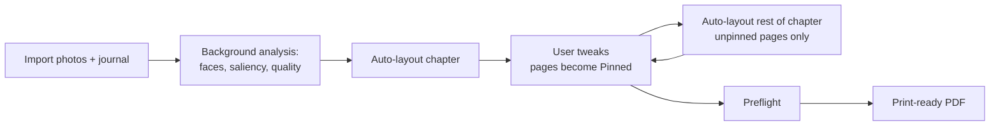

# 01 — Vision and Principles

This document states why PhotoBook exists, the one sentence the entire design serves, the
measurable targets that sentence implies, the design principles every other doc must obey, and
what v1 deliberately does not do. When a trade-off is unclear anywhere else in the doc set, the
principles here are the tiebreaker.

Related docs: [README.md](README.md) · [02-architecture.md](02-architecture.md) ·
[08-auto-layout-engine.md](08-auto-layout-engine.md) ·
[13-testing-strategy.md](13-testing-strategy.md) · [14-roadmap.md](14-roadmap.md) ·
[15-glossary.md](15-glossary.md)

## What PhotoBook is

PhotoBook is a single-user Windows desktop app that mostly-automatically lays out yearly family
photo books — one book is one year (R3), one Chapter is one month (R4, R24) — from a photo set
(folder or OneDrive album, mixed jpg/heic/webp/png per R1) plus an optional dated journal in Word
(R2), producing a print-ready PDF at 11 × 8.5 in landscape
([12-pdf-export.md](12-pdf-export.md)). The motivating user is a parent building memory books
that document a family's story and their kids' childhood year by year (R28).

The product bar: the book that comes out of pressing **Auto-layout** already looks designed.
Editing exists to nudge, not to rescue.

> **Decision:** Windows desktop, single user, .NET 10 / C# with a WPF shell — see
> [ADR-0001](adr/0001-platform-dotnet.md) and [ADR-0002](adr/0002-ui-wpf.md).

## North star

> **"The automatic layout being awesome is the most important part. Edits should really be
> tweaks."** — the user (R27)

The auto-layout engine ([08-auto-layout-engine.md](08-auto-layout-engine.md)) is the product.
Every subsystem is judged by how much it improves the engine's first draft: image analysis feeds
it Focus Regions and Tiers, the Template library gives it vocabulary, the editor protects its
output from needing attention. A feature that makes manual editing more powerful but the first
draft no better is lower priority by definition.

### Measurable corollaries

"Awesome" is measured, not asserted. These are the acceptance targets; the tests and review
sessions that verify them live in [13-testing-strategy.md](13-testing-strategy.md).

| # | Corollary | Target | Verified by |
|---|-----------|--------|-------------|
| C1 | A first draft of a month needs few tweaks. A *tweak* = one drag/swap, crop nudge, template change, tier promote/demote, or Focus Region fix. | **< 10 tweaks per chapter**, median over the reference year | Counted tweak sessions on the user's real photo set at M1 and M5 ([14-roadmap.md](14-roadmap.md)) |
| C2 | Auto-crop never amputates the subject (R25). | **100%** of detected faces inside the Safe area; **≥ 90%** of auto-placed photos need no crop adjustment | Face-in-safe assertions and crop-loss metrics in engine golden tests |
| C3 | Re-layout is fast enough to experiment freely. | Full-year re-layout **< 10 s** for 2,000 photos with analysis precomputed | Perf test in [08-auto-layout-engine.md](08-auto-layout-engine.md) |
| C4 | Analysis never blocks the user. | First-import full-year analysis **< 15 min**, entirely in the background | Perf test in [06-image-analysis.md](06-image-analysis.md) |
| C5 | Same inputs, same book. | Identical (photos, journal, templates, style, Seed) ⇒ **byte-stable PDF** (timestamps pinned via metadata option) | Determinism test in [12-pdf-export.md](12-pdf-export.md) |
| C6 | The engine never creates Preflight debt. | An untouched auto layout produces **zero empty Slots and zero text overflow**; every Preflight finding traces to a data problem (e.g. `dateUncertain`), never to the engine | Preflight run over golden books in CI |

C1 is the honest one: it is measured on real family photos, not synthetic sets, and it is the
number that decides whether the north star was met.

## The core loop

Everything in v1 serves one loop — analyze once, lay out instantly, tweak lightly, regenerate
safely, export confidently:

The loop only works if re-layout is fast (C3), deterministic (C5), and respectful of what the
user already touched (P6 below, R16).

## Goals

- **G1 — An awesome automatic first draft.** Chronological layout per month (R7), smart crops
  that keep the important parts visible (R25), photo quality driving slot size (R26), sparse
  days merged onto shared pages (R28), local-first analysis with an optional Azure upgrade path
  (R27).
- **G2 — Tweaks, not rework.** Drag/drop with swap, pan/zoom crop, letterboxing when the user
  shrinks below the Slot (R9), per-page template change with an Unplaced bin (R10, R12, R13),
  per-page layout overrides (R15), one-click re-layout of the rest of the chapter with an
  explicit warning listing affected pages (R16).
- **G3 — The journal woven in.** Dated Word entries interleaved with photos (R2), a day's text
  kept together (R5), captions below or overlaid as the layout demands (R5), month title pages
  (R24).
- **G4 — Print-perfect output.** Bleed/Trim/Safe-area-correct PDF, multiple page sizes (R19),
  global Styles for borders and typography (R23), a Preflight gate so surprises happen on screen
  and not in the mail.
- **G5 — A self-contained, durable project.** One folder holds the originals, all intent, and
  the caches; it survives app reinstalls, cache deletion, and a decade in cold storage.
- **G6 — The user's judgment always wins.** Editable Focus Regions (R25), absolute tier
  promote/demote (R26), re-dating that moves photos across Chapters or into the Outside-book
  tray (R6), permanent exclusion of near-duplicates (R17).

## Design principles

### P1 — Non-destructive, always

Originals are copied into the project and never modified. Edits are parametric: brightness,
contrast, and color live in an Adjustment Stack (R11); cropping is a `CropState`
(`zoom`, `offsetX`, `offsetY` — see [03-domain-model.md](03-domain-model.md)); removing a photo
sets `excluded: true` rather than deleting anything (R17). Any edit can be reverted at any time,
years later.

> **Decision:** Magick.NET-Q8 is the sole decode/edit backend, applying parametric adjustment
> stacks at render time over immutable originals — see
> [ADR-0004](adr/0004-imaging-magick-net.md).

### P2 — Deterministic engine

The auto-layout engine is a pure function of (photos, journal, templates, style, Seed). No I/O,
no clock, no ambient randomness — the Seed is stored in `book.json`. Same inputs produce the same
book, which makes golden tests possible, bug reports reproducible, and "auto-layout rest of
chapter" predictable.

> **Decision:** `PhotoBook.Engine` performs no I/O and takes the Seed as an explicit input;
> determinism is enforced by byte-stable golden tests — rationale inline here; module boundaries
> in [ADR-0009](adr/0009-app-architecture-mvvm-di-jobs.md).

### P3 — Local-first intelligence

Face detection (YuNet), saliency (U2-Netp), and aesthetic scoring (NIMA) run locally on ONNX
Runtime; the app is fully functional offline except OneDrive sync. Azure AI Vision is an
optional, per-book, opt-in upgrade behind the same `IImageAnalyzer` interface (R27) — a plug-in,
never a dependency.

> **Decision:** local ONNX models are the default analyzer; cloud analysis is a swappable
> adapter — see [ADR-0005](adr/0005-local-ml-onnx-runtime.md) and
> [ADR-0010](adr/0010-analysis-plugin-local-first.md).

### P4 — User intent never lives in cache

`cache/` holds only regenerable artifacts: thumbnails and analysis outputs. Everything the user
decided — dates, tiers, Focus Region edits, crops, adjustments, exclusions, pins — lives in the
project's JSON files. Deleting `cache/` costs CPU time and nothing else. Any feature that would
persist a user decision into a cache file is wrong by definition.

> **Decision:** plain-JSON project folder, no database; caches 100% regenerable — see
> [ADR-0007](adr/0007-project-storage-json-folder.md).

### P5 — Auto and manual are one representation

The engine emits the exact same `CropState` the user hand-tweaks. There is no "auto mode" that
degrades into a "manual mode"; a tweak adjusts the engine's numbers in place. This is what makes
edits tweaks: the user is always continuing the engine's work, never redoing it.

### P6 — Respect the user's touch

A manually edited page becomes Pinned; a page whose template was hand-modified becomes Detached
(its inline template snapshot is preserved verbatim). Re-layout regenerates only unpinned pages
and lists the affected page numbers before running (R16). The engine may be opinionated; it is
never entitled to undo a human.

### P7 — WYSIWYG by construction

The same SkiaSharp draw code renders the screen (`SKElement`) and the PDF (`SKDocument`).
Preview and print cannot diverge because they are the same code path, not because we tested them
into agreement.

> **Decision:** one SkiaSharp renderer for screen and PDF — see
> [ADR-0003](adr/0003-rendering-skiasharp.md) and [ADR-0006](adr/0006-pdf-skdocument.md).

### P8 — Plain files, no black boxes

The project is a human-diffable folder: `book.json`, `photos.json`, `journal.json`,
`chapters/2024-01.json`…, `originals/`, `cache/` (see
[04-project-format-and-storage.md](04-project-format-and-storage.md)). Atomic writes, autosave
every 30 s, rolling `.bak`. At under ~2,000 pre-culled photos per year, JSON plus a file cache
beats a database on durability, debuggability, and backup friendliness.

## Non-goals for v1

Each non-goal is deliberate, and each deferred one names the hook that keeps v2 cheap. Cutting
these is what buys an awesome engine in v1.

| Non-goal | v1 stance | Named v2 hook |
|----------|-----------|---------------|
| **RAW ingestion** | Not supported. Sources are pre-culled jpg/heic/webp/png (R1); RAW develop is a different product. | Formats are a decode capability of `PhotoBook.Imaging` (Magick.NET), not a domain-model list — adding extensions touches one module ([02-architecture.md](02-architecture.md)). |
| **Video** | Not supported, including stills-from-video. A photo book is stills. | None planned; permanently out of scope. |
| **Multi-user sync / collaboration** | Single-user app; no accounts, no merge UI. Photo *collection* is collaborative via a shared OneDrive album ([05-ingestion-and-photo-sources.md](05-ingestion-and-photo-sources.md)) — book *editing* is not. | The project is plain, human-diffable JSON with per-chapter files and atomic writes — file-sync or VCS-style workflows can layer on without a storage rewrite. |
| **Covers** | v1 exports the interior PDF only. Cover/spine templating varies per print service and per page count. | `PrintProfile` reserves the spine-width calculation and cover geometry ([12-pdf-export.md](12-pdf-export.md)); covers arrive as a new Template kind, not a new system. |
| **Scrapbook / image backgrounds** | Page background is solid `#000000` with default `#FFFFFF` text (R21). | Background becomes a Style property ([10-styles-and-typography.md](10-styles-and-typography.md)); letterboxing already renders "background shows through" (R9), so any future background composits correctly under existing pages. |
| **Print-service integrations** | No upload APIs, no vendor lock. Output is a generic print-ready PDF; service specifics are swappable JSON Print Profiles. Per-page JPEG export is a later addition. | New service = new `PrintProfile` JSON file; per-page JPEG reuses the existing per-page render path. |
| **Automatic culling / dedup** | The user pre-culls to under ~2,000 photos/year; the app helps with manual exclusion (R17) and Tier ranking (R26), but never auto-deletes. | QualityScore + a future similarity metric could *suggest* culls; `excluded` semantics already persist the outcome. |

> **Decision:** covers and image backgrounds are deferred to v2 — inline rationale: both are
> pure additions on top of `PrintProfile` and `Style` respectively, and neither improves the
> first draft, which is where v1's entire risk lives (R21, R27).

## How we'll know v1 is done

v1 ships when the milestones M0–M6 in [14-roadmap.md](14-roadmap.md) have met their exit
criteria, corollaries C1–C6 hold on the golden test books, and one end-to-end proof exists: the
user's real most-recent-year book — photos plus Word journal — built in the app, passing
Preflight, printed, and on the family bookshelf (R28). That book, not a feature list, is the
definition of done.
