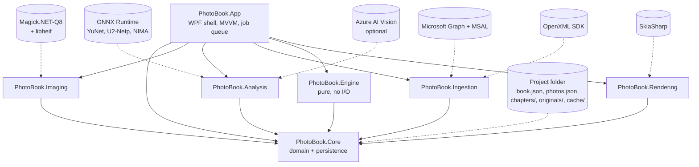
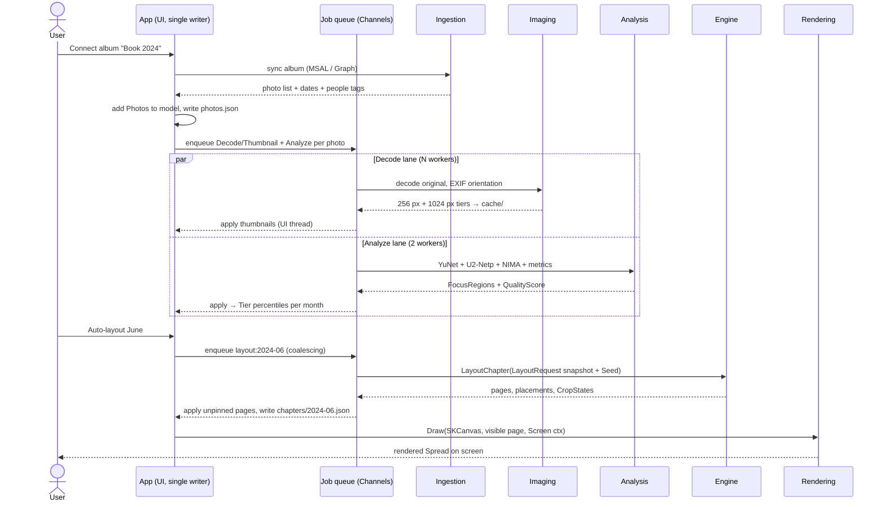

# 02 — Architecture

This document defines the solution structure, the dependency rules that keep it honest, the
threading and background-job model, dependency injection and messaging, the one-renderer design
that makes the app WYSIWYG by construction, and the memory policy that lets a ~2,000-photo book
(the R1 photo volume, pre-culled) run comfortably on an ordinary Windows machine. It is the map
every other doc hangs off: domain shapes live in [03](03-domain-model.md), on-disk format in
[04](04-project-format-and-storage.md), the layout algorithm in [08](08-auto-layout-engine.md),
and the editor behaviors in [09](09-editor-ux.md).

Related docs: [01-vision-and-principles.md](01-vision-and-principles.md) ·
[03-domain-model.md](03-domain-model.md) · [04-project-format-and-storage.md](04-project-format-and-storage.md) ·
[06-image-analysis.md](06-image-analysis.md) · [08-auto-layout-engine.md](08-auto-layout-engine.md) ·
[09-editor-ux.md](09-editor-ux.md) · [12-pdf-export.md](12-pdf-export.md) ·
[13-testing-strategy.md](13-testing-strategy.md)

## Solution structure

> **Decision:** One solution, seven projects, MVVM + DI + a Channels-based job queue; the WPF
> shell is the only project that knows the app is a desktop app — see
> [ADR-0009](adr/0009-app-architecture-mvvm-di-jobs.md).

```
PhotoBook.sln
  src/PhotoBook.Core        — domain model, project persistence (no UI deps)
  src/PhotoBook.Imaging     — Magick.NET decode/edit, thumbnails, cache
  src/PhotoBook.Analysis    — IImageAnalyzer, ONNX local, Azure adapter
  src/PhotoBook.Ingestion   — OneDrive Graph connector, folder import, journal (OpenXML)
  src/PhotoBook.Engine      — auto-layout engine (pure, deterministic)
  src/PhotoBook.Rendering   — SkiaSharp page renderer + PDF export
  src/PhotoBook.App         — WPF shell (MVVM, AvalonDock, job queue)
  tests/…                   — xUnit; golden layout tests; Verify-based snapshots
```

| Project | Owns | Key packages | Notable exports |
|---|---|---|---|
| `PhotoBook.Core` | `Book`, `Chapter`, `Page`, `Template`, `Photo`, `CropState`, `FocusRegion`, `QualityScore`/`Tier`, `Style`, `PrintProfile`; JSON persistence, atomic writes, autosave | System.Text.Json only | the entire domain vocabulary |
| `PhotoBook.Imaging` | decode (EXIF orientation applied), `AdjustmentStack` application, thumbnail tiers, `cache/` management | Magick.NET-Q8 (bundles libheif — HEIC decodes with no OS codecs, R1) | `IImageDecoder`, `IThumbnailCache` |
| `PhotoBook.Analysis` | face detect (YuNet), saliency (U2-Netp), aesthetic score (NIMA/MobileNet), sharpness/exposure metrics; Azure adapter | ONNX Runtime; Azure AI Vision SDK (optional) | `IImageAnalyzer` (R25–R27) |
| `PhotoBook.Ingestion` | OneDrive album sync via Graph, MSAL sign-in, folder import, originals copy, Word journal parse | Microsoft.Graph, MSAL, OpenXML SDK | `IPhotoSource`, `IJournalImporter` (R2) |
| `PhotoBook.Engine` | day grouping → demand model → DP partitioning → template scoring → Hungarian slot assignment → smart-crop (see [08](08-auto-layout-engine.md)) | none (pure C#) | `LayoutEngine.LayoutChapter(LayoutRequest) → LayoutResult` |
| `PhotoBook.Rendering` | the one `PageRenderer`; screen surface + `SKDocument` PDF export; preflight | SkiaSharp | `IPageRenderer`, `IPdfExporter` |
| `PhotoBook.App` | WPF shell, view models, docking, undo/redo commands, job queue host, composition root | CommunityToolkit.Mvvm, AvalonDock, Microsoft.Extensions.Hosting | `Program`/`App` |

## Dependency rules

These are constraints, not conventions. The rule set, verbatim from the kernel: **App → all;
Engine/Rendering/Analysis/Imaging/Ingestion → Core; Core → nothing; nothing references App.
Engine has no I/O.**

1. `PhotoBook.Core` references **no** other project and no UI or imaging package. It compiles
   against `System.Text.Json` and the BCL, nothing else.
2. The five middle projects (`Imaging`, `Analysis`, `Ingestion`, `Engine`, `Rendering`) reference
   `Core` and **only** `Core`. They never reference each other — when Analysis needs pixels it
   receives them as input (a decoded bitmap handed over by the job queue), it does not call Imaging.
3. `PhotoBook.App` is the only project that may reference all six, and the only project any
   third-party UI package may appear in.
4. Nothing references `App`. View models live in `App`; domain types never depend on them.
5. `PhotoBook.Engine` performs **no I/O**: no file access, no network, no clock, no `Random`
   without the injected Seed. It is a pure function of `(photos, journal, templates, style, seed)`
   so that the same inputs always produce the same book — the property golden-layout tests in
   [13-testing-strategy.md](13-testing-strategy.md) depend on.

Enforcement, in order of cheapness:

- **Project references are the graph.** No project reference, no dependency — the compiler is the
  first gate. `InternalsVisibleTo` is granted only to test projects.
- **Architecture tests** (`tests/PhotoBook.ArchTests`, NetArchTest.Rules) assert the exact edge
  set above and fail the build on any new edge. Adding a reference is a reviewed decision, not a
  drive-by.
- **Banned-API analyzer** on `PhotoBook.Engine`: `System.IO.*`, `System.Net.*`,
  `DateTime.Now`/`UtcNow`, and parameterless `new Random()` are compile errors inside the Engine.

## Component diagram



## Threading model: the single writer

> **Decision:** The UI thread is the *only* writer of the domain model. Background work reads
> immutable snapshots and returns results; the UI thread applies them as commands — see
> [ADR-0009](adr/0009-app-architecture-mvvm-di-jobs.md).

Rules:

1. **One writer.** Every mutation of `Book`, `Photo`, `Chapter`, page placements, `CropState`,
   Tier overrides, Pinned flags — everything the user can undo — happens on the WPF dispatcher
   thread, expressed as an undoable command (the command pattern that also powers undo/redo in
   [09-editor-ux.md](09-editor-ux.md)).
2. **Jobs read snapshots.** When a job is enqueued, the enqueue site captures an immutable
   snapshot of exactly the inputs the job needs (e.g., `LayoutRequest` for the Engine: photo records
   with dates/Tiers/Focus Regions, journal entries, templates, style, Seed). Jobs never hold a
   reference into the live model.
3. **Results come home as commands.** A completed job posts its result back to the dispatcher;
   the UI thread validates it against current state (the model may have moved on) and applies it.
   Analysis results (`FocusRegion`s, `QualityScore`) merge unless the user has overridden them —
   a user Tier override is absolute and never re-derived (kernel §4, R26). A layout result for a
   page the user has since Pinned is discarded.
4. **No locks in the domain.** Because there is exactly one writer and readers see snapshots,
   `Core` contains zero synchronization primitives. Race conditions are structurally impossible,
   not carefully avoided.
5. **Persistence rides the writer.** Autosave (every 30 s and after major operations) serializes
   on the dispatcher — cheap, since files are small JSON — then hands the byte buffer to a
   background writer that does the atomic temp-file + rename dance
   ([04-project-format-and-storage.md](04-project-format-and-storage.md)).

## Background job queue

Heavy work never touches the UI thread. `PhotoBook.App` hosts a job queue built on
`System.Threading.Channels`: one unbounded `Channel<Job>` per lane, each lane drained by a fixed
worker pool.

```csharp
enum JobKind { Decode, Thumbnail, Analyze, Layout, Export }
enum JobPriority { Interactive, UserInitiated, Background }

sealed record Job(
    JobKind Kind,
    string CoalesceKey,          // e.g. "thumb:256:{contentHash}", "layout:2024-06"
    JobPriority Priority,
    Func<CancellationToken, Task<object>> Work,
    Action<object> ApplyOnUiThread);
```

What runs where:

| Lane | Work | Project doing the work | Workers | Notes |
|---|---|---|---|---|
| **Decode/Thumbnail** | full decode of an original, thumbnail tier generation, adjustment previews | `Imaging` | `clamp(ProcessorCount − 2, 2, 6)` | `Interactive` jobs (thumbs for photos scrolling into view) jump the lane ahead of `Background` bulk generation |
| **Analyze** | YuNet, U2-Netp, NIMA + sharpness/exposure per photo | `Analysis` | 2 (shared ONNX sessions, intra-op threads capped at 2 each) | R25/R26 pre-processing; full-year target < 15 min on first import, running entirely behind the UI |
| **Layout** | Engine run for a Chapter or the whole book | `Engine` | 1 | latest-wins coalescing: a new `layout:2024-06` request cancels the in-flight one. "Auto-layout rest of chapter" (R16) enqueues here after the UI lists the affected page numbers; target < 10 s full-year |
| **Export** | preflight + PDF render | `Rendering` | 1, exclusive | pauses the Decode and Analyze lanes for the duration so export owns the memory budget |

Mechanics:

- **Coalescing.** Enqueueing a job whose `CoalesceKey` matches a queued-but-unstarted job replaces
  it; matching an in-flight job cancels it via its `CancellationTokenSource` and enqueues the
  replacement. Slider-drag adjustment previews and repeated re-layout clicks cost one job, not N.
- **Cancellation.** Every job gets a `CancellationToken`; closing a book cancels all lanes and
  awaits drain before the project folder is released.
- **Failure.** A failed job never corrupts the model (it never touched it); it surfaces as a
  non-modal toast plus a per-photo error badge (decode/analyze) or a blocking dialog (export).
  Analysis failures degrade gracefully: a photo with no analysis simply has no `face`/`saliency`
  Focus Regions and a neutral score until re-run.
- **Progress.** Lanes report `(done, total)` via messenger messages (below); the status bar shows
  the Analyze lane's progress during first import.

## DI and messaging

> **Decision:** `Microsoft.Extensions.Hosting` generic host as the composition root inside
> `PhotoBook.App`; `CommunityToolkit.Mvvm`'s `WeakReferenceMessenger` for UI-facing events; no
> service locator anywhere — see [ADR-0009](adr/0009-app-architecture-mvvm-di-jobs.md) and
> [ADR-0010](adr/0010-analysis-plugin-local-first.md).

Key registrations (all in `App`; the other projects expose interfaces and take constructor
dependencies, they never resolve):

| Interface | Default implementation | Lifetime | Swap point |
|---|---|---|---|
| `IImageAnalyzer` | `LocalOnnxAnalyzer` | singleton | `AzureVisionAnalyzer` opt-in **per book** (R27); both registered, a factory picks per `book.json` setting |
| `IPhotoSource` | `OneDriveGraphSource` | singleton | `FolderPhotoSource` fallback (kernel §2) |
| `IImageDecoder`, `IThumbnailCache` | Magick.NET-backed | singleton | — |
| `IPageRenderer`, `IPdfExporter` | SkiaSharp-backed | singleton | — |
| `IJournalImporter` | OpenXML-backed | singleton | — |
| `IJobQueue` | Channels implementation above | singleton | in-line synchronous fake for tests |
| `IProjectStore` | JSON folder store | singleton | — |
| View models | one per document/tool window | transient/scoped to open book | — |

Messaging: view models communicate through typed messages, never through each other —
`PhotoAnalyzed`, `TierChanged`, `PageLaidOut`, `JobProgressChanged`, `PhotoDateChanged` (which is
how the Photos tab tells the Pages tab a photo just moved to the Outside-book tray, R6).
Messages are UI-plumbing only; they carry ids, not model objects, and nothing in `Core` knows the
messenger exists.

## One renderer: WYSIWYG by construction

> **Decision:** Exactly one page-drawing routine, written against `SKCanvas`. The screen shows it
> via `SKElement`; the PDF is it via `SKDocument.CreatePdf`. There is no second "print path" to
> drift — see [ADR-0003](adr/0003-rendering-skiasharp.md) and
> [ADR-0006](adr/0006-pdf-skdocument.md).

```csharp
interface IPageRenderer
{
    // The only place a Page becomes pixels. Target-agnostic.
    void Draw(SKCanvas canvas, Page page, RenderContext ctx);
}

sealed record RenderContext(
    RenderTarget Target,        // Screen | Pdf
    float Scale,                // screen: fit/zoom factor; pdf: 300 DPI equivalents
    ImageResolution Resolution, // Screen → 1024 px tier; Pdf → full-res downsampled
    bool ShowGuides);           // trim/bleed/safe overlays — screen only, drawn after content
```

The renderer draws in page coordinates: templates address the normalized [0,1]×[0,1] single-page
trim box (kernel §3), the renderer multiplies by the physical trim size (default 11.0 × 8.5 in
landscape; other sizes via template `pageSize`, R19) and the context scale. A Spread is rendered
as two `Draw` calls onto one 22 × 8.5 surface. Because screen and PDF run the *same* code over the
*same* `CropState`, `AdjustmentStack`, style cascade, and font set (bundled OFL fonts,
[10-styles-and-typography.md](10-styles-and-typography.md)), what the user sees is what prints —
WYSIWYG is not a QA goal, it is a structural consequence. The only differences are declared in
`RenderContext`: which thumbnail tier feeds the images, and that export adds the 0.125 in bleed
box, 300 DPI downsampling, JPEG quality 90, and sRGB tagging
([12-pdf-export.md](12-pdf-export.md)). A letterboxed image (`zoom < 1`, background showing
through per R9) letterboxes identically in both, for free.

## Memory policy for a 2,000-photo book

Budget: **≤ 1.5 GB steady-state working set** while editing, **≤ 2.5 GB peak** during export, on
the R1 volume of ~2,000 photos. The disk cache is the backstop; RAM holds only what the UI can
currently show.

Thumbnail tiers (kernel §10) and their caches:

| Tier | Longest edge | On disk (`cache/`) | Decoded size (BGRA, 3:2) | In-memory cap | Eviction |
|---|---|---|---|---|---|
| Grid | 256 px | JPEG q80, ~30 KB | ~175 KB | LRU, 1,200 entries (~210 MB) | LRU on insert over cap |
| Layout preview | 1024 px | JPEG q85, ~250 KB | ~2.9 MB | LRU, 96 entries (~280 MB) | LRU on insert over cap |
| Full-res | original | `originals/` only — never cached decoded | 24–100 MB+ | 0 cached; ≤ 2 concurrent decodes | disposed immediately after use |

Policy details:

- **Cache keys** are `{contentHash}:{tier}:{adjustmentStackHash}` — editing a photo's
  `AdjustmentStack` produces new cache entries; stale ones are deleted lazily on book open.
  `cache/` is 100% regenerable and holds no user intent (kernel §5): deleting it costs decode
  time, never data.
- **Grid scrolling** (Photos tab, R6) is virtualization + prefetch: visible rows plus one screen
  ahead enqueue `Interactive` thumbnail jobs; everything else is `Background` bulk generation.
  1,200 resident grid thumbs cover several screenfuls; a full-book scroll streams through the LRU
  rather than accumulating.
- **Page editing** needs at most 8 photos per page (R20) × a Spread × bin strips — the 96-entry
  1024 px cache covers the open Spread, its neighbors, and the Unplaced/Upcoming bins with room
  to spare.
- **Full-res** is touched in exactly two places: advanced-edit preview base (R11) and export.
  Export renders pages sequentially — decode one original, apply `AdjustmentStack`, downsample to
  its 300 DPI target size, encode into the PDF, dispose — so peak memory is one original plus one
  page surface regardless of book size. This is why the Export lane is exclusive.
- **Pressure valve.** On a failed `SKBitmap` allocation or a working set above budget, both LRUs
  halve their caps for the session and re-grow after 5 minutes without pressure.

Model memory is a rounding error: 2,000 `Photo` records with Focus Regions, scores, and
adjustments serialize to a few MB of JSON — which is exactly why the kernel says **no database**
([04-project-format-and-storage.md](04-project-format-and-storage.md),
[ADR-0007](adr/0007-project-storage-json-folder.md)).

## End-to-end flow: import → analysis → auto-layout → render

The first-import happy path, showing the single writer and the lanes cooperating. Nothing below
blocks the UI; the user can browse the grid while analysis fills in (R25).



Two properties of this flow carry the whole design. First, every arrow into `App` lands on the
dispatcher as a command — undoable, race-free, autosaved. Second, the Engine call in the middle is
a pure function of its snapshot: run it twice with the same Seed and the same book comes out,
which is what makes "the automatic layout being awesome" (R27's north star) a testable claim
rather than a hope — see [13-testing-strategy.md](13-testing-strategy.md).
