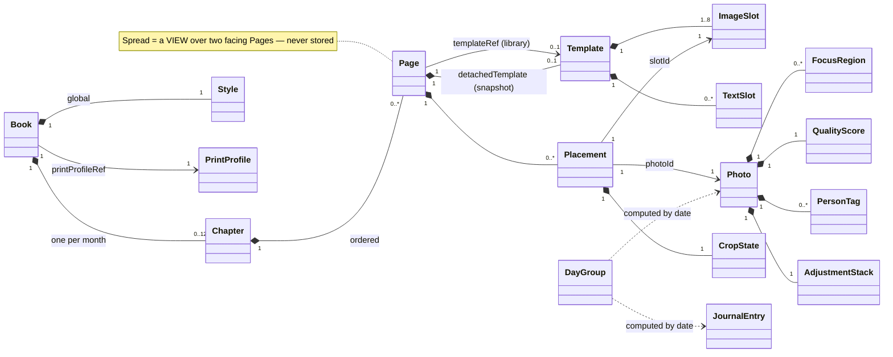

# 03 — Domain Model

This document is the canonical catalog of PhotoBook's domain entities: their fields, relationships,
and invariants. Every entity name here matches the fixed list in the spec kernel; all types live in
`src/PhotoBook.Core` with no UI or I/O dependencies. Field sketches are shown in the serialized
(camelCase JSON) shape defined by [04-project-format-and-storage.md](04-project-format-and-storage.md);
the C# records mirror them one-to-one. Other docs reference these entities — they never redefine them.

Related docs: [02-architecture.md](02-architecture.md) ·
[04-project-format-and-storage.md](04-project-format-and-storage.md) ·
[06-image-analysis.md](06-image-analysis.md) ·
[07-layout-template-system.md](07-layout-template-system.md) ·
[08-auto-layout-engine.md](08-auto-layout-engine.md) ·
[09-editor-ux.md](09-editor-ux.md) ·
[15-glossary.md](15-glossary.md)

## 1. How to read this catalog

- **Stored vs computed.** Stored entities are serialized into the project folder
  ([04-project-format-and-storage.md](04-project-format-and-storage.md)). Computed entities
  (Day Group, the bins, Spread) are derived on demand and never serialized — deleting them loses
  nothing.
- **Value types.** `Rect { x, y, w, h }` is used in two coordinate spaces and is always normalized
  `[0,1] × [0,1]`, origin top-left: *page space* (over the single-page trim box — Templates, Slots)
  and *image space* (over the decoded, orientation-corrected photo — Focus Regions, person-tag
  regions). A `Rect` never mixes spaces; the owning field's documentation names the space.
- **Ids.** All cross-file references are by string id, never by array index or object nesting.
  `Photo.id` is content-derived (`ph-` + first 16 hex chars of the SHA-256 of the original bytes,
  see [04-project-format-and-storage.md](04-project-format-and-storage.md)); all other ids are
  opaque stable strings assigned at creation.

## 2. Entity map



## 3. Photo and its satellite objects

`Photo` is the catalog record for one imported image. It owns everything the user can say *about a
photo* independent of any page: date, edits, focus, quality, tags, exclusion, caption.

```jsonc
Photo {
  "id": "ph-3fa9c2d417b25e08",       // "ph-" + sha256[..16] of original bytes; stable forever
  "contentHash": "3fa9c2…(64 hex)",   // full SHA-256; dedupe key on re-import
  "originalFileName": "IMG_1234.HEIC",
  "originalPath": "originals/3fa9c2d417b25e08-IMG_1234.heic", // relative, immutable (R1)
  "source": { "kind": "oneDrive" | "folder",
              "driveItemId": "…",     // present for oneDrive; re-sync correlation key
              "importedAtUtc": "2026-08-01T14:03:22Z" },
  "takenAt": "2024-07-04T18:21:07",   // effective date; drives Chapter membership (R6)
  "dateSource": "exif" | "graph" | "fileMtime" | "user",
  "dateUncertain": false,             // true when dateSource == "fileMtime"; cleared by user edit
  "width": 4032, "height": 3024,      // pixels after EXIF orientation is applied
  "adjustments": { AdjustmentStack },
  "focusRegions": [ FocusRegion ],
  "quality": { QualityScore },
  "tier": "S" | "A" | "B" | "C",      // engine-fused, month-relative (R26)
  "userTierOverride": "A" | null,     // absolute; wins over tier; never re-derived
  "personTags": [ PersonTag ],
  "excluded": false,                  // tombstone (R17) — see Decision below
  "caption": "First fireworks" | null // most photos have none (R5)
}
```

Effective tier = `userTierOverride ?? tier`. The date chain behind `takenAt` (EXIF
`DateTimeOriginal` → Graph `photo.takenDateTime` → file mtime) is recorded in `dateSource` and
specified in [05-ingestion-and-photo-sources.md](05-ingestion-and-photo-sources.md).

> **Decision:** `excluded: true` is a permanent tombstone. A photo the user removed from the book
> (R17) keeps its catalog row forever; re-scans and re-syncs match it by `contentHash` (and
> `driveItemId`) and **never re-import it**. Only an explicit user "restore" clears the flag.
> Rationale: silent re-appearance of a deliberately culled near-duplicate is the single most
> trust-destroying bug an importer can have; a tombstone row costs ~300 bytes.

### FocusRegion

Kernel-verbatim shape; image-space rect (R25):

```jsonc
FocusRegion { "rect": Rect, "weight": 0.0-1.0,
              "kind": "user" | "person" | "face" | "saliency",
              "personName": "Alice"   // only when kind == "person"
}
```

Fusion priority: `user` > `person` (OneDrive people tag) > `face` (YuNet) > `saliency` (U2-Netp).
The primary focus region is the highest-weight region after merging overlaps; smart-crop keeps it
visible ([08-auto-layout-engine.md](08-auto-layout-engine.md)). Fused regions are user-editable
state in `photos.json`; raw detector output lives in cache only
([04-project-format-and-storage.md](04-project-format-and-storage.md)).

### QualityScore and Tier

```jsonc
QualityScore { "aesthetic": 0.0-1.0,   // NIMA/MobileNet
               "sharpness": 0.0-1.0,   // classical Laplacian metric
               "exposure":  0.0-1.0,   // classical histogram metric
               "faceBonus": 0.0-1.0,   // count/size of detected faces
               "fused":     0.0-1.0,
               "monthPercentile": 0-100 }
```

`fused` is percentile-ranked **within the month** and bucketed to Tier **S** (top 10%), **A** (next
25%), **B** (next 45%), **C** (bottom 20%). Tier drives Slot size affinity in template scoring
(R26). Promote/demote in the UI writes `userTierOverride` — an absolute value, never a delta, and
never recomputed when the month's photo set changes.

### PersonTag

```jsonc
PersonTag { "name": "Alice", "source": "oneDrive" | "user",
            "regionRect": Rect | null }   // image space, when the source supplied one
```

A `PersonTag` with a `regionRect` is materialized as a `FocusRegion { kind: "person", personName }`
during analysis fusion, making named people top-priority crop anchors (below only explicit user
regions). Graph people-tag availability is an open spike — see
[05-ingestion-and-photo-sources.md](05-ingestion-and-photo-sources.md).

### AdjustmentStack

Non-destructive, parametric, applied by Magick.NET at render time in a fixed stage order —
**geometry → exposure → colour → finish** — so the same parameters give the same pixels whatever
order the sliders were moved in. Originals are never touched (R6, R11). Every value defaults to its
identity, and a parameter sitting at its default is omitted, so an unedited photo serializes as `{}`.

```jsonc
AdjustmentStack {
  // geometry
  "rotate": 0|90|180|270, "straighten": -15.0-15.0, "flipHorizontal": bool,
  // exposure
  "exposureEv": -2.0-2.0, "brightness": -1.0-1.0, "contrast": -1.0-1.0,
  "highlights": -1.0-1.0, "shadows": -1.0-1.0, "whites": -1.0-1.0, "blacks": -1.0-1.0,
  // colour
  "temperature": -1.0-1.0, "tint": -1.0-1.0, "saturation": -1.0-1.0, "vibrance": -1.0-1.0,
  // finish
  "noiseReduction": 0.0-1.0, "clarity": -1.0-1.0, "sharpness": 0.0-1.0,
  "vignette": 0.0-1.0, "blackAndWhite": bool
}
```

Sliders are stored on the `-1..1` scale.
[05-ingestion-and-photo-sources.md](05-ingestion-and-photo-sources.md) writes the same parameters as
`-100..100` for the UI; divide by 100. The one spelling difference is
`sharpness` here against the imaging layer's `sharpen`, mapped explicitly on both sides. Growing this
record was purely additive — new optional fields defaulting to identity — so `photos.json` stayed at
`schemaVersion` 1; the render pipeline order is owned by [02-architecture.md](02-architecture.md).

Crop is deliberately **not** here: framing is a property of photo-in-slot and lives in the
Placement's `CropState`.

### AutoAdjustStamp and LookProfile

Who owns the stack above, and what auto-adjust should aim for. The three-state machine and the
never-clobber-a-human rule are in [00-spec-kernel.md](00-spec-kernel.md) §4.

```jsonc
// on Photo — absent entirely for a photo auto-adjust has not written
AutoAdjustStamp { "rulesVersion": "auto-1;s0.75;b0;w0;c0;v0;t",  // algorithm + look settings
                  "sourceHash": "…",                              // the bytes it measured
                  "measurement": { "medianLuma": 0.31, "blackPoint": 0.02, "whitePoint": 0.94,
                                   "clipLow": 0.004, "clipHigh": 0.001,
                                   "meanRed": 0.5, "meanGreen": 0.48, "meanBlue": 0.44,
                                   "chroma": 0.11,
                                   "tiltDegrees": -1.8, "tiltConfidence": 0.72 } }

// on Book
LookProfile { "strength": 0.0-1.0,        // scales every correction; 0.75 = "normal"
              "brightness": -1.0-1.0, "warmth": -1.0-1.0,
              "contrast": -1.0-1.0, "saturation": -1.0-1.0,
              "straighten": bool,          // always written; its default is true
              "adjustOnImport": bool }
```

`rulesVersion` fuses the algorithm version with the look settings, so changing either marks every
automatic photo out of date and the next run brings them up to date. Storing the measurement is what
makes that re-run arithmetic rather than a decode of the whole book.

## 4. Book, Chapter, Page, Placement

### Book

One Book = one calendar year (R3). Serialized as `book.json`.

```jsonc
Book { "schemaVersion": 1, "id": "bk-…", "title": "Our 2024",
       "year": 2024,
       "pageSize": "11x8.5-landscape",     // default; other sizes via templates (R19)
       "style": { Style },                  // global level of the style cascade (R23)
       "printProfileRef": "generic-11x8.5", // PrintProfile id
       "seed": 42,                          // engine determinism — same inputs, same book
       "pdfTimestampUtc": "2026-08-01T14:03:22Z", // pinned PDF metadata timestamp — byte-stable export ([12-pdf-export.md](12-pdf-export.md))
       "source": { "kind": "oneDriveAlbum" | "oneDriveFolder" | "localFolder", "id": "…", "path": "Book 2024" },
       "analysis": { "analyzerId": "local-onnx" } // per-book analyzer selection; "azure-vision" is the opt-in ([06-image-analysis.md](06-image-analysis.md))
}
```

### Chapter

One Chapter = one month (R4). Serialized one file per month (`chapters/2024-07.json`) so a chapter
is a standalone, independently editable and diffable unit.

```jsonc
Chapter { "schemaVersion": 1, "year": 2024, "month": 7,
          "title": "July" | null,          // month-title page text override (R24)
          "styleOverride": { Style } | null, // sparse; cascade global → chapter → page
          "pages": [ Page ] }               // order = reading order; page numbers computed book-wide
```

**A Chapter stores no photo list.** Which photos belong to July is always computed as
`photos.where(p => !p.excluded && p.takenAt.year == book.year && p.takenAt.month == 7)`.

> **Decision:** Chapter membership is **computed** from the photo's effective date; only
> **placements** (photo → slot on a page) are **stored**. Rationale: R6 requires that re-dating a
> photo moves it between months or out of the year entirely. With computed membership that is one
> field write — no lists to reconcile, no orphaned references, no double bookkeeping. The
> placement is the user's (or engine's) spatial intent and survives independently; a placement
> whose photo dated out of the chapter is surfaced as a preflight/UI warning, not silently deleted.

### Page

```jsonc
Page { "id": "pg-01H…",
       "templateRef": "t-04-text-a" | null,   // library template id — XOR with detachedTemplate
       "detachedTemplate": { Template } | null, // inline snapshot once hand-edited (Detached, R15)
       "mirrored": false,                      // template mirrored for left vs right page
       "pinned": false,                        // Pinned: re-layout will not touch this page (R16)
       "styleOverride": { Style } | null,       // sparse page-level style override (R23, [10-styles-and-typography.md](10-styles-and-typography.md))
       "placements": [ Placement ],
       "journalAssignments": [ { "textSlotId": "t1", "entryIds": ["je-3f9a12c04b7d"] } ]
}
```

Page states (kernel-fixed): **Pinned** — the user touched it; "auto-layout rest of chapter"
regenerates only unpinned pages. **Detached** — the user edited the layout geometry itself
(add/move/resize/delete slots, R15), so the page owns an inline `Template` snapshot; the library
template is never mutated. Any manual edit sets `pinned: true`; only geometry edits detach.

Text resolution: `journal` text slots render the Day Group entries bound in `journalAssignments`;
`monthTitle` slots resolve from `Chapter.title` (R24); `caption` slots and overlay/below captions
resolve from the placed photo's `caption` (R5). Only journal bindings need storage — the other two
are derivable.

### Placement

The single stored link between the photo world and the page world.

```jsonc
Placement { "slotId": "s1",              // ImageSlot id in the page's effective template
            "photoId": "ph-3fa9c2d417b25e08",
            "crop": { CropState } }
```

One Placement binds exactly one Photo to exactly one Slot; a slot holds at most one placement —
slots without one are *empty* and flagged amber (R14). A photo appears in **at most one placement
in the entire Book**; drag-drop between filled slots swaps placements
(R9, [09-editor-ux.md](09-editor-ux.md)).

## 5. Template, ImageSlot, TextSlot

[07-layout-template-system.md](07-layout-template-system.md) owns the full template spec and the
~50-template v1 library (R20); the shapes here are the canonical kernel sketch and are what a
Detached page snapshots inline.

```jsonc
Template { "id": "t-04-text-a", "name": "Four up with journal",
           "pageSize": "11x8.5-landscape",
           "kind": "standard" | "monthTitle" | "fullBleed" | "multiDay" | "spreadPair",
           "photoCount": 4,                 // 1..8 (R20)
           "slots": [ ImageSlot ],
           "textSlots": [ TextSlot ],
           "mirrorable": true,              // auto-mirrored horizontally for left vs right page
           "pair": { "pairId": "sp-a", "side": "left" | "right" } | null, // spreadPair only (R22)
           "sections": [ … ] }              // multiDay only: per-day slot+text groups (R28)

ImageSlot { "id": "s1", "rect": Rect,       // page space
            "aspect": 1.5, "aspectTolerance": 0.35,
            "tierAffinity": "S" | "A" | "B" | "C" | "any",
            "captionPolicy": "none" | "below" | "overlay" }   // overlay for full-bleed (R5)

TextSlot  { "id": "t1", "rect": Rect,       // page space
            "role": "journal" | "caption" | "monthTitle" }
```

Kinds cover the requirement surface: `monthTitle` (R24), `fullBleed` (R18, overlay captions),
`multiDay` (R28 — sections keep each day's photos and journal together), `spreadPair` (matched
left/right pages, R22). Not every template has a text slot — textless layouts are the deliberate
negative-space option (R20).

## 6. CropState — the one crop model

Kernel-verbatim; docs [07](07-layout-template-system.md), [08](08-auto-layout-engine.md), and
[09](09-editor-ux.md) use this identical model.

```
CropState { zoom: double, offsetX: double, offsetY: double }
```

- `coverScale = max(slotW/imgW, slotH/imgH)` — the scale at which the image exactly covers the slot.
- Effective scale = `zoom × coverScale`. Default `zoom = 1.0` = minimal-crop cover fit.
- `offsetX`/`offsetY` pan the image center relative to the slot center, in slot-width/slot-height
  units; clamped so no gap appears while `zoom ≥ 1`.
- `zoom < 1` is legal: the image no longer fills the slot and the page background shows through
  (letterbox), exactly as R9 requires.

> **Decision:** The auto-layout engine emits the same `CropState` the user hand-tweaks — automatic
> and manual crops are one representation, one code path. Rationale: "edits should really be
> tweaks" (kernel north star) is only true if a tweak *continues from* the engine's answer instead
> of replacing a different model; it also makes engine output directly testable against hand-set
> expectations.

## 7. Journal entities: JournalEntry and DayGroup

### JournalEntry

Parsed from the Word journal (R2) by the OpenXML importer
([11-journal-ingestion.md](11-journal-ingestion.md)); serialized in `journal.json` together with
the unmatched-import report.

```jsonc
JournalEntry { "id": "je-3f9a12c04b7d",     // "je-" + sha256[..12] of the content-derived sourceKey
               "sourceKey": "…", "occurrence": 0, // stable identity across re-imports (doc 11)
               "dateStart": "2024-07-04", "dateEnd": "2024-07-04",
               "status": "matched" | "ambiguous" | "unmatched" | "userAssigned",
               "confidence": 0.90,
               "paragraphs": [ "…", "…" ],   // plain text; formatting normalized on import
               "userDate": null,             // effective date = userDate ?? dateStart
               "excluded": false }           // user removed this entry from the book
```

A day's journal text is **atomic**: it renders together (R5), may span the two pages of one Spread
but never crosses Spreads; if it cannot fit, the engine must choose roomier templates —
typography rules in [10-styles-and-typography.md](10-styles-and-typography.md).

### DayGroup

**Computed, never stored.** The engine's unit of layout demand: all non-excluded photos and journal
entries sharing one calendar date, photos in chronological order (R7, R11 timeline).

```jsonc
DayGroup { "date": "2024-07-04",
           "photoIds": [ "ph-…", … ],       // ordered by takenAt
           "journalEntryIds": [ "je-…" ] }
```

Day Groups are recomputed from `photos.json` + `journal.json` at engine time; sparse adjacent
days merge onto one page (R28), photo-heavy days split across pages — the Demand Model and DP
partitioning in [08-auto-layout-engine.md](08-auto-layout-engine.md) own that math.

## 8. Style and PrintProfile

### Style

One record type used at all three cascade levels — global (`Book.style`), chapter
(`Chapter.styleOverride`), page (`Page.styleOverride`). Overrides are **sparse**: only non-null
fields override the level above (R23).

```jsonc
Style { "imageBorder":  { "enabled": false, "widthPt": 2.0, "color": "#FFFFFF" } | null,
        "journalText":  { "family": "Source Serif 4",   "sizePt": 10.5, "color": "#FFFFFF" } | null,
        "captionText":  { "family": "Source Sans 3",    "sizePt": 8.5,  "color": "#FFFFFF" } | null,
        "monthTitle":   { "family": "Playfair Display", "sizePt": 64,   "color": "#FFFFFF" } | null,
        "overlayScrim": { "enabled": true, "maxOpacity": 0.6 } | null,
        "background":   { "kind": "solid", "color": "#000000" } | null }   // v1 solid black (R21)
```

Journal and caption sizes are independent knobs (R23). `background` is the documented hook for
image backgrounds later (R21) — v1 renders solid `#000000` with `#FFFFFF` default text. Defaults
and the full cascade live in [10-styles-and-typography.md](10-styles-and-typography.md).

### PrintProfile

Swappable JSON profile of print-service specifics; referenced by id from `Book.printProfileRef`.
[12-pdf-export.md](12-pdf-export.md) owns the export pipeline and preflight.

```jsonc
PrintProfile { "id": "generic-11x8.5", "name": "Generic 11×8.5 landscape",
               "bleedIn": 0.125, "safeMarginIn": 0.375, "gutterCautionIn": 0.5,
               "dpi": 300, "jpegQuality": 90, "colorProfile": "sRGB" }
```

## 9. Derived views: bins, trays, and Spread

None of the following are entities. They are queries over stored state, recomputed live; they hold
no data of their own and are never serialized.

| View | Definition (over stored state) | Requirement |
|---|---|---|
| **Unplaced bin** | Photos of the current Chapter (computed membership, not excluded) with no Placement on any page of the book | R10, R12, R13, R17 |
| **Upcoming bin** | Photos placed on pages *after* the page being edited, within the same Chapter | R12, R13 |
| **Outside-book tray** | Photos whose effective date year ≠ `Book.year` (typically after a date edit) and `excluded == false` | R6 |

Removing a photo from the Unplaced bin (R17) sets `Photo.excluded = true` — the bin itself has
nothing to delete from. Bin docking (bottom vs side, R10) is a UI preference, not model state.

> **Decision:** **Spread is a view, not a stored entity.** A Spread is the paired rendering of two
> facing Pages (from page order: pages *2k* and *2k+1* face); the editor's spread mode (R8) and
> `spreadPair` templates (R22) operate on the two underlying `Page` objects. Rationale (inline, in
> lieu of an ADR): a stored Spread forces dual-write against its pages, while R8/R22 require pages
> to stay independently editable with independently changeable layouts; everything a Spread "knows"
> — the 22 × 8.5 in panorama box, the gutter caution zone — derives from geometry constants and
> page order.

## 10. Invariants

The model layer enforces these; tests in [13-testing-strategy.md](13-testing-strategy.md) assert
them property-style.

1. One Book covers exactly one calendar year (R3); a Chapter is one month of that year
   (`chapter.year == book.year`, months unique per book).
2. Chapter membership of a Photo is **computed from its effective date — never stored**;
   Placements are stored (see Decision, §4).
3. A Placement binds exactly one `photoId` to exactly one `slotId`; a slot holds at most one
   Placement; a Photo appears in **at most one Placement book-wide**. Placed ⇒ referenced by
   exactly one slot on exactly one page.
4. Empty slots are legal and are flagged (amber) until filled (R14).
5. `excluded: true` persists across every re-scan/re-sync; an excluded Photo appears in no
   Placement, no bin, no Day Group, and no export (R17).
6. Originals are immutable; every visual change is parametric (`AdjustmentStack`) or geometric
   (`CropState`) — both fully reversible.
7. `userTierOverride` is absolute and is never recomputed or decayed (R26).
8. A Pinned Page is never modified by any auto-layout run (R16).
9. `templateRef` XOR `detachedTemplate`: exactly one is non-null. Library templates are immutable;
   Detached pages own their snapshot (R15).
10. `CropState` clamping: while `zoom ≥ 1`, offsets are clamped so the slot is fully covered;
    `zoom < 1` letterboxes over the page background (R9).
11. `Photo.id` is content-derived and stable: re-importing identical bytes yields the same identity
    and is a no-op (no duplicates).
12. A Spread is never serialized; no stored field may reference "a spread".
13. A day's journal text is atomic: rendered together, may span one Spread's two pages, never
    crosses Spreads.
14. Nothing in this catalog persists to `cache/` — **user intent never lives in cache**
    ([04-project-format-and-storage.md](04-project-format-and-storage.md)).

## 11. Persistence mapping

Where each entity is serialized — the file formats themselves are specified in
[04-project-format-and-storage.md](04-project-format-and-storage.md).

| Entity | Stored in | Notes |
|---|---|---|
| Book, Style (global), PrintProfile ref, seed | `book.json` | one file |
| Photo + FocusRegion, QualityScore/Tier, PersonTag, AdjustmentStack | `photos.json` | whole catalog, sorted by id |
| JournalEntry + import report | `journal.json` | |
| Chapter, Page, Placement, CropState, detached Template snapshots | `chapters/{year}-{month:00}.json` | one file per month (R4) |
| Template library | app-shipped resources | referenced by id; snapshotted inline on detach |
| PrintProfile definitions | app-shipped JSON profiles | swappable without code changes |
| DayGroup, bins, trays, Spread | *nowhere* | computed views |
