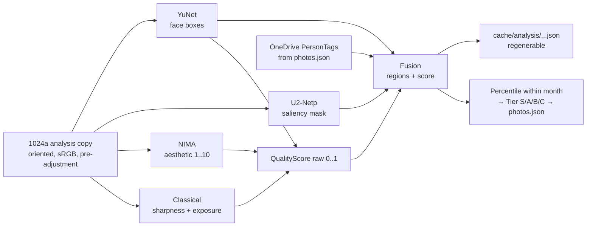

# 06 — Image Analysis

This doc specifies the analysis subsystem (`src/PhotoBook.Analysis`): the `IImageAnalyzer`
plug-in contract, the default local ONNX pipeline (YuNet faces, U2-Netp saliency, NIMA
aesthetics, classical sharpness/exposure), Focus Region fusion, `QualityScore` fusion into
within-month **S/A/B/C Tiers**, user overrides, the optional `AzureVisionAnalyzer`, and the
cache layout. Analysis is what makes R25 ("determine the interesting area … keep the important
parts visible") and R26 ("goodness of an image … relative size of the image container") work —
it is the perception layer under the north star: *the automatic layout being awesome is the most
important part*.

Related docs: [02-architecture.md](02-architecture.md) ·
[03-domain-model.md](03-domain-model.md) ·
[04-project-format-and-storage.md](04-project-format-and-storage.md) ·
[05-ingestion-and-photo-sources.md](05-ingestion-and-photo-sources.md) ·
[08-auto-layout-engine.md](08-auto-layout-engine.md) ·
[09-editor-ux.md](09-editor-ux.md) ·
[13-testing-strategy.md](13-testing-strategy.md)

## Where analysis sits

Analysis runs as background jobs queued at import time
([05-ingestion-and-photo-sources.md](05-ingestion-and-photo-sources.md)), current Chapter first.
Its input is the pre-adjustment, EXIF-oriented, sRGB **analysis copy** (`cache/thumbs/1024a/`,
long edge 1024 px) plus any `PersonTag` entries pulled from OneDrive. Its outputs are per-photo
**Focus Regions** and raw quality signals; a separate, analyzer-independent **fusion** step turns
those into the primary crop target and the Tier. The auto-layout engine
([08-auto-layout-engine.md](08-auto-layout-engine.md)) consumes both — regions drive smart-crop,
Tiers drive Slot size affinity — and the Photos tab surfaces both for inspection and override
(R25: "the user should be able to see there when looking at all the photos").



> **Decision:** Analysis is a plug-in: local ONNX models are the default and the product works
> fully offline; Azure AI Vision is an optional, opt-in adapter behind the same interface — see
> [ADR-0010](adr/0010-analysis-plugin-local-first.md) and
> [ADR-0005](adr/0005-local-ml-onnx-runtime.md).

## The IImageAnalyzer contract

Analyzers detect; they do not decide. Everything an analyzer returns is *raw material* —
region proposals and scalar signals. Fusion, weighting, percentiles, Tier assignment, and every
user-override rule live in shared code **outside** the analyzers, so swapping local for Azure
changes perception quality but never semantics.

```csharp
public interface IImageAnalyzer
{
    /// Stable id: "local-onnx" | "azure-vision". Part of every cache key.
    string Id { get; }

    /// Model-bundle / API version, e.g. "1.0". Bump ⇒ cached results stale.
    string Version { get; }

    Task<AnalysisResult> AnalyzeAsync(AnalysisInput input, CancellationToken ct);
}

public sealed record AnalysisInput(
    string ContentHash,                    // cache key + logging
    string AnalysisCopyPath,               // cache/thumbs/1024a/{hash}.jpg
    int PixelWidth, int PixelHeight,       // of the ORIGINAL (regions are normalized anyway)
    IReadOnlyList<PersonTag> PersonTags);  // from ingestion; empty on local-folder sources

public sealed record AnalysisResult(
    IReadOnlyList<FocusRegion> Regions,    // kinds face | saliency (person/user added in fusion)
    RawQualitySignals Signals);

public sealed record RawQualitySignals(
    double Aesthetic,        // 0..1  (NIMA mean, normalized; Azure adapter also fills this locally)
    double Sharpness,        // 0..1  (1 = crisp)
    double Exposure,         // 0..1  (1 = well exposed)
    int    FaceCount,
    double LargestFaceArea); // largest face box area / image area, 0..1
```

Contract rules:

- All rects are **normalized image coordinates** `[0,1]×[0,1]`, origin top-left, on the oriented
  image — identical convention to `FocusRegion` in the kernel and to `PersonTag.rect`.
- Analyzers are pure with respect to the project: they read the analysis copy, return a value,
  and never touch `photos.json`. Persistence is the caller's job (cache section below).
- `AnalyzeAsync` must be safe to run with parallelism = `Environment.ProcessorCount / 2`;
  ONNX Runtime sessions are shared and thread-safe, created once per app run.
- Cancellation is honored between model runs; a cancelled analysis writes nothing.
- Selection is a per-book setting in `book.json`: `"analysis": { "analyzerId": "local-onnx" }`
  (kernel §10). Azure endpoint + key live in `%APPDATA%` via DPAPI, never in the project folder.

## LocalOnnxAnalyzer: the default pipeline

Four detectors over the 1024 px analysis copy, all via ONNX Runtime (CPU execution provider;
DirectML is a v-next option, not a dependency). Model files live in the app's `models/` folder,
copied there at build time from the repository's [`models/`](../models/) directory.

> **Decision:** The redistributable models are **committed to the repository** —
> YuNet (MIT) and U²-Netp (Apache-2.0) — so face detection and saliency work with no setup step.
> `Directory.Build.targets` copies them next to the executable for the app and test projects only,
> under the opt-in `BundleOnnxModels` property, so class libraries do not carry 4.6 MB they never
> read. **NIMA is not bundled:** no maintained ONNX build exists (published implementations ship
> Keras or PyTorch weights, and the AVA-trained weights have unclear redistribution terms), so the
> aesthetic component falls back to the classical proxy below. Each model is discovered
> independently by file name, and a missing one degrades that stage only —
> `OnnxAvailability` reports a *partial* install naming the absent file rather than failing.
> Verified tensor shapes and provenance: [`models/README.md`](../models/README.md).

### YuNet — face detection

- Model: `face_detection_yunet_2023mar.onnx` (~230 KB). Input: analysis copy letterboxed to
  640 px long edge. Thresholds: score **0.7**, NMS IoU **0.3**.
- Output boxes → `FocusRegion { kind: "face" }` with
  `weight = 0.6·confidence + 0.4·min(1, faceArea/0.04)` — a confident, reasonably large face
  approaches weight 1.0; a tiny background face stays low.
- Also feeds `FaceCount` and `LargestFaceArea` into `RawQualitySignals`. This is a family
  memory book: faces are the subject, and both smart-crop and Tier scoring lean on them.

### U2-Netp — saliency

- Model: `u2netp.onnx` (~4.5 MB). Input 320×320; output saliency mask upsampled to the
  analysis copy.
- Mask → threshold at **0.5** → connected components → drop components under **2%** of image
  area → keep the **3** largest → bounding boxes as `FocusRegion { kind: "saliency" }`,
  `weight = meanMaskValue × min(1, area/0.15)`.
- Saliency is the safety net for photos with no faces (landscapes, food, the kid's drawing):
  something always proposes a subject, so smart-crop never falls back to blind center-crop.

### NIMA — aesthetic score

- Model: NIMA on a MobileNet backbone (`nima-mobilenet.onnx`, ~13 MB), AVA-trained. Input
  224×224 center-ish resize; output 10-bin score distribution.
- `Aesthetic = (mean(distribution) − 1) / 9` → 0..1. Only the mean is used; the distribution's
  variance is not (v1 keeps signals scalar and explainable).

### Classical sharpness and exposure

No model download can beat two cheap, robust classics for *technical* quality:

- **Sharpness:** variance of the Laplacian on the grayscale analysis copy;
  `Sharpness = clamp01(log10(1 + varLap) / 3.0)`. Motion blur and missed focus — the two
  biggest "why is this photo big?" complaints — crater this signal.
- **Exposure:** from the luma histogram: `clipLo` = fraction of pixels < 8/255, `clipHi` =
  fraction > 247/255, `mid` = mean luma.
  `Exposure = clamp01(1 − 2·clipLo − 2·clipHi − |mid − 0.5|)`. Blown skies and black mush both
  read as defects; a deliberately dark-but-unclipped photo is *not* punished (the `|mid−0.5|`
  term is gentle by design).

## FocusRegion fusion

Fusion assembles the per-photo region set the rest of the app sees. The canonical shape
(kernel §4):

```
FocusRegion { rect: Rect (normalized image coords), weight: 0..1,
              kind: user | person | face | saliency, personName?: string }
```

Priority: **`user` > `person` > `face` > `saliency`** — human intent beats a name, a name beats
an anonymous face, any face beats "something contrasty".

Fusion steps, in order:

1. **Inject `person` regions.** Every OneDrive `PersonTag` *with a rect* becomes
   `FocusRegion { kind: "person", personName, weight: 0.95 }`. Named people are, near-axiomatically
   for this product, the important part of the photo. Tags **without** rects (a possible
   people-tag spike outcome — see
   [05-ingestion-and-photo-sources.md](05-ingestion-and-photo-sources.md)) cannot be localized:
   they contribute a small quality bonus (below) and grid search/captioning value only.
2. **Dedupe person vs face.** A `face` region with IoU > 0.3 against a `person` region is
   dropped — it is the same face, and the person region carries the name.
3. **Merge within kind.** Regions of the same kind with IoU > 0.4 merge to their union rect,
   keeping the max weight (two overlapping saliency blobs are one subject).
4. **Apply user edits.** User-drawn regions (`kind: "user"`, weight 1.0) come from
   `photos.json`, as do per-region suppressions (a derived region the user deleted stays
   deleted — recorded as a suppression entry, since re-analysis would otherwise resurrect it).
5. **Primary region** = highest weight in the highest non-empty priority kind. The auto-layout
   engine's smart-crop rule (owned by [08-auto-layout-engine.md](08-auto-layout-engine.md),
   stated canonically in kernel §4) then chooses the maximal crop window of the Slot's aspect
   that contains the primary Focus Region — merging overlapping regions — and emits it as a
   `CropState`. Analysis produces regions; it never produces crops.

The Photos tab renders all regions as overlay outlines on each photo (R25: pre-processing the
user "should be able to see … when looking at all the photos"), color-coded by kind, with the
primary emphasized.

## QualityScore fusion and Tiers

R26 wants "a determining of the goodness of an image *compared to other images*" that drives
"the relative size of the image container it gets put into". Two-stage design: an absolute raw
score, then a **relative** rank within the month.

**Raw score** (0..1), fused from the signals:

```
faceBonus = min(1, 0.25·min(FaceCount, 3) + 0.5·min(1, LargestFaceArea / 0.08))
          + (0.1 if any rect-less PersonTag present, capped at 1)

raw = 0.50·Aesthetic + 0.25·Sharpness + 0.15·Exposure + 0.10·faceBonus
```

Weights are v1 defaults, tuned during M1 against real family sets (golden tests in
[13-testing-strategy.md](13-testing-strategy.md) pin the behavior once tuned).

**Percentile within the month.** Raw scores are only comparable in context: a phone-snap
December competes with December, not with the golden-hour vacation shots of July. Each photo's
`raw` is ranked against all **non-excluded** photos of its Chapter (month), giving a percentile.

**Tiers** (kernel §4) by percentile, rank-ceiling at the boundaries:

| Tier | Percentile band | Layout meaning ([08-auto-layout-engine.md](08-auto-layout-engine.md)) |
|---|---|---|
| **S** | top 10% | hero shots — full-bleed and largest Slots |
| **A** | next 25% | large/medium Slots |
| **B** | next 45% | standard grid Slots |
| **C** | bottom 20% | small Slots; engine prefers not to feature them |

Tier is stored on the Photo in `photos.json` (`tier`, plus `qualityRaw` for the inspector UI);
it is an input to layout and must be stable across cache deletion. Recomputation triggers:
photo re-dated across months, photo excluded/re-included (the pool changed), analysis re-run
(model/analyzer version bump), or re-import of modified source bytes — the full trigger matrix
is in [05-ingestion-and-photo-sources.md](05-ingestion-and-photo-sources.md).

## User overrides

Automation proposes; the user disposes. Both override channels are permanent user intent,
stored in `photos.json`, never in cache, and never silently recomputed:

- **Focus edit (R25):** in the Photos tab the user can draw new regions (`kind: "user"`,
  weight 1.0), resize/move them, and delete any region including derived ones (persisted as
  suppressions, step 4 above). User regions outrank everything in fusion, so a focus fix
  immediately improves every future auto-crop of that photo. Editing focus does not touch
  Pinned pages; unpinned placements pick up new crops on the next layout run.
- **Promote/demote (R26):** one-click Tier bump in the grid sets
  `userTierOverride: "S" | "A" | "B" | "C"`. Overrides are **absolute** (kernel §4): the photo
  simply *is* that Tier from then on — never re-derived, immune to percentile churn from
  re-dating, exclusion changes, or analyzer upgrades. The computed tier is retained alongside
  for display ("B, promoted to S") and for a possible future "clear override" affordance.
- Overrides survive re-sync, re-import, and cache deletion by construction — they live where
  user intent lives.

## AzureVisionAnalyzer: the optional cloud adapter

R27: "Ideally all the image detection algorithms above would be local, but if better results can
be gotten by using AI resources in Azure then I want to do that."

- **What it is:** Azure AI Vision **Image Analysis 4.0** behind the same `IImageAnalyzer`
  contract (`Id = "azure-vision"`), enabled per book:
  `"analysis": { "analyzerId": "azure-vision" }`.
- **What it adds over local:** markedly better *people detection* (profiles, partial occlusion,
  toddlers mid-motion — exactly this product's corpus) mapped to `face` regions, and
  higher-quality subject proposals via the service's smart-crop/salient-region results mapped to
  `saliency` regions. Its caption/tag output is stored in the cache for future search/caption
  suggestions but is unused in v1.
- **What stays local:** aesthetics and technical quality. Azure does not score "is this a good
  photo", so the adapter *composes*: Azure for regions, local NIMA + classical metrics for
  `RawQualitySignals`. Fusion and Tiers are shared code, so books analyzed either way behave
  identically downstream.
- **When to prefer it:** the local pipeline misses subjects in busy scenes, non-frontal faces
  go undetected, or crops keep needing manual focus fixes. The honest recommendation: run
  local first (it is free, private, offline); flip one book to Azure if its results annoy you,
  and re-analysis of the whole book is one background pass.
- **Cost:** Image Analysis is ~US$1.00–1.50 per 1,000 transactions at v1 volumes; one call per
  photo ⇒ a full 2,000-photo year costs on the order of **$2–3** per full re-analysis. Trivial
  in money, but not in principle — hence opt-in.
- **Privacy:** enabling it sends the 1024 px analysis copies (not originals, not the journal)
  to the user's own Azure resource in their chosen region. Nothing leaves the machine unless
  the user explicitly turns this on; local-first is the default and the fallback
  ([ADR-0010](adr/0010-analysis-plugin-local-first.md)). Endpoint and key are stored
  DPAPI-protected under `%APPDATA%\PhotoBook`, never in the (shareable) project folder.
- **Failure mode:** network/quota errors leave existing results in place and surface one
  aggregate warning; the book keeps working on whatever analysis it has. The adapter retries
  with backoff (3 attempts) and honors cancellation like any analyzer.

## Caching: everything regenerable

Per kernel §5, `cache/` is 100% regenerable and **user intent never lives in cache**:

```
cache/analysis/{contentHash}.{analyzerId}.json
```

```jsonc
{
  "schemaVersion": 1,
  "analyzerId": "local-onnx",
  "analyzerVersion": "1.0",
  "regions": [ /* derived FocusRegions only: face + saliency (+ Azure-mapped) */ ],
  "signals": { "aesthetic": 0.62, "sharpness": 0.81, "exposure": 0.90,
               "faceCount": 2, "largestFaceArea": 0.06 }
}
```

- **Key includes analyzer id and version**: switching analyzers or shipping updated models makes
  old entries stale by key mismatch, not by bookkeeping; stale entries are recomputed in the
  background and orphans are garbage-collected on project open.
- What is cached: derived regions and raw signals — expensive to compute, safe to lose.
- What is *not* cached: user Focus Regions, suppressions, `tier`, `userTierOverride`, person
  tags — all `photos.json`. Deleting `cache/` costs one background re-analysis pass and loses
  nothing the user did.
- Invalidation by edits follows the cache invalidation matrix in
  [05-ingestion-and-photo-sources.md](05-ingestion-and-photo-sources.md): geometry adjustments
  invalidate analysis (pixels moved); exposure/color/finish adjustments do not (analysis reads
  the pre-adjustment copy, so fixing a photo never silently re-tiers it).

## Performance budget

Kernel §7 target: **full-year analysis < 15 minutes in the background on first import** (2,000
photos), with layout usable for the current month much sooner.

- Per-photo budget on the 1024 px copy, single CPU thread: YuNet ≤ 60 ms, U2-Netp ≤ 150 ms,
  NIMA ≤ 80 ms, classical ≤ 20 ms, fusion + I/O ≤ 40 ms ⇒ **≤ 350 ms/photo**.
- 2,000 photos ⇒ ~12 min single-threaded; the job queue runs analysis at parallelism
  `ProcessorCount / 2`, so a typical 8-core machine finishes in ~3–4 min — comfortably inside
  budget, with headroom for slower hardware.
- Priority order mirrors thumbnails: current Chapter first, then outward by month distance;
  the Photos grid shows a per-photo "analyzing…" shimmer until regions/Tier arrive.
- Determinism: identical input bytes + analyzer version ⇒ identical output (ONNX Runtime CPU EP
  is deterministic; classical metrics trivially so). This keeps the layout engine's
  same-inputs-same-book guarantee intact end to end, and lets
  [13-testing-strategy.md](13-testing-strategy.md) snapshot analysis outputs as goldens.
