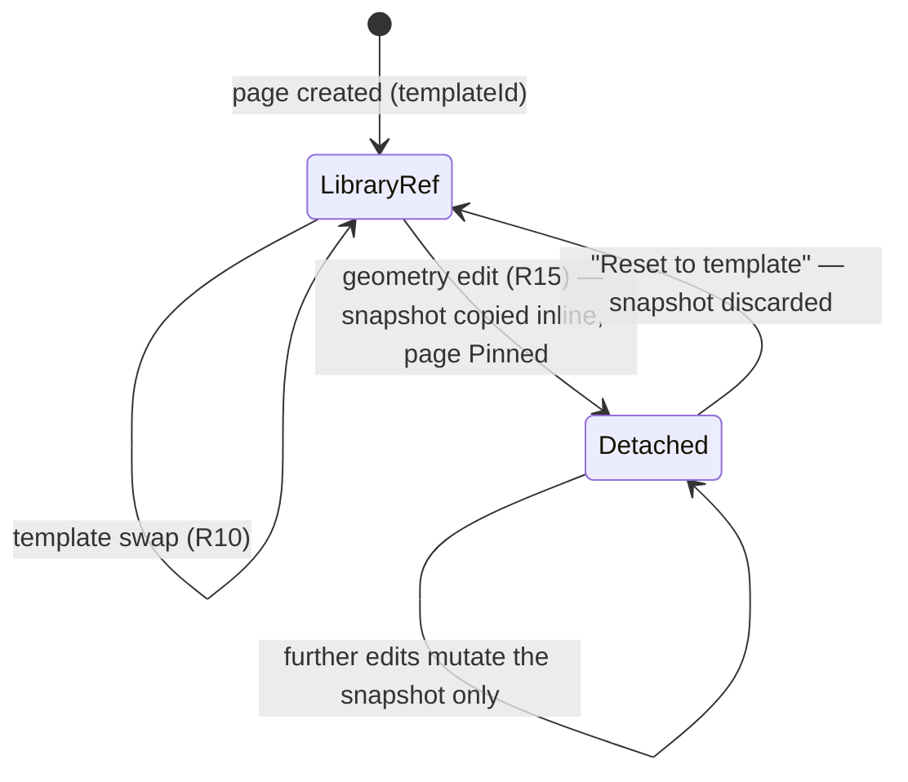

# 07 — Layout Template System

This doc is the full specification of PhotoBook's page templates: the JSON schema every template
file must satisfy, the semantics of image Slots and text slots, caption policies, deliberate
overlap and z-order, the left/right mirroring rule (R20), multi-day section templates (R28),
matched spread pairs (R22), the detach-on-edit rule that keeps the library immutable, the concrete
v1 library of ~50 templates, and the linter that keeps every template printable. The auto-layout engine
([08-auto-layout-engine.md](08-auto-layout-engine.md)) consumes these templates as pure input;
the editor ([09-editor-ux.md](09-editor-ux.md)) swaps and detaches them; styles
([10-styles-and-typography.md](10-styles-and-typography.md)) control how their text renders.

Related docs: [03-domain-model.md](03-domain-model.md) ·
[04-project-format-and-storage.md](04-project-format-and-storage.md) ·
[08-auto-layout-engine.md](08-auto-layout-engine.md) · [09-editor-ux.md](09-editor-ux.md) ·
[10-styles-and-typography.md](10-styles-and-typography.md) · [12-pdf-export.md](12-pdf-export.md)

## Design principles

1. **Templates are data, not code.** A `Template` is a JSON document; adding a layout to the
   library must never require recompiling layout logic. All layout intelligence (which template,
   which photo in which Slot, how to crop) lives in the engine, not in the template.
2. **Normalized geometry.** All rects are normalized `[0,1] × [0,1]` over the single-page **trim**
   box, origin top-left (kernel §3). The same template renders identically at screen preview and
   300 DPI PDF because both go through the same SkiaSharp draw code.
3. **Templates propose; Styles decide appearance.** A template says *where* text and photos go.
   Fonts, sizes, colors, and image borders come from the `Style` cascade (R23) — a template never
   embeds a font name or a color.
4. **The library is immutable.** User edits to a page's geometry produce a Detached inline
   snapshot in the chapter file; library templates are never mutated (see
   [Detach-on-edit and template swap](#detach-on-edit-and-template-swap)).
5. **A page is full unless it is deliberately empty.** R20 asks layouts to use *most* of the space,
   and the first real month said the v1 library did not: it averaged 0.56 of the page covered and a
   lone photo rendered as a stamp in a black field. The library now averages **0.79** with most
   standard templates in the **0.75–0.92** band and every single-photo standard template a hero at
   ≥ 0.72. Negative space stays a feature — around **8** standard layouts sit under 0.72 with
   generous asymmetric margins — but it is now a choice a template makes, not the default, and the
   engine rations those airy pages instead of leaning on them
   ([08-auto-layout-engine.md](08-auto-layout-engine.md)).
6. **Overlap is a design tool, and it is declared.** Photos may overlap each other and text may sit
   on a photo, but only when the template says so and the geometry says how — see
   [Deliberate overlap](#deliberate-overlap-layers-and-scrims). Undeclared overlap is an authoring
   accident and the linter treats it as one.

> **Decision:** Templates ship as embedded JSON resources in `PhotoBook.Core`
> (`Templates/{id}.json`, one file per template), loaded at startup into an in-memory
> `TemplateLibrary`, linted, and sorted by `id` before being handed to the engine. Rationale:
> `PhotoBook.Engine` must stay pure and I/O-free (kernel §12), the library must version with the
> app (a project references templates by `id`), and deterministic ordering feeds the engine's
> same-inputs-same-book guarantee (kernel §7). Storage of *detached* snapshots follows
> [ADR-0007](adr/0007-project-storage-json-folder.md).

Useful normalized constants for the default `11x8.5-landscape` page (kernel §3). Divide inches by
11 for x-axis values and by 8.5 for y-axis values:

| Physical quantity | x (÷ 11) | y (÷ 8.5) |
|---|---|---|
| Bleed 0.125 in | 0.0114 | 0.0147 |
| Safe margin 0.375 in | 0.0341 | 0.0441 |
| Gutter caution 0.5 in | 0.0455 | — |
| Minimum Slot edge 1.5 in | 0.1364 | 0.1765 |
| Below-caption band 0.30 in | — | 0.0353 |

## Template JSON schema

`schemaVersion: 1`. System.Text.Json, camelCase (kernel §5). Complete annotated example — this is
the kernel §6 example `t-04-text-a` fully worked:

```jsonc
{
  "schemaVersion": 1,
  "id": "t-04-text-a",                  // stable string id; never reused or renamed
  "name": "Four up with journal",
  "pageSize": "11x8.5-landscape",
  "kind": "standard",                   // standard | monthTitle | fullBleed | multiDay | spreadPair
  "photoCount": 4,                      // 1..8 (R20); must equal total slot count
  "mirrorable": true,                   // engine may mirror horizontally for left pages (R20)
  "overlaps": false,                    // opt-in to deliberate overlap; default false, omit when false
  "slots": [
    { "id": "s1", "rect": { "x": 0.018, "y": 0.024, "w": 0.578, "h": 0.592 },
      "aspect": 1.2635, "aspectTolerance": 0.35,
      "tierAffinity": "S", "captionPolicy": "below", "bleed": false },
    { "id": "s2", "rect": { "x": 0.614, "y": 0.024, "w": 0.364, "h": 0.333 },
      "aspect": 1.4146, "aspectTolerance": 0.35,
      "tierAffinity": "A", "captionPolicy": "none", "bleed": false },
    { "id": "s3", "rect": { "x": 0.614, "y": 0.373, "w": 0.364, "h": 0.333 },
      "aspect": 1.4146, "aspectTolerance": 0.35,
      "tierAffinity": "B", "captionPolicy": "none", "bleed": false },
    { "id": "s4", "rect": { "x": 0.018, "y": 0.634, "w": 0.578, "h": 0.311 },
      "aspect": 2.4051, "aspectTolerance": 0.35,
      "tierAffinity": "B", "captionPolicy": "none", "bleed": false }
  ],
  "textSlots": [
    { "id": "t1", "rect": { "x": 0.614, "y": 0.72, "w": 0.35, "h": 0.225 },
      "role": "journal", "align": "left" }
  ],
  "pair": null,                         // spreadPair only: { "pairId": "sp-a", "side": "left" }
  "sections": null                      // multiDay only: see Multi-day section templates
}
```

Top-level fields:

| Field | Type | Rules |
|---|---|---|
| `schemaVersion` | int | Required. Currently `1`. Loader rejects unknown major versions. |
| `id` | string | Required, unique library-wide, stable forever (chapter files reference it). Naming convention: `t-<NN>-<text\|notext>-<letter>` for standard (`NN` = photoCount, zero-padded), `t-01-fb-<letter>` full-bleed, `t-title-<letter>` month title, `t-md-<letter>` multi-day, `t-sp-<letter>-left/-right` spread pairs. |
| `name` | string | Required. Human display name shown in the layout picker. |
| `pageSize` | string | Required. Page-size id from `book.json` (R19). v1 ships `11x8.5-landscape` only; a template applies only to pages whose size id matches exactly. New sizes get their own template variants — no automatic re-stretching across aspect families. |
| `kind` | enum | `standard \| monthTitle \| fullBleed \| multiDay \| spreadPair` (kernel §6). Drives engine eligibility: `monthTitle` only for the Chapter title page (R24), `multiDay` only for merged Day Groups (R28), `spreadPair` only when both facing pages are available. |
| `photoCount` | int | 1..8 (R20). Must equal `slots.length` (`multiDay`: total across sections; `spreadPair`: this side's slots, with each `spanId` slot counted once per pair). |
| `mirrorable` | bool | Required. See [Mirroring](#mirroring-one-template-left-and-right-pages). Must be `false` for `spreadPair`. |
| `overlaps` | bool | Optional, default `false`; omitted when false. The template's opt-in to [deliberate overlap](#deliberate-overlap-layers-and-scrims) — image slots that intersect, or text placed on a photo. Overlap without this flag is a linter error (L2, L3). |
| `slots` | ImageSlot[] | Required, ≥ 1. |
| `textSlots` | TextSlot[] | Required, may be empty (`[]`) — textless templates are legal and encouraged (R20). |
| `pair` | object? | `spreadPair` only: `{ "pairId": string, "side": "left" \| "right" }`. |
| `sections` | Section[]? | `multiDay` only. |

Unknown fields are a load error for library templates (they indicate a version skew) but are
preserved round-trip on detached snapshots for forward compatibility.

## ImageSlot semantics

| Field | Type | Rules |
|---|---|---|
| `id` | string | Unique in template. Convention `s1..sN` in reading order (top-left → bottom-right); the Unplaced-bin fill order and empty-slot amber flags (R14) follow this order. |
| `rect` | `{x,y,w,h}` | Normalized over the trim box. Must lie within `[0,1]²` unless `bleed: true`. |
| `aspect` | double | The Slot's **physical** width/height in inches: `aspect = (w × 11) / (h × 8.5)` for the default page. Declared redundantly so authors and the assignment scorer never re-derive it; the linter enforces consistency (rule L5). |
| `aspectTolerance` | double | 0..0.6. A photo with native aspect `p` fits with zero aspect penalty when `max(p/aspect, aspect/p) ≤ 1 + aspectTolerance`; beyond that, the engine's crop-loss cost ramps up (scoring formula in [08-auto-layout-engine.md](08-auto-layout-engine.md)). Default 0.35. |
| `tierAffinity` | enum | `S \| A \| B \| C \| any`. **Soft** preference, never a hard filter: the Hungarian assignment adds cost for tier mismatch (a Chapter may simply have no S-tier photos left). Authoring rule of thumb: Slots covering ≥ 30% of the page get `S`, 12–30% get `A`, 5–12% get `B`, thumbnails get `C` or `any`. This is how Tier drives photo size on the page (R26). |
| `captionPolicy` | enum | `none \| below \| overlay` — see [Caption policies](#caption-policies). |
| `bleed` | bool | Default `false`. When `true`, the rect may cross the trim edge and must extend fully to the bleed box edge on every side it crosses (bleed box = trim + 0.125 in per outer edge, i.e. x ∈ [−0.0114, 1.0114], y ∈ [−0.0147, 1.0147]). No partial-bleed slivers. |
| `layer` | int | Optional, `0..9`, default `0`; omitted when 0. Paint order: slots draw in ascending layer, ties in authored order, so a higher layer sits **on top**. Two slots may only overlap when their layers differ (L2). `Template.SlotsInPaintOrder` is the ordering the renderer consumes; `slots` itself stays in reading order because assignment, bin fill and empty-slot flags follow that. |
| `spanId` | string? | `spreadPair` templates only: slots in the left and right templates sharing a `spanId` render **one** photo continuously across the gutter (R18). |

A full-bleed single-photo slot is exactly:

```jsonc
{ "id": "s1", "rect": { "x": -0.0114, "y": -0.0147, "w": 1.0228, "h": 1.0294 },
  "aspect": 1.286, "aspectTolerance": 0.25, "tierAffinity": "S",
  "captionPolicy": "overlay", "bleed": true }
```

The photo placed in a Slot always cover-fills the rect via `CropState { zoom, offsetX, offsetY }`
(kernel §4) — auto-layout emits a CropState from Focus Regions (R25) and the user hand-tweaks the
*same* CropState by panning/zooming (R9, R13); `zoom < 1` letterboxes and the black page background
shows through (R9). Faces stay inside the safe margin and out of the gutter caution zone via
smart-crop, not via template geometry — Slots themselves may run to the trim edge.

## TextSlot semantics

| Field | Type | Rules |
|---|---|---|
| `id` | string | Unique in template. Convention `t1..tN`. |
| `rect` | `{x,y,w,h}` | Must lie fully inside the safe area **and** clear the gutter caution zone: `x ≥ 0.0455`, `x + w ≤ 0.9659`, `y ≥ 0.0441`, `y + h ≤ 0.9559` (as authored — templates are authored as right pages, see Mirroring). |
| `role` | enum | `journal \| caption \| monthTitle` (kernel §6). `journal` holds a day's journal text; `caption` is a rare standalone caption block placed beside an image; `monthTitle` holds the Chapter title (R24). Any role may sit on a photo when the template declares it and the slot takes a `scrim`; `monthTitle` additionally gets the scrim automatically at render time (doc 10 §7). |
| `align` | enum? | `left \| center \| right`. Default `left` for `journal`/`caption`, `center` for `monthTitle`. |
| `attachedTo` | string? | `caption` role only: the `id` of the ImageSlot this caption belongs to. |
| `scrim` | bool | Optional, default `false`; omitted when false. Declares that this text sits **on** a photo and renders on the [doc 10 §4](10-styles-and-typography.md) scrim. Required for any text slot that intersects an image slot (L3) — see [Deliberate overlap](#deliberate-overlap-layers-and-scrims). |

What a TextSlot does **not** contain: font family, size, color, line spacing. All of that comes
from the Style cascade — journal text defaults to Source Serif 4 10.5 pt, captions Source Sans 3
8.5 pt, month titles Playfair Display 64 pt, all overridable globally (R23, R24); see
[10-styles-and-typography.md](10-styles-and-typography.md).

Text capacity is *derived*, not declared: the engine measures whether a Day Group's journal text
fits the slot at current style metrics, and text-fit is a **hard filter** in template scoring.
There is no auto font-shrink: a day's journal text is atomic — it may span the two pages of one
Spread but never crosses Spreads; if it can't fit, the engine must pick a roomier template
(kernel §9, [08-auto-layout-engine.md](08-auto-layout-engine.md)). A page whose template has a
journal slot but whose day has no journal entry renders the slot empty — black negative space, by
design (R20).

## Caption policies

Most photos have no caption; some do (R5). Captions are **not** authored as TextSlots — each
ImageSlot declares a `captionPolicy` telling the renderer where a caption goes *if* the placed
photo has one:

- **`none`** — this Slot cannot show a caption. If the user types a caption for a photo placed
  here, the editor warns and offers to move the photo to a captionable Slot
  ([09-editor-ux.md](09-editor-ux.md)).
- **`below`** — a 0.30 in caption band (normalized h = 0.0353) is reserved at the bottom of the
  Slot rect *only when a caption is present*; the image cover-fills the remaining
  `h − 0.0353`. No caption → the image gets the full rect. Max two lines, ellipsis beyond;
  metrics in [10-styles-and-typography.md](10-styles-and-typography.md).
- **`overlay`** — the caption renders inside the image on a bottom scrim: black vertical gradient
  0% → 60% opacity, scrim height 18% of the Slot height with a 0.5 in minimum. This is the policy
  for full-bleed heroes where a below-band is impossible (R5). Scrim spec is owned by
  [10-styles-and-typography.md](10-styles-and-typography.md).

Authoring guidance: give `below` to large Slots with room to spare, `overlay` only to `bleed`
slots and heroes, `none` to thumbnails under 2.5 in wide (an 8.5 pt caption under a tiny image
reads as clutter) **and to any Slot that carries an overlaid TextSlot** — a journal block on a
scrim plus an overlay caption on the same photo is two pieces of text fighting for the same corner.

## Deliberate overlap: layers and scrims

The v1 library shipped with zero overlapping slots and one text-over-photo template, and the pages
read flat: rows of rectangles in a grid, each one boxed off from the next. Overlap is what turns a
grid into a composition, so it is now a first-class part of the schema — but a *declared* one, because
the same geometry produced by accident is a bug.

> **Decision:** Overlap is opt-in per template (`"overlaps": true`) and ordered per slot
> (`"layer": n`). Rationale: the flag separates intent from accident so the linter can still catch a
> slot that slid under its neighbour during an edit, and the layer gives the renderer a defined paint
> order that does not depend on `slots` being in reading order — which it must stay in, because slot
> assignment, the Unplaced-bin fill order and the amber empty-slot flags all follow it.

**Photo over photo.** Give the covering slot a higher `layer`. The paint order the renderer consumes
is `Template.SlotsInPaintOrder` — ascending layer, ties in authored order — never `slots` directly.
The library uses three moves:

- a small photo overlapping the **corner** of a larger one (`t-02-notext-b`, `t-02-text-c`,
  `t-03-notext-c`, `t-04-notext-c`),
- a stacked pair with a deliberate **offset** (`t-02-text-d`, `t-03-notext-d`'s diagonal cascade),
- a rail or centre panel biting into the **outer third** of what it sits on (`t-05-notext-b`,
  `t-08-notext-b`).

**Keep faces safe.** Smart-crop centres the subject in its slot (R25), so an overlap that lands in the
middle of the covered slot hides exactly what the crop worked to keep. Overlap corners and outer
thirds; L13 warns when the shared area's centre falls in the middle ninth of the covered slot, and L2
errors when the covered slot loses more than 35% of itself.

**Text over photo.** A TextSlot may sit on an ImageSlot when the template declares `overlaps` and the
text slot declares `scrim: true`, which is what gets it the doc 10 §4 gradient. Three things stay
errors (L3), because each one is unreadable rather than expressive:

- no scrim — white text on an unknown photo is a coin flip,
- the block hanging off its photo, which would drag the scrim onto the black page background,
- a block covering more than half its photo, which is a text box with wallpaper behind it.

The block must also sit on exactly one photo: a scrim spanning two slots would show the gap between
them through the gradient. Thirteen templates place text this way — the hero singles, the multi-day
`t-md-a`, the month titles `t-title-a`/`t-title-d`, and the gallery spread — always on the quiet
outer or gutter-side edge of the photo, never across its middle. What the renderer draws behind them
is the **panel scrim** of [10-styles-and-typography.md](10-styles-and-typography.md) §4: sized to the
words rather than to the slot, feathered on all four sides, clipped to the photo it belongs to.

**How an overlap reads as deliberate.** Geometry alone does not do it: two frames of similar tone
simply merge at the seam, and the result looks like a collision rather than a composition. So a slot
above `layer: 0` casts a soft **lift** — a 7 pt feathered shadow offset 2 pt down, at 55% — onto
whatever is beneath it, drawn immediately before its photo so only the offset skirt shows.

> **Decision:** **The lift is geometry, not style.** Layer-zero slots never get one. An edge treatment
> on *every* photo is `imageBorder`, which is the user's to switch on across the whole book (R23,
> doc 10 §5); this is the page telling the reader which frame is on top, and it exists only in the
> templates that opted into overlap. Like the scrims, it is built from flat fills and plain gradients
> so `SKDocument.CreatePdf` writes it natively (ADR-0003) — a blur would rasterize on the PDF path and
> make export diverge from the preview.

Both behaviours are pinned by pixel assertions rather than by a golden page, because a golden compares
the emitted page and would pass whether or not the renderer honored any of this — see
[13-testing-strategy.md](13-testing-strategy.md) "Pixel assertions for the things a golden cannot see".

## Mirroring: one template, left and right pages

> **Decision:** Every template is authored as a **right page** (gutter edge at `x = 0`); when the
> engine or the user places a `mirrorable: true` template on a left page, geometry is mirrored
> horizontally and automatically. Rationale (R20): one authored file serves both page sides, the
> visual weight of a layout stays biased toward the outer edge on both sides of a Spread, and
> gutter-safety constraints can be linted against a single known gutter edge.

The transform, applied at load time to produce the left-page variant (never persisted):

```
mirror(rect)  = { x: 1 − rect.x − rect.w, y: rect.y, w: rect.w, h: rect.h }
```

- Applied to every Slot and TextSlot rect; `bleed` slots mirror into the opposite bleed edge.
- Slot/TextSlot `id`s, ordering, `aspect`, `tierAffinity`, and `captionPolicy` are unchanged —
  a photo placement (`slotId` → photo + CropState) survives a page moving sides untouched, except
  the engine recomputes CropState pan clamping (slot geometry moved, image didn't).
- Text `align` is **not** flipped: journal stays left-aligned regardless of page side; reading
  direction beats symmetry.
- `mirrorable: false` templates render identically on both sides. Use it for symmetric layouts
  where mirroring is a visual no-op (centered grids) and for `spreadPair` sides (mandatory).
- v1 has no manual mirror toggle; the page's side (even page index = left) decides.

## Multi-day section templates

Sparse days must share a page: 2–3 days with 2–3 photos each and short journal entries combine
onto one page, and each day's photos + text stay together as a unit (R28). `kind: "multiDay"`
templates express this with `sections`:

```jsonc
"sections": [
  { "id": "d1", "slotIds": ["s1", "s2"], "textSlotIds": ["t1"] },
  { "id": "d2", "slotIds": ["s3"],       "textSlotIds": ["t2"] },
  { "id": "d3", "slotIds": ["s4"],       "textSlotIds": [] }
]
```

| Section field | Rules |
|---|---|
| `id` | Unique in template; convention `d1..dN` in day order = reading order (top→bottom as authored). |
| `slotIds` | ≥ 1 ImageSlot ids. Every Slot in a multiDay template belongs to exactly one section (linter L8). |
| `textSlotIds` | 0..1 `journal`-role TextSlot ids. Empty means this section's day shows photos only (its journal, if any, makes the template ineligible for that day). |

Engine contract ([08-auto-layout-engine.md](08-auto-layout-engine.md)): the DP page partitioner
may map 2–3 *consecutive* Day Groups onto one multiDay page; Day Group *k* fills section *k* in
order. Hard filters per section: the day's placed-photo count equals `slotIds.length`, and the
day's journal text fits the section's text slot (or the section has no text slot and the day has
no journal). Sections never share photos or text across days — that is the R28 invariant, enforced
structurally rather than by scoring. v1 ships sections separated by whitespace only (≥ 0.15 in
between section bounding boxes); no rule lines — the black background provides separation.

## Spread pairs

R22: facing pages should be *considered* together, yet each Page stays independently editable, and
the whole feature may slip — it lands in **M5** ([14-roadmap.md](14-roadmap.md)). A Spread is a
view over two facing pages, never a stored entity (kernel §4), so spread pairs are two ordinary
templates linked by metadata:

```jsonc
// t-sp-a-left.json                          // t-sp-a-right.json
"kind": "spreadPair",                        "kind": "spreadPair",
"mirrorable": false,                         "mirrorable": false,
"pair": { "pairId": "sp-a", "side": "left" } "pair": { "pairId": "sp-a", "side": "right" }
```

- **Pairing is a soft bonus, not a constraint.** The engine's template scorer awards a pair bonus
  when both pages of a Spread take the two sides of one `pairId`. If the user later swaps or
  detaches one side, the other side keeps its template — nothing breaks, no warning beyond the
  normal re-layout preview (R22: "pages editable and layouts changeable independently").
- **Gutter-spanning photos** (R18): slots sharing a `spanId` across the two sides hold the *same*
  photo. The engine computes one CropState over the virtual 22 × 8.5 in Spread canvas and each
  page renders its half; the centerline falls inside the photo, which accepts center loss, while
  smart-crop keeps faces ≥ 0.5 in from the centerline (kernel §3). In `photos → slots`
  accounting the spanned photo counts once.
- Non-spanning pair templates (matched left/right compositions) are just aesthetic bookends —
  symmetric weight around the gutter.

> **Decision:** No stored `Spread` entity and no hard left/right coupling — pairing lives entirely
> in template metadata plus an engine scoring bonus. Rationale: R22 explicitly demands independent
> page editing; a coupled entity would force cascade edits and conflict with Pinned/Detached
> semantics. Storage stays per-page per [ADR-0007](adr/0007-project-storage-json-folder.md).

## Detach-on-edit and template swap

Two different user actions, two different behaviors:

**Template swap (not a detach).** Picking a different library template for a page (R10) keeps the
page referencing the library by `templateId`. Photos re-flow into the new Slots in Slot order
(`s1..sN`) preserving photo order; smart-crop recomputes each CropState for the new Slot geometry
(user pan/zoom is Slot-relative and does not survive a shape change). Fewer Slots than photos →
overflow photos go to the Unplaced bin (R10). More Slots than photos → extra Slots render empty
and are flagged amber (R14), fillable from the Unplaced or Upcoming bin (R12, R13).

**Geometry edit (detach).** Any per-page layout modification — move/resize a Slot, add or delete
an image or text container (R15) — copies the template JSON *inline* into the page record in the
chapter file as a `detachedTemplate` snapshot; the page state becomes **Detached** (which implies
**Pinned** — re-layout never touches it, kernel §7). The snapshot drops `id` and gains
`"basedOn": "<original id>"`. The library template is never mutated; other pages using it are
unaffected. Snapshot schema = template schema, linted with editor-grade severity (errors become
badges, never save blockers — see [Template linter](#template-linter)).



"Reset to template" restores `basedOn` as the live `templateId` and re-runs slot assignment; it
does not clear the Pinned flag (the user still touched the page — only "auto-layout rest of
chapter" with the page explicitly unpinned regenerates it, R16).

## The v1 template library

Per kernel §6 the target is **~50 templates**: 54 single-page templates in the category counts
below, plus 3 spread pairs (6 template files, counted as 3 units). Every id follows the naming
convention from the schema table. `Text` = has a journal TextSlot. `Mir` = `mirrorable`.
`Cov` = slot coverage, the union of the slot rects clipped to trim (what L10 bounds and what the
engine's `S_coverage` scores). `Ov` = declares `overlaps`: **P** photo over photo, **T** text on a
scrim over a photo.

Library-wide: mean coverage **0.79** (was 0.56), 32 of 43 standard templates in the 0.75–0.92 band,
21 templates using overlap, 8 standard templates deliberately airy under 0.72.

### 1-photo — 6 (incl. full-bleed)

Every single-photo standard template is a **hero**: a lone photo is a statement, never a stamp in
the middle of a black page.

| Id | Kind | Text | Mir | Cov | Ov | Description |
|---|---|---|---|---|---|---|
| `t-01-fb-a` | fullBleed | no | no | 1.00 | | Full-bleed hero, overlay caption on bottom scrim (R5). |
| `t-01-fb-b` | fullBleed | no | no | 1.00 | | Full-bleed hero, no caption — pure image page. |
| `t-01-text-a` | standard | yes | yes | 0.89 | T | Photo across the whole page, journal on a scrim in its outer-bottom quarter. |
| `t-01-text-b` | standard | yes | yes | 0.87 | T | Hero at the outer edge, journal column on a scrim over its quiet gutter-side third. |
| `t-01-notext-a` | standard | no | yes | 0.87 | | One hero, generous even margin, overlay caption available. |
| `t-01-notext-b` | standard | no | yes | 0.86 | | One hero pushed to the gutter side, a deliberate outer band of black (R20). |

### 2-photo — 8

| Id | Text | Mir | Cov | Ov | Description |
|---|---|---|---|---|---|
| `t-02-text-a` | yes | yes | 0.76 | T | Two landscapes stacked wide, journal on a scrim over the lower one's inner third. |
| `t-02-text-b` | yes | yes | 0.87 | T | Full-height side-by-side pair, journal on a scrim over the gutter-side photo. |
| `t-02-text-c` | yes | yes | 0.74 | P | Wide hero with a smaller photo overlapping its outer-bottom corner, journal beneath. |
| `t-02-text-d` | yes | yes | 0.72 | P | Tall portrait outer overlapping a landscape inner, journal under the landscape. |
| `t-02-notext-a` | no | no | 0.84 | | Two equal landscapes side by side in a full-height band. |
| `t-02-notext-b` | no | yes | 0.78 | P | Dominant photo with a small inset overlapping its outer-bottom corner. |
| `t-02-notext-c` | no | no | 0.83 | | Two portraits as a full-height diptych. |
| `t-02-notext-d` | no | no | 0.84 | | Two edge-to-edge panorama strips (aspect ≈ 2.9). |

### 3-photo — 8

| Id | Text | Mir | Cov | Ov | Description |
|---|---|---|---|---|---|
| `t-03-text-a` | yes | yes | 0.82 | | Full-height hero outer, two stacked inner, journal in the inner-bottom corner. |
| `t-03-text-b` | yes | no | 0.54 | | Three across the top with a wide centre, roomy journal band below — airy, text-led. |
| `t-03-text-c` | yes | yes | 0.86 | T | Wide hero over two below, journal on a scrim in the hero's gutter side. |
| `t-03-text-d` | yes | yes | 0.75 | | Hero inner, two stacked outer, journal under the hero. |
| `t-03-notext-a` | no | yes | 0.89 | | One big + two small in an L arrangement. |
| `t-03-notext-b` | no | no | 0.88 | | Three full-height portrait columns — triptych. |
| `t-03-notext-c` | no | yes | 0.78 | P | Hero with two small photos overlapping opposite corners. |
| `t-03-notext-d` | no | yes | 0.52 | P | Diagonal cascade of three, each offset over the last — airy by design. |

### 4-photo — 8

| Id | Text | Mir | Cov | Ov | Description |
|---|---|---|---|---|---|
| `t-04-text-a` | yes | yes | 0.76 | | "Four up with journal" — the schema example: hero + wrap of three, journal bottom-outer. |
| `t-04-text-b` | yes | yes | 0.89 | T | Full 2×2 grid, journal on a scrim over the bottom-inner photo. |
| `t-04-text-c` | yes | no | 0.38 | | Filmstrip of four over the library's roomiest journal band — the long-entry page. |
| `t-04-text-d` | yes | no | 0.61 | | Journal band on top, four equal photos below. |
| `t-04-notext-a` | no | no | 0.89 | | 2×2 equal grid, tight gutters. |
| `t-04-notext-b` | no | yes | 0.89 | | Full-height hero outer + three stacked in an inner rail. |
| `t-04-notext-c` | no | yes | 0.79 | P | Mosaic of three with a fourth overlapping the big photo's bottom edge. |
| `t-04-notext-d` | no | no | 0.84 | | Four portraits in a row, edge to edge. |

### 5-photo — 6

| Id | Text | Mir | Cov | Ov | Description |
|---|---|---|---|---|---|
| `t-05-text-a` | yes | yes | 0.85 | T | Full-height hero + 2×2 grid, journal on a scrim over the hero's lower half. |
| `t-05-text-b` | yes | no | 0.65 | | Three across the top, two below-inner, journal below-outer. |
| `t-05-text-c` | yes | no | 0.44 | | Roomy journal band above a five-photo filmstrip — airy, text-led. |
| `t-05-notext-a` | no | yes | 0.87 | | Mosaic: one big + four descending sizes. |
| `t-05-notext-b` | no | no | 0.75 | P | Quincunx — four corners with a centre panel overlapping all four inner corners. |
| `t-05-notext-c` | no | no | 0.88 | | Two large above three small. |

### 6-photo — 5

| Id | Text | Mir | Cov | Ov | Description |
|---|---|---|---|---|---|
| `t-06-text-a` | yes | yes | 0.63 | | 3×2 grid on the outer side, journal rail at the gutter — airy by design. |
| `t-06-text-b` | yes | yes | 0.62 | | 2×2 grid + two stacked, journal band beneath — airy by design. |
| `t-06-notext-a` | no | no | 0.88 | | 3×2 equal grid — the workhorse. |
| `t-06-notext-b` | no | yes | 0.87 | | Hero + five-photo mosaic. |
| `t-06-notext-c` | no | no | 0.88 | | Two triptych rows of mixed widths, weight alternating across the rows. |

### 7–8-photo — 4

| Id | Text | Mir | Cov | Ov | Description |
|---|---|---|---|---|---|
| `t-07-text-a` | yes | yes | 0.85 | T | Wide hero with a six-thumbnail band below, journal on a scrim in the hero's gutter side. |
| `t-07-notext-a` | no | yes | 0.86 | | Mosaic of seven mixed sizes, largest at the outer edge. |
| `t-08-notext-a` | no | no | 0.87 | | 4×2 equal grid — the contact-sheet page (R20 max). |
| `t-08-notext-b` | no | yes | 0.86 | P | Two heroes with a six-thumbnail rail overlapping their bottom edge. |

### Month title — 4 (kind `monthTitle`, R24)

| Id | Photos | Mir | Cov | Ov | Description |
|---|---|---|---|---|---|
| `t-title-a` | 1 | no | 1.00 | T | Full-bleed photo, month name on a scrim lower-outer (name overlaps image per R24). |
| `t-title-b` | 1 | yes | 0.66 | | Photo on the top two-thirds, month name in the black field below. |
| `t-title-c` | 3 | no | 0.64 | | Month name centered above a three-photo band. |
| `t-title-d` | 1 | no | 0.77 | T | Hero photo, month name on a scrim in its lower-outer corner. |

### Multi-day — 5 (kind `multiDay`, R28)

| Id | Sections | Photos | Cov | Ov | Description |
|---|---|---|---|---|---|
| `t-md-a` | 2 | 2 | 0.85 | T | Two full-width photo bands, each day's journal on a scrim over its own photo. |
| `t-md-b` | 2 | 4 | 0.71 | | Two side-by-side day columns: 2 photos + journal each. |
| `t-md-c` | 3 | 3 | 0.62 | | Three vertical thirds: 1 photo + short journal each. |
| `t-md-d` | 2 | 3 | 0.61 | | Hero day (2 photos + journal) over a minor day (1 photo + journal). |
| `t-md-e` | 3 | 6 | 0.58 | | Three day rows of 2 photos + a journal column — the dense catch-up page. |

### Spread pairs — 3 pairs (kind `spreadPair`, R22, ships in M5)

| Pair | Files | Cov | Ov | Description |
|---|---|---|---|---|
| `sp-a` | `t-sp-a-left` / `t-sp-a-right` | 1.00 / 1.00 | | Panorama: one photo spans the full 22 × 8.5 spread via `spanId` (R18), overlay caption on the right page. |
| `sp-b` | `t-sp-b-left` / `t-sp-b-right` | 0.86 / 0.86 | T | Mirrored gallery: hero + two stacked per side, journal on a scrim over each side's hero. |
| `sp-c` | `t-sp-c-left` / `t-sp-c-right` | 1.00 / 0.65 | | Hero spread: full-bleed hero left, 4-photo grid + journal band right. |

## Representative sketches

Normalized page outline = trim box; `░` = caption scrim; sketches are proportional, not exact.

`t-01-fb-a` — full-bleed hero, overlay caption:

```
┌────────────────────────────────────────────┐
│                                            │
│                                            │
│              s1  (S, bleed,                │
│               full page)                   │
│                                            │
│░░░░░░░░░░░░ caption on scrim ░░░░░░░░░░░░░░│
└────────────────────────────────────────────┘
```

`t-01-text-a` — hero single, journal on a scrim over its outer-bottom quarter (authored as a right
page; gutter = left). Coverage 0.89 — the lone photo is the page:

```
┌────────────────────────────────────────────┐
│ ┌────────────────────────────────────────┐ │
│ │                                        │ │
│ │              s1 (S)                    │ │
│ │                     ░░░░░░░░░░░░░░░░░░ │ │
│ │                     ░ t1 journal     ░ │ │
│ │                     ░ on scrim       ░ │ │
│ └────────────────────────────────────────┘ │
└────────────────────────────────────────────┘
```

`t-03-notext-a` — L arrangement, no text, full height (coverage 0.89):

```
┌────────────────────────────────────────────┐
│ ┌──────────────────────┐ ┌───────────────┐ │
│ │                      │ │    s2 (B)     │ │
│ │       s1 (S)         │ └───────────────┘ │
│ │                      │ ┌───────────────┐ │
│ │                      │ │    s3 (B)     │ │
│ └──────────────────────┘ └───────────────┘ │
└────────────────────────────────────────────┘
```

`t-02-notext-b` — deliberate overlap: a small photo on `layer: 1` biting the outer-bottom corner of
the dominant one, which keeps 93% of itself (L2's limit is 35% covered):

```
┌────────────────────────────────────────────┐
│ ┌────────────────────────────┐             │
│ │                            │             │
│ │         s1 (S, layer 0)    │             │
│ │                    ┌───────┴──────────┐  │
│ │                    │ s2 (B, layer 1)  │  │
│ └────────────────────┤                  │  │
│                      └──────────────────┘  │
└────────────────────────────────────────────┘
```

`t-04-text-a` — the schema example:

```
┌────────────────────────────────────────────┐
│ ┌───────────────────┐ ┌──────────────────┐ │
│ │                   │ │      s2 (A)      │ │
│ │      s1 (S)       │ └──────────────────┘ │
│ │   caption below   │ ┌──────────────────┐ │
│ │                   │ │      s3 (B)      │ │
│ └───────────────────┘ └──────────────────┘ │
│ ┌───────────────────┐  ┌─────────────────┐ │
│ │      s4 (B)       │  │ t1 journal      │ │
│ └───────────────────┘  └─────────────────┘ │
└────────────────────────────────────────────┘
```

`t-06-text-a` — 3×2 grid + journal rail at the gutter:

```
┌────────────────────────────────────────────┐
│ ┌────────┐ ┌────────┐ ┌────────┐ ┌───────┐ │
│ │ s1 (A) │ │ s2 (B) │ │ s3 (B) │ │  t1   │ │
│ └────────┘ └────────┘ └────────┘ │journal│ │
│ ┌────────┐ ┌────────┐ ┌────────┐ │       │ │
│ │ s4 (B) │ │ s5 (B) │ │ s6 (C) │ │       │ │
│ └────────┘ └────────┘ └────────┘ └───────┘ │
└────────────────────────────────────────────┘
```

`t-title-a` — month title over full-bleed photo (R24):

```
┌────────────────────────────────────────────┐
│                                            │
│              s1  (S, bleed)                │
│                                            │
│░░░░░░░░░░░░░░░░░░░░░░░░░░░░░░  ┌─────────┐ │
│░░░░░░░░░░░░░░░░░░░░░░░░░░░░░░  │ OCTOBER │ │
│░░░░░░░░░░░░░░░░░░░░░░░░░░░░░░  └─────────┘ │
└────────────────────────────────────────────┘
```

`t-md-a` — two-day page, each day's photo + journal stay together (R28); the journal sits on a scrim
over its own day's photo, so both days get a full-width band (coverage 0.85):

```
┌────────────────────────────────────────────┐
│ ┌────────────────────────────────────────┐ │  section d1
│ │ s1 (A)     ░ t1 journal (day 1) ░      │ │
│ └────────────────────────────────────────┘ │
│ ┌────────────────────────────────────────┐ │  section d2
│ │ s2 (A)             ░ t2 journal (day 2)│ │
│ └────────────────────────────────────────┘ │
└────────────────────────────────────────────┘
```

`sp-a` — panorama spread pair; one photo spans the gutter via `spanId` (R18, R22):

```
┌────────────────────────────────────────────┬┬────────────────────────────────────────────┐
│                                            ││                                            │
│                 s1 (spanId: pan1,          ││          s1 continues …                    │
│                  bleed, one photo          ││                                            │
│                  across 22 × 8.5)          ││░░░░░░░░░ caption on scrim ░░░░░░░░░░░░░░░░░│
└────────────────────────────────────────────┴┴────────────────────────────────────────────┘
                                        gutter (±0.5 in caution)
```

## Template linter

The linter runs in two places: as an xUnit test over the embedded library — the build fails on
any error ([13-testing-strategy.md](13-testing-strategy.md)) — and inside the editor after every
geometry edit to a Detached snapshot, where errors surface as red/amber badges but never block
saving ([09-editor-ux.md](09-editor-ux.md)). Rules, with severities:

| Rule | Sev | Check |
|---|---|---|
| **L1** slots inside trim | error | Every Slot rect within `[0,1]²`; exceeding trim requires `bleed: true`, and a bleed rect must lie within the bleed box (x ∈ [−0.0114, 1.0114], y ∈ [−0.0147, 1.0147]) and reach the bleed edge exactly on every crossed side. |
| **L2** overlap is declared and ordered | error | Pairwise ImageSlot intersection ≤ 0.002 of page area is rounding slop. Above that it is an overlap and must be *intentional*: the template declares `"overlaps": true`, the two slots sit on different `layer`s, and the lower slot keeps ≥ 65% of itself uncovered. `layer` ∈ 0..9. Warns when a template declares `overlaps` and nothing overlaps. |
| **L3** text on an image is deliberate and legible | error | A TextSlot intersecting an ImageSlot needs `"overlaps": true` on the template **and** `"scrim": true` on the slot (doc 10 §4); it must lie wholly inside exactly one ImageSlot and cover ≤ 50% of it. Applies to every role — `monthTitle` may overlap by R24 and takes the same legibility checks. Warns on a `scrim` with no image behind it. |
| **L4** text slots inside safe area | error | Every TextSlot: `x ≥ 0.0455` (gutter caution, as authored), `x + w ≤ 0.9659`, `y ≥ 0.0441`, `y + h ≤ 0.9559`. |
| **L5** aspect sanity | error | `abs(aspect − derived)/derived ≤ 0.03` where `derived = (w × pageW) / (h × pageH)`; `aspect ∈ [0.3, 3.5]`; `aspectTolerance ∈ [0, 0.6]`. |
| **L6** photo count | error | `photoCount == slots.length` (multiDay: summed over sections; spreadPair: `spanId` slots counted once per pair); `1 ≤ photoCount ≤ 8` (R20). |
| **L7** printable slot size | error | `w ≥ 0.1364` and `h ≥ 0.1765` (1.5 in minimum edge, keeps effective DPI printable); if `captionPolicy: "below"`, `h ≥ 0.1765 + 0.0353`. |
| **L8** structural integrity | error | Ids unique per template; multiDay `sections` partition all slots and textSlots exactly (each id in exactly one section); `sections` present iff `kind: "multiDay"`; `pair` present iff `kind: "spreadPair"`. |
| **L9** spread pair integrity | error | `spreadPair`: `mirrorable == false`; both `pairId` sides exist in the library; `spanId` sets match 1:1 across the two sides. |
| **L10** coverage sanity | warn | Slot coverage between 0.15 and 0.97 of page area, measured as the **union** of the Slot rects clipped to trim (`TemplateLinter.PageCoverage`) so overlap cannot double-count. Negative space is legitimate (R20); a near-empty or over-stuffed page is suspicious. Templates with a bleed Slot are exempt. |
| **L11** trim-touching slots | warn | A non-bleed Slot edge exactly on trim may show a hairline at trim variance; allowed (black background hides it), flagged for the author. |
| **L12** well-formedness | error | All rect values finite, `w, h > 0`; `schemaVersion` known; unknown fields rejected for library templates, preserved (warn) on Detached snapshots. |
| **L13** overlap placement | warn | The shared area of an intentional overlap should not be centred in the middle ninth of the covered Slot — smart-crop puts the subject there (R25). Overlap corners and outer thirds. |

Linter pseudocode shape (library gate):

```
foreach template in library:
    issues = Lint(template, pageSize)          // pure; same rules both contexts
    fail build if issues.Any(i => i.Severity == Error)
assert library ids unique && sorted load order == ordered by id   // determinism (kernel §7)
```
