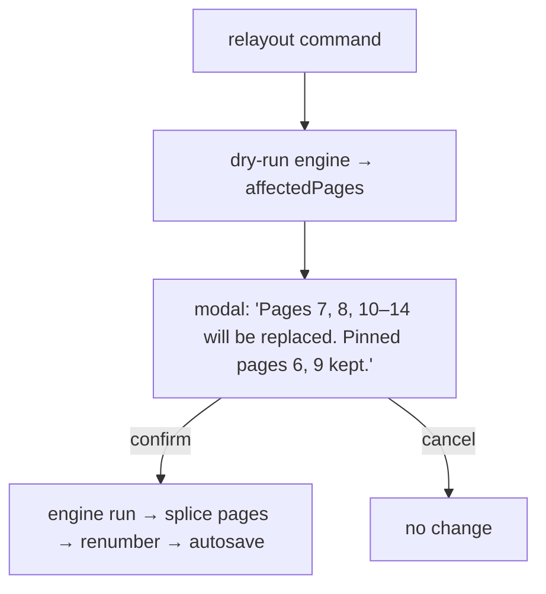

# 08 — Auto-Layout Engine

This document specifies the auto-layout engine in `src/PhotoBook.Engine` — the core of PhotoBook.
The north star (user's words): **"The automatic layout being awesome is the most important part.
Edits should really be tweaks."** (R27). The engine turns a Chapter's photos, journal entries,
Tiers, and Focus Regions into concrete pages: a Template per page, a photo per Slot, and a
`CropState` per placement. Every phase below is specified to implementation readiness: data
shapes, formulas with default weights, pseudocode, and failure behavior.

Related docs: [02-architecture.md](02-architecture.md) ·
[03-domain-model.md](03-domain-model.md) · [06-image-analysis.md](06-image-analysis.md) ·
[07-layout-template-system.md](07-layout-template-system.md) · [09-editor-ux.md](09-editor-ux.md) ·
[10-styles-and-typography.md](10-styles-and-typography.md) ·
[11-journal-ingestion.md](11-journal-ingestion.md) · [13-testing-strategy.md](13-testing-strategy.md)

## 1. Contract: a pure, deterministic function

> **Decision:** The engine is a pure function with no I/O, living in `PhotoBook.Engine` with a
> dependency only on `PhotoBook.Core` — see
> [ADR-0009](adr/0009-app-architecture-mvvm-di-jobs.md). Purity is what makes golden layout tests
> (see [13-testing-strategy.md](13-testing-strategy.md)) and byte-stable output possible.

```
LayoutResult LayoutChapter(LayoutRequest req)

LayoutRequest {
  chapter:        ChapterInput        // month, days' photos + journal, existing pages w/ pinned flags
  templates:      TemplateLibrary     // from doc 07, incl. libraryVersion
  style:          Style               // text metrics inputs (fonts/sizes), doc 10
  seed:           ulong               // from book.json (§5 of the kernel)
  scope:          RestOfChapter(fromPage) | SingleDay(date) | InsertUnplaced | WholeChapter
  startParity:    Left | Right        // parity of the chapter's first regenerated page
}

LayoutResult {
  pages:          Page[]              // template ref or inline snapshot, slot→photo + CropState
  affectedPages:  int[]               // page numbers replaced (for the R16 warning, computed in dry-run)
  diagnostics:    LayoutDiagnostic[]  // text overflow, crowding, unplaceable photos
}
```

Rules of the contract:

- **No wall clock, no I/O, no global state.** All analysis inputs (Tier, Focus Regions, aspect
  ratios) arrive precomputed in `ChapterInput`; the engine never touches pixels or ONNX
  (see [06-image-analysis.md](06-image-analysis.md), [ADR-0005](adr/0005-local-ml-onnx-runtime.md),
  [ADR-0010](adr/0010-analysis-plugin-local-first.md)).
- **Same inputs ⇒ identical `LayoutResult`,** field for field. This is asserted by golden tests.
- The engine **emits the same `CropState` the user hand-tweaks** — auto and manual placement are
  one representation (kernel §4), so a user tweak is literally a small edit to engine output (R9).

## 2. Pipeline overview

The six phases are fixed by kernel §7. Phases 1–3 decide *how many pages and which photos on
each*; phases 4–6 decide *what each page looks like*.


A Chapter additionally gets a month title page (R24) prepended before day pages; it is produced
by phase 4 directly (kind `monthTitle`, hero photo = highest-scoring S-tier photo of the month,
tie-break by seeded hash) and does not participate in partitioning.

## 3. Phase 1 — Day grouping

Input: the Chapter's non-excluded photos (excluded photos are gone from layout forever, R17) and
its `JournalEntry` list from [11-journal-ingestion.md](11-journal-ingestion.md).

```
function GroupDays(photos, journalEntries) -> DayGroup[]
    byDate = photos.GroupBy(p => p.date.Date)          // resolved date chain, doc 05; dateUncertain
                                                       // photos group by their best date
    dates  = union(byDate.Keys, journalEntries.Select(j => j.date)).SortAscending()
    return dates.Select(d => DayGroup {
        date:    d,
        photos:  byDate[d].OrderBy(p => p.takenTime)   // chronological within the day (R7)
                          .ThenBy(p => p.contentHash), // total order — determinism tie-break
        journal: journalEntries.SingleOrDefault(j => j.date == d)   // doc 11 merges same-day entries
    })
```

Properties:

- A `DayGroup` may be **photos-only**, **journal-only** (entry with zero photos), or both. All
  three survive to partitioning; interleaving photos with dated journal text (R2) falls out of
  the shared date axis.
- A day's journal text is **atomic** (R5): it is never split across Day Groups, and downstream it
  may span the two pages of one Spread but never crosses Spreads (kernel §9).
- Ordering inside a Day Group is the reading order used by chrono-preserving costs in phase 5.

## 4. Phase 2 — the Demand Model

The Demand Model converts each Day Group into a scalar **demand** in *page units* (1.0 = one full
page of the current `pageSize`). It is the single knob-bearing formula that encodes "how much
room does this day deserve".

```
tierArea = { S: 0.30, A: 0.18, B: 0.11, C: 0.07 }      // page units per photo, by Tier

photoDemand(d) = Σ over p in d.photos of tierArea[tier(p)]
textDemand(d)  = journalChars(d) / CHARS_PER_FULL_PAGE  // CHARS_PER_FULL_PAGE = 4800
demand(d)      = W_PHOTO·photoDemand(d) + W_TEXT·textDemand(d) + W_BASE
```

| Constant | Default | Meaning / tuning note |
|---|---|---|
| `tierArea[S..C]` | 0.30 / 0.18 / 0.11 / 0.07 | S-tier photos want hero-sized Slots; ~3 S or ~8 B photos fill a page |
| `CHARS_PER_FULL_PAGE` | 4800 | chars of journal body text filling one page at defaults (Source Serif 4, 10.5 pt ≈ 60 chars/in² over the ~79 in² safe area; recompute from Style if fonts change — see [10-styles-and-typography.md](10-styles-and-typography.md)) |
| `W_PHOTO` | 1.0 | photo area weight |
| `W_TEXT` | 1.0 | text area weight |
| `W_BASE` | 0.05 | per-day breathing room (gutters, captions, whitespace) |
| `MIN_DAY_DEMAND` | 0.15 | floor for any non-empty day — even one C photo earns visible space |

`demand` is clamped to `max(demand, MIN_DAY_DEMAND)`. Tier here is the **effective** tier:
`userTierOverride` wins absolutely when present (kernel §4, R26), so promoting a photo directly
raises its day's demand and its slot-size affinity in phase 5.

Worked examples (calibration targets, also used as unit-test fixtures):

- 3 consecutive days, each 2 C-tier photos + a 250-char entry → demand ≈ 0.24 each → merge to
  **one page** (R28).
- One day, 8 B photos, no journal → 0.93 → **one full page**.
- Birthday, 40 photos (6 S, 12 A, 22 B) + 1900-char entry → 6.78 → **6–7 pages**.

These three are regression anchors, asserted by `Doc08CalibrationTests`. The §4b solo-page rule and
the §6 coverage retune below leave all three page counts unchanged: none of the three examples
contains a day whose photo count is one, so no solo-page cost is ever charged, and coverage is a
phase-4 term that cannot move a page count.

### 4b. The solo-page rule

> **Decision:** A page may hold a **single photo only when that photo has earned it.** Rationale
> (inline): the user's words after the first real month were *"When there is only a single picture
> for a page, it should be large. However, if the picture is lame include it on another page."* A
> lone photo on a page is the most emphatic gesture the book has; spending it on a weak frame is
> worse than spending it on nothing. The rule belongs in the demand model rather than in a
> post-filter because "this photo does not deserve a page" is a statement about *how much room the
> day deserves*, and expressing it as a cost is what lets it trade off against the merge and split
> transitions of §5 instead of fighting them.

```
earnsSoloPage(p, streamCount) =
      rank(tierEff(p)) ≤ rank(SOLO_TIER)                    // S or A: always
   or (streamCount ≤ 1 and rank(tierEff(p)) ≤ rank(LONE_DAY_TIER))   // the day's only photo, and not bottom-tier

weakStraggler(d) = d.photos.Count == 1 and not earnsSoloPage(d.photos[0], 1)
```

`streamCount` is the number of photos in the run being cut into pages — the Day Group, or the
absorbed run of days of §5. Tier is the **effective** tier, so promoting a photo (R26) is also how
the user says "yes, this one *does* deserve its own page".

Every page-producing transition of §5 pays for the single-photo pages its shape forces:

```
forcedSoloPages(n, k) = max(0, 2k − n)     // every part holds ≥ 1 photo, so once the parts of
                                           // two or more run out, 2k − n parts are forced to one
unearnedShare(photos)  = |{p : not earnsSoloPage(p, n)}| / n
soloCost(photos, k)    = SOLO_PAGE_COST · forcedSoloPages(n, k) · unearnedShare(photos)
```

| Constant | Default | Meaning / tuning note |
|---|---|---|
| `SOLO_TIER` | A | worst tier that earns a solo page unconditionally |
| `LONE_DAY_TIER` | B | worst tier that earns a solo page when it is genuinely the day's only photo |
| `SOLO_PAGE_COST` | 0.45 | charged per forced, unearned single-photo page; same order as `PARITY_PENALTY`, so the DP will accept a whole page of misfit rather than strand a weak frame |
| `SOLO_PART_PENALTY` | 1.25 | the same rule inside one day's photo cut (§5), in normalized time-gap units — above the largest possible normalized gap (1.0), so not even a day boundary can shed one weak frame onto its own page |

The rule is deliberately *narrow*: it removes stragglers, not single-photo pages. A day with one
B-tier photo still gets its page, and an S or A photo anywhere gets one whenever the partitioner
finds it cheap — where §6's `S_coverage` then makes sure it renders large.

## 5. Phase 3 — DP page partitioning

> **Decision:** Page partitioning is exact dynamic programming over the day sequence, not a
> greedy fill. Rationale (inline): greedy packing produces "orphan" thin last pages and cannot
> trade a merge early in the month against a split later; the DP state space is tiny (≤ 31 days ×
> 2 parities × ≤ 4 merge lengths), so exactness is free and, unlike greedy, stable under small
> input perturbations — which keeps relayout churn low.

The DP chooses, for the ordered sequence `d[1..n]` of Day Groups, a segmentation into **page
runs**: several consecutive sparse days merged onto one `multiDay` page (R28), one day split across
`k ≥ 1` pages, or a weak straggler day absorbed into a neighbour's ordinary page (§4b). It tracks
Spread parity so that (a) a day whose text needs two pages lands on a left page, and (b)
`spreadPair` and full-Spread templates (R18, R22) are only offered to left-parity pages.

**State.** `dp[i][par]` = minimal cost to lay out days `1..i`, where `par ∈ {Left, Right}` is the
parity of the *next* page to be emitted. `dp[0][startParity] = 0`.

**Transitions.** From `dp[j][par]`:

1. **Merge** days `j+1..i` (with `1 ≤ i−j ≤ MAX_DAYS_PER_PAGE`) onto one `multiDay` page.
   Allowed iff every merged day has `photos.Count ≤ 3`, total photos ≤ 8 (R20 slot ceiling), and
   `D = Σ demand ≤ 1.15`. Emits 1 page; `par` flips.
2. **Split** the single day `i = j+1` across `k` pages, `k ∈ [kMin..kMax]` where
   `kMin = max(1, ceil(photos/8))` and `kMax = max(kMin, ceil(1.6 · D))`. Emits `k` pages;
   `par` flips `k` times. If `textDemand(d) > MAX_TEXT_PER_PAGE (= 0.55)`, the day needs a full
   Spread for its text: require `k ≥ 2` and `par == Left`; from `par == Right` this transition
   instead carries `PARITY_PENALTY` and raises a `TextNeedsSpread` diagnostic (surfaced by
   preflight, [12-pdf-export.md](12-pdf-export.md)).
3. **Absorb** days `j+1..i` (with `2 ≤ i−j ≤ MAX_DAYS_PER_PAGE`) into **one flattened photo
   stream**, laid out over `k` pages exactly like a single day. This is the escape hatch §4b needs:
   R28's merge caps (≤ 3 photos per merged day, plus a `multiDay` template of that exact shape) mean
   a lone straggler next to a *busy* day cannot merge, and without this transition the DP had no
   choice but to give it a page of its own. Allowed iff the run is **one host day plus adjacent weak
   stragglers** — at least one `weakStraggler(d)`, and at most one day that is not one — a
   single-page template of the resulting photo count exists, and at most one day brings journal text
   and that text still fits somewhere (two days' entries on a `standard` page would render as one
   undated block, which is a `multiDay` page's job). Emits `k` pages; `par` flips `k` times.

**Cost function.**

```
fitCost(k, D)   = ((k − D) / max(k, D))²                   // 0 = perfect fill, →1 = badly off
segCost(merge)  = W_FIT·fitCost(1, D) + MERGE_COST·(daysMerged − 1)
segCost(split)  = W_FIT·fitCost(k, D) + soloCost(d.photos, k)
                + (PARITY_PENALTY if spread-text rule violated)
segCost(absorb) = W_FIT·fitCost(k, D) + ABSORB_COST·(daysAbsorbed − 1) + soloCost(runPhotos, k)
                + (PARITY_PENALTY if spread-text rule violated)
```

`soloCost` is §4b's. A `multiDay` merge keeps each day its own section and heading, so
`ABSORB_COST > MERGE_COST` makes merging win wherever both apply; absorbing is strictly the
fallback.

| Constant | Default | Effect when raised |
|---|---|---|
| `W_FIT` | 1.0 | pages hug demand more tightly |
| `MERGE_COST` | 0.08 | fewer multi-day pages; days keep their own page longer |
| `ABSORB_COST` | 0.12 | stragglers keep their own page longer; must stay above `MERGE_COST` |
| `PARITY_PENALTY` | 0.50 | engine tries harder to spread-align long-text days |
| `MAX_DAYS_PER_PAGE` | 3 | matches `multiDay` template sections (kernel §6) |

```
function PartitionChapter(days, startParity) -> Segment[]
    dp[0][startParity] = 0;  all other states = +∞
    for i in 1..n:
      for par in {Left, Right}:
        // merge endings
        for j in max(0, i−MAX_DAYS_PER_PAGE)..i−1:
            if MergeAllowed(days[j+1..i]):
                relax(dp[i][flip(par)], dp[j][par] + segCost(merge j+1..i))
        // absorb endings
        for j in max(0, i−MAX_DAYS_PER_PAGE)..i−2:
            if AbsorbAllowed(days[j+1..i]):
                run = flatten(days[j+1..i])
                for k in kMin(run)..kMax(run):
                    relax(dp[i][parityAfter(par, k)], dp[j][par] + segCost(absorb j+1..i, k))
        // split endings
        d = days[i]
        for k in kMin(d)..kMax(d):
            relax(dp[i][parityAfter(par, k)], dp[i−1][par] + segCost(split d, k))
    return Backtrack(argmin over par of dp[n][par])
```

**Distributing a split day's photos.** A day split over `k` pages is cut at the `k−1` largest
time gaps between consecutive photos (breakfast/park/dinner clusters fall out naturally), subject
to every page getting 1..8 photos; ties broken by the seeded hash (§9). A part is cut down to a
*single* photo only when that photo earned a solo page — otherwise the cut pays `SOLO_PART_PENALTY`
(§4b) and the boundary moves, which is what stops the enormous day-boundary gap inside an absorbed
run from simply re-isolating the straggler. The journal entry rides on the day's first page (or
spans the first Spread when `TextNeedsSpread`). An absorbed run is cut by the same code over its
flattened photo stream, and its entries ride its first page in date order.

**Pinned pages partition the DP.** Pinned and Detached pages (see §10) are immovable anchors:
their photos and days are removed from the input sequence, and the DP runs independently on each
maximal run of days between anchors, with `startParity` derived from each anchor's page number.
Regenerated pages splice around anchors in chronological order.

## 6. Phase 4 — Template scoring

For every planned page (photo list + text chars + `Left|Right` side + `standard|multiDay` need),
the engine ranks the Template library ([07-layout-template-system.md](07-layout-template-system.md)).

**Hard filters** (a template failing any is discarded before scoring):

| Filter | Rule |
|---|---|
| Photo count | `template.photoCount == page.photos.Count` (exact; no empty auto-slots — amber-flag empties are a manual-edit state, R14) |
| Kind | merged pages ⇒ `multiDay` with matching section structure (days × per-day photo counts); title page ⇒ `monthTitle`; otherwise `standard` or `fullBleed`; `spreadPair` only on Left-parity pages with a partner page from the same day |
| Text fit | if page carries journal text: template has a `textSlots[role=journal]` with `capacity(slot) ≥ chars`, where `capacity(slot) = slotArea_in² × 60 chars/in²` from Style metrics. **No auto font-shrink** (kernel §9): text too big ⇒ this filter forces a roomier template; if *no* template passes, escalate per §12 |
| Textless | pages with no journal text may use any template; an unused journal slot renders blank — deliberate negative space (R20) |
| Mirroring | templates are authored as right pages; `mirrorable` ones are auto-mirrored on **Left** pages ([07 § Mirroring](07-layout-template-system.md#mirroring-one-template-left-and-right-pages)); `mirrorable: false` ones are side-agnostic and render identically on both sides |

**Soft score** — higher is better, weights sum to 1.0:

```
score(t, page) = 0.26·S_aspect + 0.17·S_tier + 0.13·S_text + 0.17·S_variety + 0.10·S_pacing
               + 0.17·S_coverage
               + jitter(t, page)                       // seeded, |jitter| ≤ 0.02, see §9
```

| Component | Weight | Definition |
|---|---|---|
| `S_aspect` | 0.26 | `1 − meanAssignmentCost` from actually running phase 5's Hungarian on this candidate (n ≤ 8 ⇒ O(8³) is trivial, so scoring uses the *real* assignment, not an estimate) |
| `S_tier` | 0.17 | mean over slots of `1 − tierDist(photo, slot)` from the same assignment |
| `S_text` | 0.13 | fill = `chars / capacity`; score = 1.0 for fill ∈ [0.50, 0.85], falling linearly to 0.3 at fill 0.10 (cavernous slot) and to 0 at fill 1.0 |
| `S_variety` | 0.17 | pacing memory over the already-laid-out chapter prefix: 0 if same template id as previous page; 0.5 if used within last 3 pages; 0.75 if same template *family* (doc 07) within last 2; else 1.0 |
| `S_pacing` | 0.10 | **rhythm only.** `fullBleed` gets 1.0 iff the page has an S-tier photo **and** no `fullBleed` in the last 4 pages, else 0.2. An **airy** template (coverage < `AIRY_COVERAGE_MAX = 0.55` — deliberate negative space, R20) gets 1.0 when no airy page appeared in the last `AIRY_COOLDOWN = 5` pages and 0.25 when one did. Everything else takes the flat 0.80 baseline: a well-filled page is always in rhythm |
| `S_coverage` | 0.17 | `min(1, coverage(t) / target)`, where `coverage(t)` is the **union** area of the template's image slots as a fraction of the trim box and `target = SOLO_COVERAGE_TARGET (0.92)` for a page holding one photo, `COVERAGE_TARGET (0.82)` otherwise |

> **Decision:** Coverage is its own, **monotone** score term, and `S_pacing` no longer mentions it.
> Rationale (inline): the original `S_pacing` gave its coverage bonus for landing within ±10% of the
> page's *demand*, which meant a page carrying one weak photo (demand ≈ 0.15) scored best on the
> emptiest template in the library. Measured over the shipped set, mean slot coverage was 0.562 and a
> lone photo rendered at 0.15–0.46 of the page — exactly the user's *"lots of white/black space. It
> should be more full."* Making fuller monotonically better fixes that at every demand, and raises
> the solo-page bar higher still (0.92), so a photo that earned a page under §4b actually renders
> large. Airiness does not disappear — it is bought back deliberately, and rationed by a cooldown,
> in `S_pacing`. Coverage is the union rather than the sum of slot rects because templates now
> overlap slots on purpose (doc 07); a summed figure would score an overlapping layout as fuller than
> it looks.

The winner is `argmax score`, ties broken by seeded hash of `(templateId, pageIndex)` (§9). The
winning candidate's Hungarian assignment is kept — phase 5 is not re-run.

## 7. Phase 5 — Hungarian slot assignment

> **Decision:** Photo→Slot matching is solved exactly with the Hungarian algorithm per page
> (per section for `multiDay`). Rationale (inline): n ≤ 8 makes O(n³) ≈ 512 steps negligible,
> and exact matching avoids the classic greedy failure where the first photo takes the slot the
> last photo needed; exactness also keeps output stable across runs.

Cost matrix `C[p][s] ∈ [0, ~1.15]`, photos × slots (square — hard filter guarantees equal count;
`multiDay` runs one matrix per section so each day's photos stay inside that day's section):

```
C[p][s] = 0.45·aspectCrop(p,s) + 0.20·focusRisk(p,s) + 0.20·tierDist(p,s)
        + 0.15·chronoDisp(p,s) + captionAdj(p,s)
```

| Term | Definition |
|---|---|
| `aspectCrop` | `min(1, |ln(aspect(p) / aspect(s))| / ln 3)` — log-space aspect mismatch ≈ fraction of image lost to cover-cropping; saturates at a 3:1 mismatch |
| `focusRisk` | fraction of the primary Focus Region's area that cannot be kept visible at `zoom = 1` under the best pan (0 when the region fits the maximal crop window of §8; this is the "keep the important parts visible" pressure of R25 applied at *matching* time, not just crop time) |
| `tierDist` | `|rank(tierEff(p)) − rank(s.tierAffinity)| / 3` with ranks S=0…C=3; `tierAffinity == "any"` ⇒ 0. `tierEff` honors `userTierOverride` (R26) — promoting a photo steers it into hero slots |
| `chronoDisp` | `|timeIndex(p) − readingIndex(s)| / max(1, n−1)` — preserves chronological reading order (R7) without making it a hard constraint |
| `captionAdj` | `+0.15` if photo has a caption and `s.captionPolicy == "none"`; `0` otherwise (captions need `below` or `overlay` slots, R5) |

Output: `placements: (photoId, slotId)[]` in slot order, plus the per-pair costs (reused by
`S_aspect`/`S_tier` above and by diagnostics).

## 8. Phase 6 — Smart crop: deriving CropState from Focus Regions

This phase implements kernel §4 **verbatim**: *choose the maximal crop window of the slot's
aspect that contains the primary focus region (highest weight; merge overlapping), then express
it as a `CropState`.* One representation for auto and manual (R9, R25).

**Step 1 — primary Focus Region.** Regions are fused with priority
`user > person > face > saliency` (kernel §4; sources in
[06-image-analysis.md](06-image-analysis.md)). Sort candidates by `(kindPriority, weight)`
descending; take the top region, then merge into it (bounding-box union, `weight = max`) every
region that overlaps it. The result is `F = {fx, fy, fw, fh}` in normalized image coordinates.
If the photo has no regions at all, `F` = the centered rect of half the image's width and height.

**Step 2 — maximal crop window.** Work in normalized image coordinates (image = unit square).
Let `A_img = imgW/imgH` (pixels) and `A_slot = slotW/slotH` (page units). A crop window with the
slot's *absolute* aspect has normalized aspect

```
a = A_slot / A_img                       // window w/h ratio in normalized image coords
maxW = min(1, a);  maxH = maxW / a       // ⇒ maxH = min(1, 1/a); the maximal (minimal-crop) window
```

The maximal window is exactly the `zoom = 1.0` cover-fit of kernel §4 — the engine's default.

**Step 3 — position (and, rarely, shrink) the window.**

```
function PlaceWindow(F, regions, maxW, maxH) -> {cx, cy, w, h}
    w = maxW; h = maxH
    if F.fw ≤ w and F.fh ≤ h:
        // Feasible center interval per axis so the window contains F and stays in [0,1]:
        loX = max(w/2, F.fx + F.fw − w/2);  hiX = min(1 − w/2, F.fx + w/2)
        loY = max(h/2, F.fy + F.fh − h/2);  hiY = min(1 − h/2, F.fy + h/2)
        // Aim at the weighted centroid of ALL regions (keeps secondary faces in frame
        // when possible), clamped into the feasible interval:
        cx = clamp(weightedCentroidX(regions), loX, hiX)
        cy = clamp(weightedCentroidY(regions), loY, hiY)
    else:
        // F is larger than the maximal window on some axis — full containment impossible.
        // Keep zoom = 1.0 (window stays maximal) and center on F's centroid, clamped:
        cx = clamp(F.fx + F.fw/2, w/2, 1 − w/2)
        cy = clamp(F.fy + F.fh/2, h/2, 1 − h/2)
        emit diagnostic FocusClipped(photo, slot)      // already penalized via focusRisk in §7
    return {cx, cy, w, h}
```

**Gutter and safe-area nudge** (kernel §3): if the slot crosses the Spread centerline
(full-Spread photo) or touches the trim edge, map every `face`/`person` region into page space
and, if one lands inside the 0.5 in gutter caution zone or outside the 0.375 in safe margin,
shift `cx` within `[loX, hiX]` by the smallest amount that clears it; if it cannot be cleared,
prefer the position minimizing the violation and emit `FaceNearGutter`. Full-Spread photos accept
center loss by design — only faces trigger the nudge.

**Step 4 — emit `CropState`.** With `coverScale = max(slotW/imgW, slotH/imgH)` (kernel §4):

```
function ToCropState(window, imgW, imgH, slotW, slotH) -> CropState
    zoom    = maxW / window.w            // maximal window ⇒ zoom = 1.0 exactly
    s       = zoom × coverScale          // effective scale, image px → page units
    offsetX = (0.5 − window.cx) × (s × imgW) / slotW    // slot-width units (kernel §4)
    offsetY = (0.5 − window.cy) × (s × imgH) / slotH    // slot-height units
    return CropState { zoom, offsetX, offsetY }
```

Sanity: a centered window gives `offset = (0,0)`; a focus region right of center gives
`cx > 0.5` ⇒ negative `offsetX` — the image slides left so the region stays visible. Offsets are
clamped by the shared no-gap rule while `zoom ≥ 1` (kernel §4), which `PlaceWindow`'s in-bounds
intervals already guarantee.

> **Decision:** The engine never emits `zoom < 1` (letterbox) and never emits `zoom > 1.25`.
> Rationale (inline): letterboxing is an aesthetic *choice* the user makes by hand (R9), not a
> default the engine should spring on them; and auto-zooming past 1.25× silently costs print
> resolution (preflight flags effective DPI < 200 — [12-pdf-export.md](12-pdf-export.md)). The
> only zoom the engine currently emits is exactly 1.0; the ceiling is headroom for a future
> "tight portrait crop" heuristic.

## 9. Determinism and seeding

The Seed lives in `book.json` (kernel §5), is generated once at book creation, and never changes
implicitly. The contract: **layout is a pure function of (photos, journal, templates, style,
seed)** — kernel §7.

- Single PRNG discipline: `rand(entityId) = SplitMix64(seed XOR Fnv1a64(entityStableId))`.
  Randomness is **only** used for (a) tie-breaks among exactly equal scores and (b) the ±0.02
  template-score `jitter` that stops a 31-day month from picking the same near-optimal template
  31 times. Both are functions of stable ids (photo `contentHash`, `templateId`, day date,
  page-run index) — never of array position or iteration order.
- All sorts use total-order comparators with a stable final key (content hash / id); no
  `Dictionary` iteration order ever reaches an output; no wall-clock, culture, or
  floating-point-environment dependence (doubles, default rounding, no fast-math).
- **Reroll:** the editor's "shuffle layout" action ([09-editor-ux.md](09-editor-ux.md)) simply
  writes a new seed and re-runs — a *chosen* new book, never accidental churn.
- Stability under perturbation is a tested property: adding one photo to day 14 must not change
  pages for days 1–13 in the golden tests (the DP prefix for unchanged days is identical, and
  jitter keys don't shift because they hash content, not positions).

## 10. Pinned, Detached, and the three relayout commands (R16)

Manual edit ⇒ page becomes **Pinned** (kernel §7). Hand-editing a page's *layout* (move/resize/
add/delete containers, R15) additionally makes it **Detached** — its template becomes an inline
snapshot ([07-layout-template-system.md](07-layout-template-system.md)). For the engine the two
collapse to one rule: **Pinned pages (Detached is always also Pinned) are never regenerated and
act as chronological anchors** (§5). Their photos are excluded from the day sequence; their page
numbers fix parity for each DP region between anchors.



All three commands share the flow above — **warn + list affected pages first** (R16), computed
by a dry run of phases 1–3 (cheap; no template scoring needed to know page counts):

1. **Auto-layout rest of chapter** (`scope = RestOfChapter(fromPage)`): regenerates every
   unpinned page with number ≥ `fromPage`. Days already fully on pinned pages stay put; photos
   the user removed to the Unplaced bin stay unplaced (user intent is never overridden); photos
   on replaced pages return to the pool and are re-laid.
2. **Lay out this day** (`scope = SingleDay(date)`): re-runs the pipeline for exactly one Day
   Group's unpinned pages. The DP region is just that day (it may still change its page count —
   e.g. 2 → 3 pages after the user promoted photos to S); subsequent pages renumber but are not
   re-laid.
3. **Insert pages for Unplaced bin** (`scope = InsertUnplaced`): takes the Chapter's Unplaced-bin
   photos (R16), groups them by day (phase 1), runs the pipeline on that sub-sequence only, and
   splices each produced page immediately after the last existing page containing any photo of an
   earlier-or-equal date. Existing pages are untouched — this is the only scope with an empty
   `affectedPages` (the warning modal instead lists *inserted* positions).

## 11. Feedback loops: how user edits make the next layout better

The engine is designed so the R25/R26 review passes in the Photos tab
([09-editor-ux.md](09-editor-ux.md)) directly reshape output:

- **Tier promote/demote (R26)** sets `userTierOverride` absolutely — never re-derived (kernel
  §4). Effects: demand (§4) rises/falls ⇒ the day may gain/lose a page; `tierDist` (§7) steers
  the photo into bigger/smaller slots; an S promotion makes the photo eligible for `fullBleed`
  pacing (§6); and promoting to A or S is exactly how the user says "this one *has* earned a page to
  itself" under §4b, while demoting to C sends a straggler onto a neighbour's page. Applied on the
  next engine run over any scope containing the photo.
- **Focus Region edits (R25)** add/modify `kind: user` regions — top fusion priority, so a single
  user rectangle beats every detector. Two application paths:
  - *Immediate re-crop:* on saving a focus edit, the app recomputes phase 6 only, for every
    **unpinned** placement of that photo, in place — no repartition, no warning (crop is exactly
    what the user asked to influence). Pinned pages are untouched; the editor shows a subtle
    "crop suggestion available" badge there instead.
  - *Next full run:* `focusRisk` (§7) now scores with the user's region, so matching itself
    improves — the photo migrates toward slots whose aspect can hold the region.
- **Excluded photos (R17)** and **date changes (R6)** simply change phase 1's input; a date
  change that leaves the year moves the photo to the Outside-book tray upstream of the engine.

## 12. Failure and degenerate cases

| Case | Behavior |
|---|---|
| **0-photo, journal-only day** | Valid Day Group (`photoDemand = 0`). Small entry ⇒ merges onto a `multiDay` page as a text-only section (the `multiDay` schema's sections permit 0 photo slots — requirement on doc 07's library). Entry > 0.5 page and unmergeable ⇒ the text-dominant `multiDay` variant fills its own page. |
| **40-photo day** | `kMin = ceil(40/8) = 5`; demand-driven `k` typically 5–7. Photos cut at the largest time gaps (§5); S photos anchor hero slots per page; `S_pacing` prevents five full-bleeds in a row. |
| **Text too big for any template** | §6's text hard filter escalates: (1) roomiest journal template of the needed photo count; (2) shed photos to the *next page of the same day* (repartition with `k+1`); (3) span the Spread (`TextNeedsSpread`, §5); (4) still too big ⇒ place with `TextOverflow` diagnostic — preflight blocks export until the user splits the entry or accepts an edit ([12-pdf-export.md](12-pdf-export.md)). Never auto-shrink the font (kernel §9). |
| **Empty chapter** (no photos, no journal, or all excluded) | Month title page only; dashboard shows the chapter as "empty" — not an error. |
| **Photo not yet analyzed** (first-import race) | Analysis-independent fallbacks: `tier = B`, focus = centered half-image rect (§8 step 1). The M0 walking skeleton runs entirely on these. When analysis lands, affected unpinned placements re-crop as in §11. |
| **A lone bottom-tier photo** on a day of its own | §4b's `weakStraggler`. It merges (R28) when its neighbours are sparse, otherwise the §5 absorb transition puts it on a neighbouring day's page and raises a `StragglerAbsorbed` info diagnostic. Only when *nothing* adjacent can hold it — a Chapter of exactly one C-tier photo, or a straggler walled in by Pinned anchors — does it keep a page, because a placed photo beats a lost one. |
| **All pages pinned** in scope | `affectedPages = []`; the command reports "nothing to do" instead of showing an empty warning. |
| **One photo, panorama (aspect > 3)** | `aspectCrop` saturates for every standard slot; full-bleed/spread templates win if parity allows; otherwise the placement keeps `zoom = 1.0` and `FocusClipped` marks it for the user — the engine does not letterbox (§8 Decision). |
| **Day count > 31 / duplicate dates** | Impossible by construction (phase 1 groups by calendar date within one month). |

## 13. Performance and incremental relayout

Targets (kernel §7): **full-year re-layout < 10 s for 2,000 photos** with analysis precomputed;
full-year analysis < 15 min in the background on first import (that budget belongs to
[06-image-analysis.md](06-image-analysis.md), not the engine).

Engine-side budget for one ~170-photo Chapter (measured targets, enforced by benchmark tests in
[13-testing-strategy.md](13-testing-strategy.md)):

| Phase | Complexity | Budget |
|---|---|---|
| Day grouping | O(P log P) | < 1 ms |
| Demand Model | O(D) | < 1 ms |
| DP partitioning | O(D · MAX_DAYS_PER_PAGE · kMax · 2) ≈ 31 × 3 × 10 × 2 | < 1 ms |
| Template scoring + Hungarian | ~25 pages × ~12 surviving candidates × O(8³) | < 15 ms |
| Smart crop | O(placements) | < 5 ms |
| **Chapter total (CPU)** | | **< 150 ms** |

Twelve chapters ≈ 2 s of engine CPU; the 10 s year budget leaves 8 s for text measurement, JSON
persistence, and preview invalidation. Two engineering rules make this hold:

- **Text metrics are the only expensive leaf.** `capacity()` and text-fit checks use cached
  metrics keyed by `hash(text, fontFamily, sizePt, slotWidth)`; the cache is supplied inside
  `LayoutRequest` (kept pure — the engine reads it, the app owns it, and it is regenerable cache
  per kernel §5: user intent never lives in it).
- **Memoized segments.** Each DP segment's downstream result (template choice, assignment,
  crops) is memoized under `segKey = hash(seed, libraryVersion, styleVersion, dayHashes…)` where
  a `dayHash` covers photo ids, effective tiers, focus regions, and journal text. Editing day 14
  changes only day 14's hash; every other segment replays from memo. This is why "small edit ⇒
  small relayout" holds even for `WholeChapter` scope, and why the R16 dry-run is effectively
  free. The memo is in-memory only and never persisted.

Everything above runs on the background job queue ([02-architecture.md](02-architecture.md));
results apply on the UI thread through the single-writer command pipeline, so a relayout is one
undoable command ([09-editor-ux.md](09-editor-ux.md)).

## 14. Tunables summary

Single reference table of every knob defined in this doc (defaults are the shipped values; all
live in engine code as constants in v1 — a `layoutTuning` block in `book.json` is a documented
future hook, not v1 scope):

| Knob | § | Default |
|---|---|---|
| `tierArea` S/A/B/C | §4 | 0.30 / 0.18 / 0.11 / 0.07 |
| `CHARS_PER_FULL_PAGE` | §4 | 4800 |
| `W_PHOTO` / `W_TEXT` / `W_BASE` | §4 | 1.0 / 1.0 / 0.05 |
| `MIN_DAY_DEMAND` | §4 | 0.15 |
| `SOLO_TIER` / `LONE_DAY_TIER` | §4b | A / B |
| `SOLO_PAGE_COST` / `SOLO_PART_PENALTY` | §4b | 0.45 / 1.25 |
| `W_FIT` / `MERGE_COST` / `ABSORB_COST` / `PARITY_PENALTY` | §5 | 1.0 / 0.08 / 0.12 / 0.50 |
| `MAX_DAYS_PER_PAGE` / `MAX_TEXT_PER_PAGE` | §5 | 3 / 0.55 |
| Template score weights (aspect/tier/text/variety/pacing/coverage) | §6 | 0.26 / 0.17 / 0.13 / 0.17 / 0.10 / 0.17 |
| `COVERAGE_TARGET` / `SOLO_COVERAGE_TARGET` | §6 | 0.82 / 0.92 |
| `AIRY_COVERAGE_MAX` / `AIRY_COOLDOWN` | §6 | 0.55 / 5 pages |
| `S_pacing` baseline / airy-out-of-rhythm / full-bleed-out-of-rhythm | §6 | 0.80 / 0.25 / 0.20 |
| Score jitter bound | §6, §9 | ±0.02 |
| Hungarian weights (aspect/focus/tier/chrono) + caption adj | §7 | 0.45 / 0.20 / 0.20 / 0.15 + 0.15 |
| Engine zoom range emitted | §8 | exactly 1.0 (ceiling 1.25 reserved) |
| Full-bleed cooldown | §6 | 4 pages |
