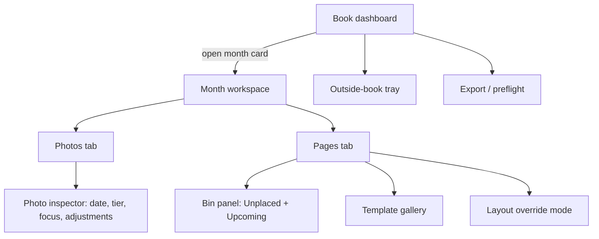

# 09 — Editor UX

This document specifies the interactive editor: the screen map from Book dashboard to Month
workspace, every gesture in the Photos and Pages tabs (drag-drop, crop pan/zoom, template
switching, bins, re-dating, focus/tier editing, per-page layout overrides, auto-layout commands),
the undo model, and the keyboard map. The guiding principle is the north star from
[01-vision-and-principles.md](01-vision-and-principles.md): the engine does the layout, and
**edits are tweaks** — every gesture here is a small, reversible correction on top of an already
good page, never a from-scratch construction tool.

Related docs: [02-architecture.md](02-architecture.md) ·
[03-domain-model.md](03-domain-model.md) · [07-layout-template-system.md](07-layout-template-system.md) ·
[08-auto-layout-engine.md](08-auto-layout-engine.md) · [10-styles-and-typography.md](10-styles-and-typography.md) ·
[12-pdf-export.md](12-pdf-export.md) · [15-glossary.md](15-glossary.md)

> **Decision:** The shell is WPF with CommunityToolkit.Mvvm and AvalonDock for dockable panels;
> the page canvas is a SkiaSharp `SKElement` driven by the same renderer as PDF export, so the
> editor is WYSIWYG by construction — see [ADR-0002](adr/0002-ui-wpf.md) and
> [ADR-0003](adr/0003-rendering-skiasharp.md).

> **Decision:** All model mutations go through undoable commands executed on the UI thread
> (single-writer); decoding, analysis, and preview rendering run on the Channels-based background
> job queue — see [ADR-0009](adr/0009-app-architecture-mvvm-di-jobs.md).

## 1. Screen map



**Book dashboard.** One card per Chapter (Jan–Dec) showing: cover thumbnail (the month-title
page), photo count, page count, an **amber badge** with the count of empty Slots (R14), and an
Unplaced-bin count. Global chrome: book settings (style, page size, print profile), the
**Outside-book tray** button (with count badge, R6), Export (runs preflight per
[12-pdf-export.md](12-pdf-export.md)), and background-job status (analysis progress from
[06-image-analysis.md](06-image-analysis.md)).

**Month workspace.** A two-tab surface for one Chapter. **Photos tab** = the photo grid
(inspect, reorder, re-date, Tier promote/demote, Focus Region edit, adjustments). **Pages tab** =
the page canvas (single page or Spread), the dockable bin panel, template gallery, layout
override mode, and the auto-layout commands. `Ctrl+Tab` toggles tabs; selection is shared — a
photo selected in the Photos tab is highlighted (slot or bin) when switching to Pages.

## 2. Photos tab

A virtualized grid of 256 px thumbnails (cache tier per
[05-ingestion-and-photo-sources.md](05-ingestion-and-photo-sources.md)), sorted chronologically.
Each cell shows badges: **Tier chip** (S/A/B/C, per [06-image-analysis.md](06-image-analysis.md)),
**placed/unplaced dot** (green = on a page, hollow = in Unplaced bin), **⚠ dateUncertain**, and
**Excluded** (dimmed 40% opacity, only visible when the *Show excluded* filter is on). Filters:
All / Unplaced / Excluded / dateUncertain / by Tier. `Space` opens a full-size quick preview;
`Enter` opens the inspector panel (right side, 320 px).

The inspector is **switched, not scrolled**: an **Info | Adjust | Focus** segmented control sits
directly under the photo thumbnail, with a dot on any section carrying edits. Info holds the file,
date, Tier and Exclude controls; Adjust holds the full adjustment stack (§2.3); Focus holds the
region editor (§2.2). The thumbnail shrinks from 200 px to 104 px when Adjust or Focus is open,
because those sections carry their own working preview.

> **Decision:** **Sections, not one long scroll.** Adjust originally sat ~870 px down a 320 px rail,
> below Date and a 150 px Focus preview, and the first user of a real month reported the image
> corrections as *missing* — they exist and are complete, they were simply below the fold. The
> switcher puts every section one click from anywhere and opening Adjust shows the live preview,
> Orientation, Black-and-white and the Exposure/Brightness/Contrast sliders with no scrolling. The
> selected section persists in `editorSettings.inspectorSection`.

### 2.1 Re-date flow and the Outside-book tray (R6)

Entry points: inspector Date section, context menu *Change date…* (also on placed photos in the
Pages tab), or `D`. The dialog shows the current date, its provenance (EXIF / OneDrive /
file-mtime per [05-ingestion-and-photo-sources.md](05-ingestion-and-photo-sources.md)), and a
date-time picker. Setting a date manually always clears `dateUncertain`. Outcomes:

| New date lands in | Effect |
|---|---|
| Same Chapter | Photo re-sorts in the grid. A placed photo stays on its page (placement is explicit user/engine intent); a toast notes the order change. |
| Another Chapter, same year | Photo moves to that Chapter's Unplaced bin. If it was placed, its Slot becomes an empty **amber** Slot (R14); the source page's Pinned state is unchanged (see §3.5 rationale). Toast with **Undo** and a *Go to March* link. |
| Outside the book year | Photo moves to the **Outside-book tray** (visible from the dashboard). It stays in `photos.json` with its new date; it is *not* `excluded` — restoring an in-year date returns it to the right Chapter's Unplaced bin. The tray supports the same re-date dialog and Exclude action. |

All three are single undoable commands (move + slot vacate composite).

### 2.2 Focus Region editing (R25)

Inspector **Focus** section (or `F`) overlays the photo with its Focus Regions, color-coded by
`kind`: **user** = solid accent blue, **person** = green with the `personName` label, **face** =
teal, **saliency** = gray outline. Gestures:

- **Draw** a new `user` region: drag on empty area (weight defaults to 1.0).
- **Move/resize** `user` regions with 8 handles; detected regions (person/face/saliency) cannot
  be reshaped — they reflect analysis truth.
- **Disable** any detected region: click its ⊘ toggle → weight set to 0 (kept, grayed, re-enable
  anytime). **Delete** removes `user` regions only.
- **Weight slider** 0–1 on the selected region; drags coalesce into one undo entry.

On commit, smart-crop is re-run (rule in kernel terms: maximal window of the slot aspect
containing the primary Focus Region → new `CropState`) for every placement of this photo on
**unpinned** pages, immediately and silently. Placements on Pinned or Detached pages are left
untouched but get a small *crop may be stale* badge with a one-click *Re-crop* action — the user's
hand-tuned crops are never overwritten without an explicit gesture.

### 2.3 Tier promote/demote (R26)

Inspector Tier section shows the fused score, the derived percentile, and four segmented buttons
**S A B C**. Clicking one (or `]` promote / `[` demote on the grid selection) sets
`userTierOverride` in `photos.json` — an **absolute** assignment, never re-derived by future
analysis runs (kernel §4). Overridden chips get a small ▲ marker with *Reset to automatic* in the
context menu. Tier changes affect only future auto-layout runs; nothing on existing pages moves.

### 2.4 Adjustments (R11)

Inspector **Adjust** section hosts the non-destructive `AdjustmentStack` (brightness, contrast,
color, crop-independent edits — parameter set owned by
[06-image-analysis.md](06-image-analysis.md) and [ADR-0004](adr/0004-imaging-magick-net.md)).
The identical panel opens from a placed photo's context menu in the Pages tab **and** from any
bin item, satisfying R11's "placed or in the bin" requirement. Slider drags coalesce; preview
renders on the job queue at 1024 px and swaps in when ready.

### 2.5 Grid reorder (R6)

The grid's order **is** chronological order — the same axis the engine reads (`takenTime`, then
`contentHash` as the determinism tie-break,
[08-auto-layout-engine.md](08-auto-layout-engine.md) §3). Reordering is therefore a *time* edit,
not a second hidden sort key that the engine would have to learn about: drag a thumbnail, drop it
between two neighbours, and the app rewrites its `takenTime` to the midpoint of the neighbours'
times. Rules:

- Drops are accepted **only within one calendar day**. Dragging past a day boundary shows the
  no-drop cursor and a tooltip pointing at *Change date…* (§2.1) — moving a photo to another day
  is a re-date, with all of §2.1's consequences (Day Group membership, Chapter membership, the
  Outside-book tray).
- The calendar date and the `dateUncertain` flag are untouched; only the time of day moves.
- If the drop's neighbours share a timestamp to the second (bursts, or scans that all carry
  midnight), the day's photos are first re-stamped at even intervals across their existing span,
  then the drop applies — one composite undo entry.
- Multi-select drags move the selection as a block, preserving its internal order. One undoable
  command per drop; drag position is committed on pointer-up only.
- Reorder does **not** move photos between pages: placed photos keep their Placements, and the
  new order feeds the *next* engine run (`chronoDisp`, doc 08 §7) rather than reshuffling
  existing pages. Slot-to-slot moves live in the Pages tab (§3.2).

## 3. Pages tab

Layout: page filmstrip on the left (72 px thumbnails, amber badges on pages with empty Slots),
the SkiaSharp canvas in the center, the dockable bin panel (§3.5), and a toolbar: view toggle
Single|Spread, *Change template*, *Edit layout*, and the three auto-layout buttons (§3.8).
Viewport zoom: `Ctrl+wheel`, `Ctrl+=`/`Ctrl+-`, `F11` = fit page.

**The sheet is drawn as a physical object.** The canvas clips the page to its trim box and sets it on
a lighter "table" surface (`PageTableBrush`, shared with the Pages scroller so the surround is
unbroken), with a soft drop shadow beneath it and a crisp light trim line around it. Nothing outside
trim is shown, because nothing outside trim is printed. In Spread view the two halves take no inner
bleed and no spine shadow, and their trim edges butt-join into a single seam.

> **Decision:** **The page edge must survive a black page.** v1 pages are `#000000` (R21) and the
> boundary used to be a 1 px `#23272C` hairline on a `#0A0B0C` canvas — three near-blacks, so the
> first user of a real month could not tell where the page ended. Contrast for the edge comes from the
> *surround*, not from the line, which is why the table is a mid-grey rather than the app background.

Guides — **bleed** (dashed warm red at the media box), **trim** (solid light) and **safe** (dashed
green) — are an overlay on `G`, off by default and persisted in `editorSettings.pageGuidesVisible`,
with a named legend pill. Turning them on grows the visible sheet from the trim box to the bleed box,
so the strip that gets cut is visible; the amber gutter caution hatch rides the same toggle. They are
drawn *over* the preview rather than baked into it by the renderer, so the bitmap the editor shows is
byte-for-byte what the PDF gets.

### 3.1 Single-page vs Spread editing toggle (R8)

The **Single | Spread** segmented control (`S`) switches the canvas between one page and the
facing pair. A Spread is a *view*, never a stored entity (kernel §4): every edit still targets
exactly one underlying `Page`, determined by cursor position. Spread view adds the 22 × 8.5 in
panorama frame, the gutter caution zone (0.5 in either side of the centerline, rendered as a
hatched band), and enables direct drag-drop between the facing pages (a normal cross-page
move/swap; both touched pages become Pinned). `spreadPair` templates
([07-layout-template-system.md](07-layout-template-system.md), R22) are applied from Spread view
and set both pages' templates in one composite command.

### 3.2 Drag-drop with swap semantics (R9)

Drag sources: any placed photo, any bin item, any Photos-tab thumbnail. During drag: a 60%-opacity
ghost thumbnail follows the cursor; the hovered Slot shows a 2 px accent inset ring; invalid
targets show the no-drop cursor. Hovering a filmstrip page thumbnail for 400 ms spring-loads
navigation to that page, enabling cross-page drops without the bins. Drop outcomes:

| Drag from → to | Result |
|---|---|
| Slot A → empty Slot B | Move. A becomes an empty amber Slot. |
| Slot A → occupied Slot B | **Swap**: the two photos exchange Slots. |
| Bin (Unplaced or Upcoming) → empty Slot | Place. |
| Bin → occupied Slot | Replace: incoming photo takes the Slot; displaced photo goes to the **Unplaced bin**. If the incoming photo came from the Upcoming bin, its old Slot on the later page becomes an amber hole (§3.5). |
| Slot → bin panel (Unplaced tab) | Unplace: Slot becomes amber, photo joins the Unplaced bin. |
| `Ctrl` held on any occupied-Slot drop | Force **replace** instead of swap (displaced photo → Unplaced bin). |

Every photo that lands in a new Slot gets a **fresh smart-crop** `CropState` computed for that
Slot's geometry — crops never travel with the photo, because a crop is a property of the
photo-in-this-Slot pairing. Any drop that changes a page marks that page **Pinned** (kernel §7);
a first-time toast explains: *"This page is now pinned — auto-layout will leave it alone."*

### 3.3 Pan/zoom crop editing (R9)

Click selects a Slot; double-click (or `Enter` on a selected Slot) enters **crop mode** for its
photo. Crop mode overlays: rule-of-thirds grid, the photo's Focus Regions (ghosted), safe-area
and gutter guides, and a zoom readout (e.g. `zoom 1.30`). Gestures edit the canonical
`CropState { zoom, offsetX, offsetY }` (kernel §4) directly:

- **Drag** pans: pointer delta is converted to `offsetX/offsetY` in slot-width/height units.
- **Wheel** (no modifier, in crop mode) zooms in 5% steps about the cursor point; the offset is
  simultaneously adjusted so the pixel under the cursor stays put. `+`/`-` step zoom ±0.05;
  arrows nudge offsets by 0.01 (`Shift` = 0.05).
- **Zoom range** is clamped to **[0.25, 4.0]**. Effective scale is always
  `zoom × coverScale` where `coverScale = max(slotW/imgW, slotH/imgH)`; `zoom = 1.0` is the
  minimal-crop cover fit.
- **Clamping.** While `zoom ≥ 1`, offsets clamp so no gap ever appears at a Slot edge. When the
  user zooms below 1.0, the image no longer fills the Slot and the page background (solid black,
  [10-styles-and-typography.md](10-styles-and-typography.md)) shows through as a letterbox —
  exactly R9's "background should just show through". In this regime offsets clamp so the image
  stays entirely **inside** the Slot rect (no bleeding out of the frame).
- **`0`** resets to the engine's smart-crop; context menu *Re-run smart crop* does the same.
- `Esc` or `Enter` exits crop mode; clicking another Slot commits and moves selection.

The first crop change marks the page Pinned. Live rendering uses the 1024 px preview tier; the
full-res pixels are only touched at export.

```text
// pointer → CropState during a pan drag (slot in screen px)
onDragDelta(dx, dy):
    crop.offsetX = clamp(crop.offsetX + dx / slotScreenW, lox, hix)
    crop.offsetY = clamp(crop.offsetY + dy / slotScreenH, loy, hiy)
    // lox..hix: gap-free bounds when zoom >= 1; inside-slot bounds when zoom < 1
    invalidateCanvas()          // coalesced into ONE undo command at pointer-up (§4)
```

### 3.4 Template switch and overflow rules (R10, R12)

*Change template* (`T`) opens the template gallery popover: the library from
[07-layout-template-system.md](07-layout-template-system.md), filtered by default to the current
page's `photoCount` ± 2, with an *All* toggle and filters by `kind`. Each gallery cell is a
**live preview**: the candidate template rendered with this page's actual photos, assigned by the
engine's Hungarian slot assignment and smart-cropped, using 256 px thumbnails (computed on the
job queue; placeholder wireframe until ready). Applying:

- **Fewer Slots than photos:** the slot assignment keeps the lowest-cost photo→Slot mapping; the
  overflow photos move to the **Unplaced bin** (R10) in one composite command. The toast names
  them: *"2 photos moved to Unplaced."*
- **More Slots than photos:** extra Slots are left empty and flagged **amber** (R14). The user
  fills them by dragging from the Unplaced bin or the Upcoming bin (R12), or via the Slot's
  context menu *Fill from bin…* which opens the bin panel with best-fit suggestions (aspect and
  Tier match) sorted first.
- **On a Detached page:** a confirm dialog warns that the hand-edited geometry will be replaced
  by the library template: *"This page has a custom layout. Applying 'Four up with journal'
  discards those layout edits (photos are kept). Apply?"*

A template switch marks the page Pinned, clears Detached (the page becomes a plain template ref
again), and is undoable as one command.

### 3.5 Bin panel: Unplaced + Upcoming (R12, R13)

One AvalonDock anchorable panel with a two-segment header: **Unplaced** | **Upcoming**.

> **Decision:** The bin docks to the **bottom by default** (horizontal filmstrip, 148 px tall)
> and can be docked to either side (vertical list, 200 px wide) by normal AvalonDock drag; the
> choice persists in per-user app settings, not in the project — R13 makes dock position a user
> preference, not book content. See [ADR-0002](adr/0002-ui-wpf.md).

- **Unplaced** shows this Chapter's photos that are on no page, chronological, with Tier chips.
  Non-empty Unplaced at export time is a preflight warning
  ([12-pdf-export.md](12-pdf-export.md)).
- **Upcoming** shows photos placed on pages **after the current page** in this Chapter, in page
  order, each with a page-number badge (e.g. `p. 9`) and a hover jump-to-page link — this is how
  "images on subsequent pages can be easily moved to the current page" (R13).

Dragging an **Upcoming** photo onto the current page removes it from its later Slot: that Slot
becomes an empty **amber** hole on the old page (visible immediately on its filmstrip thumbnail),
and the photo is placed here.

> **Decision:** Pulling from Upcoming pins the **destination** page but leaves the **source**
> page's Pinned state unchanged. Rationale: the user's intent was about this page; leaving the
> source unpinned lets *Auto-layout rest of chapter* (§3.8) heal the hole automatically, which is
> the tweak-first workflow we want. The amber flag plus a toast (*"Page 9 now has an empty slot —
> re-flow later pages?"* with a one-click action) keeps the hole impossible to miss.

Both bin tabs share the placed-photo context menu: *Change date…* (§2.1), *Adjust…* (§2.4),
*Set tier*, *Exclude from book* (§3.9).

### 3.6 Empty-Slot amber flagging (R14)

An empty Slot renders as: 2 px **dashed amber `#FFB300`** inset border, 12%-opacity amber fill,
and a centered photo-plus glyph. The flag propagates upward so it can't hide: filmstrip page
thumbnails get an amber count badge, the dashboard Chapter card aggregates the Chapter total, and
preflight lists every empty Slot by page number before export. Empty Slots are valid drop targets
and offer *Fill from bin…* / *Delete slot* (the latter only via layout override mode, §3.7).

### 3.7 Per-page layout override mode (R15) and Detached semantics

*Edit layout* (`L`) toggles **layout override mode** on the current page: photo content dims to
50%, Slots and TextSlots grow move/resize handles, and a small toolbar appears: *Add photo slot*,
*Add text slot*, *Delete slot*, *Bring forward/backward*, *Revert to template*.

- **Move/resize:** drag body or 8 handles; geometry snaps (6 screen px tolerance) to trim edges,
  the 0.375 in safe margin, page halves/thirds, and other Slot edges; coordinates are stored
  normalized to `[0,1] × [0,1]` per kernel §3. Minimum Slot size 0.05 × 0.05. Overlap is allowed;
  z-order = slot order with explicit reorder commands.
- **Add:** *Add photo slot* drops a 0.30 × 0.30 Slot at the cursor (`aspect` derived from its
  rect, `tierAffinity: "any"`, `captionPolicy: "none"`), immediately empty-amber. *Add text slot*
  adds a `caption`-role TextSlot; roles are editable (journal/caption) in the slot inspector.
- **Delete:** `Del` removes the selected Slot; if occupied, its photo goes to the Unplaced bin.
  TextSlots can be deleted too — R15's "remove text containers".

> **Decision:** The **first geometry edit Detaches the page**: its template reference is replaced
> by an inline template snapshot inside the Chapter JSON
> ([04-project-format-and-storage.md](04-project-format-and-storage.md)); the library template is
> never mutated (kernel §6). A Detached page is **also Pinned** — a hand-built layout is the
> strongest possible "engine, hands off" signal. The page header shows a `Detached` chip.
> Inline rationale; storage shape per [ADR-0007](adr/0007-project-storage-json-folder.md).

*Revert to template* re-attaches the original library template: photos are re-assigned by the
engine's slot assignment, overflow follows §3.4's Unplaced rule, and the Detached chip clears
(the page stays Pinned, since the user is still actively editing it). Exiting override mode
(`L` or `Esc`) returns to normal editing; every individual override action is separately
undoable.

### 3.8 Auto-layout buttons and warning dialogs (R16)

Three toolbar commands, all deterministic per the book Seed and all executed by the engine
([08-auto-layout-engine.md](08-auto-layout-engine.md)) on the job queue with a modal progress
bar (cancel = no-op, model untouched until commit):

1. **Auto-layout rest of chapter.** Regenerates every **unpinned** page from the current page to
   the Chapter's end. The warning dialog is explicit, listing concrete page numbers before
   anything runs: *"Pages 7, 9–12 will be re-laid out. Pinned pages (8) and detached pages (10)
   will not change."* Optional checkbox: **Include pinned pages (unpins them first)** — off by
   default; Detached pages are never included. Buttons: *Re-lay out 5 pages* / *Cancel*.
2. **Re-layout this day.** Re-runs the engine for the current Day Group only (its pages may merge
   or split per R28). If any of the Day Group's pages are Pinned, the same dialog pattern lists
   them with the include-pinned checkbox.
3. **Insert pages for Unplaced.** The engine builds new pages for the Unplaced bin's photos and
   inserts them into the Chapter in date order; later pages shift. Dialog previews the outcome:
   *"3 new pages will be inserted (after pages 4 and 9) for 11 unplaced photos."* Existing pages
   are not modified.

Each command commits as **one composite undo entry** (a before/after snapshot of the affected
pages), so `Ctrl+Z` restores the entire previous state of the Chapter in one step.

### 3.8a Auto-adjust (R6, R11)

The same discipline, applied to photo corrections rather than pages. Three entry points:

1. **Auto-adjust all**, on the Photos-tab toolbar. Book-wide, and the only batch. Follows §3.8
   exactly: a dialog with concrete counts before anything runs (*"312 photos will be adjusted…
   47 that you edited by hand will be left alone"*), cancelling changes nothing because the whole
   run is measured before any of it is committed, progress on the job queue, and one composite undo
   entry for the lot. The §3.8 *include pinned pages* checkbox has a direct analogue here — **also
   replace my edits and put those photos back on auto** — off by default, and the answer is a
   button rather than a checkbox so the safe one can be the default.
2. **Auto**, beside *Reset all* in the Adjust panel (§2.4). One photo, no dialog: it is a single
   `Ctrl+Z` away and the user is looking straight at the result. Deliberately overrides hand edits —
   this is the *reset to automatic* verb of §2.2, and the only per-photo route back.
3. **Auto-adjust this photo**, on the Pages-tab slot context menu (§3.5), beside *Re-run smart crop*.
   The same verb for the other half of a photo.

A chip in the Adjust panel says which of kernel §4's three states the photo is in — absent for
*Untouched*, because that is the default and saying so is noise. It updates on undo: `Ctrl+Z` moves a
photo between automatic and manual as surely as a slider does.

*Reset all* on an automatic photo takes it off auto as well as clearing the parameters. Clearing a
correction is a decision, and without this the next book-wide run would put it straight back.

The book's `LookProfile` — strength, brightness, warmth, contrast, colour, straighten, and the
adjust-on-import opt-in — lives in Book settings and applies with no *Apply* button, because it
changes no photo until a run happens. The panel says how many automatic photos the current settings
have put out of date.

### 3.9 Remove from bin = Exclude, with permanence (R17)

*Exclude from book* on an Unplaced-bin item (or `E` in the Photos tab, or the Outside-book tray)
sets `excluded: true` in `photos.json`. The photo leaves all bins, grids, and the engine's input —
the tool for "two near-duplicates were picked by accident". Semantics:

- **Permanent across syncs:** re-scanning the folder or re-syncing the OneDrive album never
  resurrects an excluded photo (kernel §4); the flag lives on the catalog entry keyed by content
  hash ([05-ingestion-and-photo-sources.md](05-ingestion-and-photo-sources.md)).
- **Not destructive:** the original file stays in `originals/`. No confirmation dialog — the
  action is covered by `Ctrl+Z` and by the Photos tab's *Show excluded* filter, where excluded
  photos appear dimmed with a *Restore* button (restore returns them to the Unplaced bin).

## 4. Undo model

Command pattern, per kernel §8. One stack per open book, capacity **200** entries, in-memory only
(not persisted; autosave in [04-project-format-and-storage.md](04-project-format-and-storage.md)
makes crash-loss ≤ 30 s of work regardless).

```csharp
interface IEditCommand {
    string Description { get; }        // for Edit-menu "Undo Move photo to page 7"
    void Do(BookModel model);
    void Undo(BookModel model);
    bool TryCoalesce(IEditCommand next); // same-target continuous gestures merge
}
```

- **Single-writer:** commands execute only on the UI thread; background jobs (previews, engine
  runs) hand results back via dispatcher and commit through a command. No lock-based sharing.
- **Coalescing:** a pan drag is one command regardless of pointer-move count (created at
  pointer-down, folded until pointer-up); crop-zoom wheel ticks and `+`/`-` presses on the same
  placement coalesce within a **500 ms** window; adjustment/weight slider drags coalesce per
  gesture. Coalescing never crosses targets — panning Slot A then Slot B is two entries.
- **Composites:** template switch, re-date, Upcoming pull, revert-to-template, and every §3.8
  engine command are `CompositeCommand`s — one `Ctrl+Z` reverses the whole operation including
  bin moves, amber holes, and Pinned/Detached flag changes (pin-state transitions always ride
  inside the command that caused them).
- **Redo** (`Ctrl+Y` / `Ctrl+Shift+Z`) is cleared by any new command, standard linear history.
- Excluded-photo and Outside-book moves are ordinary commands — fully undoable in-session.

## 5. Keyboard map

| Key | Context | Action |
|---|---|---|
| `Ctrl+Z` / `Ctrl+Y` | Global | Undo / redo (`Ctrl+Shift+Z` = redo alias) |
| `Ctrl+S` | Global | Save now (autosave still runs) |
| `Ctrl+Tab` | Month workspace | Toggle Photos ↔ Pages tab |
| `Space` | Photos tab | Quick full-size preview |
| `Enter` | Photos tab | Open inspector for selection |
| `D` | Photo selected (either tab) | Change date… dialog (§2.1) |
| `F` | Photo selected | Focus Region editor (§2.2) |
| `[` / `]` | Photo selected | Demote / promote Tier (§2.3) |
| `E` | Photo selected | Exclude from book (§3.9) |
| `Page Up` / `Page Down` | Pages tab | Previous / next page |
| `Home` / `End` | Pages tab | First / last page of Chapter |
| `S` | Pages tab | Toggle Single ↔ Spread view (§3.1) |
| `T` | Pages tab | Template gallery (§3.4) |
| `L` | Pages tab | Toggle layout override mode (§3.7) |
| `B` | Pages tab | Show/hide bin panel |
| `G` | Pages tab | Toggle the bleed/trim/safe guide overlay and the gutter caution hatch (persisted) |
| `F11` | Pages tab | Fit page to window |
| `Ctrl+wheel`, `Ctrl+=` / `Ctrl+-` | Pages tab | Viewport zoom |
| `Tab` | Slot selected | Select next Slot on page |
| `Enter` | Slot selected | Enter crop mode (§3.3) |
| `Del` | Slot selected | Unplace photo → Unplaced bin |
| `Del` | Layout override, slot selected | Delete Slot (photo → Unplaced bin) |
| Drag / wheel / `+` `-` | Crop mode | Pan / zoom `CropState` |
| Arrows (`Shift` = ×5) | Crop mode | Nudge offset by 0.01 (0.05) |
| `0` | Crop mode | Reset to smart-crop |
| `Esc` | Any mode | Exit crop/override mode, else clear selection |
| `Ctrl` (held at drop) | Drag-drop | Replace instead of swap (§3.2) |

## 6. Responsiveness rules

Concrete budgets the implementation is held to: pointer-to-canvas latency for pan/zoom < 16 ms
(preview tier, GPU-composited `SKElement`); template-gallery live previews stream in < 500 ms per
cell on the job queue; §3.8 engine runs show progress within 100 ms and stay cancelable; the UI
thread never decodes an image. Everything visible is drawn by `PhotoBook.Rendering` — if the
canvas shows it, the PDF will match ([12-pdf-export.md](12-pdf-export.md)).
