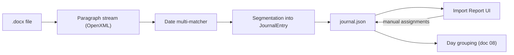

# 11 — Journal Ingestion

This doc specifies how PhotoBook turns an optional Word journal into dated `JournalEntry` records
that the auto-layout engine interleaves with photos (R2). It covers the OpenXML paragraph-stream
parser, the tolerant multi-matcher date pipeline with confidence scores, the Import Report UI for
unmatched and ambiguous entries, re-import semantics that preserve user assignments, the rules for
no-photo days and no-entry photos, and the atomic-text policy that connects journal length to
template selection in the engine.

Related docs: [05-ingestion-and-photo-sources.md](05-ingestion-and-photo-sources.md) ·
[08-auto-layout-engine.md](08-auto-layout-engine.md) · [09-editor-ux.md](09-editor-ux.md) ·
[10-styles-and-typography.md](10-styles-and-typography.md) ·
[04-project-format-and-storage.md](04-project-format-and-storage.md) ·
[13-testing-strategy.md](13-testing-strategy.md)

> **Decision:** Journals are parsed with the OpenXML SDK (`DocumentFormat.OpenXml`) directly from
> `.docx` — no Word interop, no Word installation required — see
> [ADR-0008](adr/0008-journal-openxml.md).

## Pipeline overview

Journal ingestion lives in `src/PhotoBook.Ingestion` and runs as a background job. It is a pure
transformation from a `.docx` file to `journal.json`; the only mutable inputs are the user's
manual date assignments, which are stored alongside the parsed entries and survive re-import.



## OpenXML parsing: the paragraph stream

The parser reduces `w:document/w:body` to a flat, ordered list of `ParagraphRecord`s. Everything
downstream (matching, segmentation, identity) operates on this stream — never on raw OpenXML.

```
ParagraphRecord {
  index: int          // 0-based position in the flattened body
  text: string        // all runs concatenated, whitespace collapsed to single spaces, trimmed
  styleId: string?    // w:pStyle val, e.g. "Heading1", "Heading2"
  outlineLevel: int?  // from the resolved style, if any
  isBoldOnly: bool    // every non-whitespace run is bold
  isAllCaps: bool     // text is uppercase or every run has w:caps
  isListItem: bool    // has numbering properties (w:numPr)
}
```

Flattening rules:

- **Tracked changes** are read as if accepted: `w:ins` content is kept, `w:del` content dropped.
- **Tables** are flattened row-major; each cell contributes its paragraphs in order.
- **Ignored entirely:** headers, footers, footnotes, endnotes, comments, text boxes anchored to
  the page, and embedded images (photos enter only through the photo pipeline, R1).
- Empty paragraphs are dropped from the stream but recorded as paragraph breaks so entry text
  keeps its blank-line structure.
- Hyperlinks contribute their display text only.

**Heading hints.** A paragraph is a *heading candidate* — and therefore gets first crack at date
matching — when any of these hold: `styleId` matches `^Heading[1-6]$`; `outlineLevel <= 2`;
or (`isBoldOnly` or `isAllCaps`) and `text.Length <= 60` and the text does not end in `.`, `!`,
or `?`. Body paragraphs are still scanned for *inline* date prefixes (matchers 2–6 below), so
journals written as "1/5 — We drove up to the pass…" work without any heading styles.

## Date detection: the tolerant multi-matcher

Real family journals mix formats freely, so PhotoBook runs an ordered list of matchers over each
paragraph; **the first matcher that fires wins** for that paragraph. Each match carries a base
confidence in `[0,1]`, then the adjustments below are applied.

| # | Matcher | Fires on | Examples | Base confidence |
|---|---------|----------|----------|-----------------|
| 1 | `ExplicitHeading` | heading candidate whose **entire text** parses as a date | "Friday, January 5, 2024" · "2024-01-05" · "Jan 5" | 1.00 with year, 0.90 without |
| 2 | `MonthDayPrefix` | paragraph **starting** with month-name + day | "January 5 — snow day" · "Jan 5th: …" | 0.80 |
| 3 | `NumericDate` | numeric date token at paragraph start | "1/5/2024" · "1/5/24" · "1/5" · "1-5" | 0.75 |
| 4 | `WeekdayOrdinal` | weekday + ordinal, no month | "Monday the 5th" · "Monday, the 5th" | 0.70 |
| 5 | `Range` | any of the above expressing a span | "January 5–7" · "Jan 5 – Jan 7" · "the 5th through the 7th" | underlying matcher − 0.05 |
| 6 | `OrdinalOnly` | bare ordinal at paragraph start | "The 5th." | 0.60 |

> **Decision:** Numeric dates are interpreted **month/day** (en-US). Rationale: the app is
> single-user with a US locale (kernel §2); a locale switch is a one-line matcher option, not a
> guess we make per document. When the day field is > 12 the reading is forced and confidence is
> unchanged; when both M/D and D/M readings are valid dates, M/D is kept, confidence drops by
> 0.15, and the D/M reading is recorded in `alternates`.

Adjustments applied to every match, in order:

- **Year inference.** A date without a year gets the book year (R3). If the resolved date falls
  outside the book year: −0.25 and the entry is flagged `outOfYear` in the Import Report.
- **Chronology prior.** Journals read forward. The matcher keeps a *month cursor* = the date of
  the most recent entry with confidence ≥ 0.70. A candidate more than 3 days **before** the
  cursor: −0.20. A jump more than 45 days **forward**: −0.15. Matchers 4 and 6 (no month stated)
  resolve their day number against the cursor's month, trying cursor month, then cursor+1, then
  cursor−1, and taking the first chronologically plausible hit.
- **Weekday agreement.** If the text states a weekday and it matches the computed date: +0.10
  (capped at 1.00). If it contradicts: −0.30, and both resolutions (trust-the-day and
  trust-the-weekday, i.e. the nearest date in the cursor month falling on that weekday) are
  recorded in `alternates`.

**Thresholds (fixed):** final confidence ≥ 0.70 → `matched`; 0.40–0.69 → `ambiguous`
(provisionally assigned but flagged); < 0.40 → the token is not treated as a date at all and the
paragraph flows into the current entry. A heading candidate that yields no date match at any
confidence is surfaced in the Import Report as an *unmatched heading* so a quirky format is never
silently swallowed.

## Segmentation into JournalEntry records

```
cursor = null; current = PreambleBucket
foreach p in paragraphs:
    m = FirstMatch(orderedMatchers, p, cursor)
    if m != null and m.confidence >= 0.40:
        Close(current)
        current = StartEntry(m)                    // status: matched | ambiguous
        if m.confidence >= 0.70: cursor = m.dateStart
        AppendRemainderAfterDateToken(current, p)  // inline dates keep their trailing text
    else:
        Append(current, p)
Close(current)
```

- Text **before the first date match** goes to a single preamble bucket, shown as *unmatched* in
  the Import Report (it is often a title page or dedication; the user can exclude or date it).
- Two consecutive entries resolving to the **same date merge** into one `JournalEntry` — a day's
  text is atomic (R5, kernel §9) and the model stores exactly one entry per day.
- A `Range` match produces one entry with `dateStart`/`dateEnd`; day grouping (doc 08) attaches
  it to the `dateStart` Day Group and treats the span as covered (interior days with no photos
  produce no separate pages).

## journal.json schema

Stored at the project root per kernel §5: System.Text.Json, camelCase, `schemaVersion`, atomic
write (temp file + rename), rolling `.bak`, human-diffable.

```jsonc
{
  "schemaVersion": 1,
  "source": {
    "fileName": "Journal-2024.docx",
    "contentHash": "sha256:9f2c…",        // of the .docx bytes at import time
    "importedAtUtc": "2026-08-01T17:20:00Z"
  },
  "entries": [
    {
      "id": "je-3f9a12c04b7d",            // stable identity — see Re-import semantics
      "sourceKey": "friday, january 5|we drove up to the pass and the kids",
      "occurrence": 0,                     // disambiguates identical sourceKeys
      "dateStart": "2024-01-05",
      "dateEnd": "2024-01-05",
      "status": "matched",                 // matched | ambiguous | unmatched | userAssigned
      "matchedBy": "explicitHeading",      // matcher name, camelCase; null when unmatched
      "confidence": 0.90,
      "alternates": ["2024-05-01"],        // other defensible resolutions, may be empty
      "headingText": "Friday, January 5",  // null for inline matches
      "paragraphs": [
        "We drove up to the pass and the kids sledded until dark.",
        "Hot chocolate spill in the van. Worth it."
      ],
      "userDate": null,                    // ISO date; when set it wins over dateStart
      "excluded": false                    // user removed this entry from the book
    }
  ],
  "importReport": {
    "matched": 118,
    "ambiguous": 6,
    "unmatched": 3,
    "outOfYear": 1,
    "orphanedUserAssignments": []          // see Re-import semantics
  }
}
```

The **effective date** used everywhere downstream is `userDate ?? dateStart`. Nothing outside
`entries[*].userDate` and `entries[*].excluded` is ever written by the UI — everything else is
regenerated from the document on re-import.

## Import Report UI

The Import Report opens automatically when the import job finishes with any non-`matched` entry,
and is always reachable from the Book dashboard (doc 09). It is the single place where date
problems are resolved (kernel §2: "tolerant multi-matcher + import report UI").

- **Layout.** Left: entry list grouped *Unmatched* / *Ambiguous* / *Out-of-year* / *Matched*,
  each row showing effective date (or "—"), confidence, and a one-line text preview. Right: the
  full entry text with the detected date token highlighted, plus the matcher name and any
  `alternates` as one-click chips.
- **Actions per entry:** *Assign date* (date picker pre-seeded from the chronology cursor);
  *pick an alternate*; *Merge into previous entry*; *Split at paragraph* (selection creates a new
  entry with status `unmatched`, pending a date); *Exclude*. Any manual date action sets
  `status: "userAssigned"`, `userDate`, and confidence 1.00.
- **Ambient surfacing.** The Month workspace shows a badge when its Chapter has ambiguous or
  unmatched entries touching that month. Unresolved entries never block export — an unmatched
  entry simply does not appear in the book; the badge and report are the persistent reminder.

## Re-import semantics

The journal will be edited in Word and re-imported many times. The contract: **the document owns
the text; the user owns the dates.**

> **Decision:** Entry identity is content-derived, not positional —
> `sourceKey = normalize(headingText) + "|" + normalize(first 80 chars of first paragraph)`,
> where `normalize` lowercases, strips punctuation, and collapses whitespace;
> `id = "je-" + first 12 hex chars of SHA-256(sourceKey + "#" + occurrence)`. Rationale:
> positional ids break the moment a paragraph is inserted; content keys survive reordering and
> unrelated edits, and the 80-char prefix tolerates edits deeper in the entry.

Re-import algorithm:

1. Parse the new document to a fresh entry list (full pipeline above).
2. Match old → new: exact `id`, then unique `headingText`, else no match.
3. For matched pairs, carry forward `userDate`, `excluded`, and `userAssigned` status onto the
   new entry; `paragraphs`, `headingText`, and machine fields are always refreshed from the
   document.
4. Old entries carrying user data that match nothing land in
   `importReport.orphanedUserAssignments` with their old text preview; the Import Report offers a
   *re-attach* picker (choose a new entry to receive the assignment) or *discard*.
5. Entries whose effective date changed trigger day-group regeneration for the affected Chapters
   only; Pinned pages are untouched per doc 08's re-layout rules (R16).

Importing the same document twice is a strict no-op: identical ids, identical `journal.json`
(modulo `importedAtUtc`). This is a golden test in [13-testing-strategy.md](13-testing-strategy.md).

## No-photo days and no-entry photos

- **Photos, no entry.** A Day Group with photos but no `JournalEntry` is normal. Template scoring
  (doc 08) prefers textless templates for it; when a chosen template has a journal `TextSlot`
  anyway, the slot renders empty — deliberate negative space, not an error (R20). Only empty
  **ImageSlots** get the amber missing-content flag (R14, doc 09); empty journal slots never do.
- **Entry, no photos.** A dated entry with no photos that day still ships (R2). Preferred path:
  the DP partitioner merges it with adjacent Day Groups onto one `multiDay` page (R28); this doc
  imposes on [07-layout-template-system.md](07-layout-template-system.md) that `multiDay`
  sections may be **text-only** (zero image slots). Fallback for a long photoless entry that fits
  no shared page: its own page on the journal-dominant `multiDay` template variant with a single
  text-only section. Chronological order is preserved either way.
- **No photos, no entry.** The date simply does not appear in the book. No filler pages.
- **Excluded entries** (`excluded: true`) are treated exactly like "no entry" days.

## Atomic text policy and the engine hook

Per kernel §9, restated here as the binding contract between ingestion, engine, and rendering:

- **No auto font-shrink, ever.** Font sizes come only from `Style`
  ([10-styles-and-typography.md](10-styles-and-typography.md)); the engine never scales text to
  force a fit.
- **A day's journal text is atomic.** It renders as one continuous flow. It may continue from the
  left page's journal slot to the right page's journal slot of the **same Spread**; it never
  crosses a Spread boundary, and it is never split across non-facing pages.
- **Fit is a hard filter.** Template scoring (doc 08) rejects any template whose journal slot
  chain cannot hold the entry at current Style sizes — before any soft scoring happens.
- **Overflow forces roomier templates.** The escalation ladder: (1) same page count, template
  with a larger text slot and fewer/smaller photo slots; (2) split the Day Group's *photos*
  across the two pages of one Spread with a linked journal slot chain; (3) if even the roomiest
  spread pair overflows, the page is laid out with the text visibly clipped and preflight raises
  a **text overflow error** ([12-pdf-export.md](12-pdf-export.md)). The fixes are editorial:
  trim the entry in Word and re-import, or reduce the journal font size globally in Style (R23).

The measurement contract injected into the engine (Engine stays pure and I/O-free, kernel §12):

```
interface ITextMeasurer {
    // Deterministic: shapes with the bundled OFL fonts only; no system font fallback.
    double MeasureHeightIn(IReadOnlyList<string> paragraphs, TextStyle style, double widthIn);
}

bool FitsJournalText(JournalEntry entry, Template t, Style style) {
    var chain = t.JournalSlotChain();               // 1 slot, or L+R linked slots on a spread pair
    double remaining = chain.Sum(s => s.HeightIn);
    double needed = measurer.MeasureHeightIn(entry.Paragraphs, style.Journal, chain[0].WidthIn);
    return needed <= remaining;
}
```

`ITextMeasurer` is implemented in `src/PhotoBook.Rendering` on the same SkiaSharp shaping code
that draws the page, so measurement and rendering can never disagree — WYSIWYG by construction
(kernel §2).

## Testing hooks

- Fixture `.docx` files are **generated in test code** via OpenXML (no binary blobs in the repo):
  one per matcher, plus mixed-format, tracked-changes, table-based, and heading-free journals.
- Table-driven matcher tests: (paragraph text, cursor) → (date, confidence, matcher name).
- Golden `journal.json` snapshots via Verify; re-import idempotence (import twice → identical ids
  and content); orphaned-assignment round-trip.
- Chronology fuzz: shuffled and gap-heavy date sequences must never crash and must degrade to
  `ambiguous`/`unmatched`, never to silently wrong `matched` dates.

See [13-testing-strategy.md](13-testing-strategy.md) for the harness conventions.
