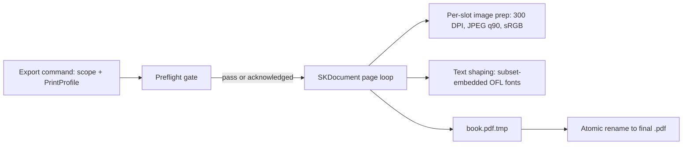

# 12 — PDF Export

This doc specifies the print-ready PDF pipeline: the SKDocument page loop, image downsampling and
encoding rules, font embedding, the bleed/trim/safe geometry from kernel §3 including Spread and
gutter handling, the swappable `PrintProfile` JSON schema, the preflight gating dialog, the
deterministic byte-stable output guarantee, and export scope options. Everything here renders
through the exact same SkiaSharp draw code as the on-screen editor, so what the user proofs is
what prints.

Related docs: [02-architecture.md](02-architecture.md) ·
[07-layout-template-system.md](07-layout-template-system.md) ·
[08-auto-layout-engine.md](08-auto-layout-engine.md) ·
[10-styles-and-typography.md](10-styles-and-typography.md) ·
[04-project-format-and-storage.md](04-project-format-and-storage.md) ·
[13-testing-strategy.md](13-testing-strategy.md)

> **Decision:** PDFs are produced with SkiaSharp's `SKDocument.CreatePdf`, driving the same
> `PageRenderer` used by the screen (`SKElement`) — WYSIWYG by construction, one rendering code
> path to test — see [ADR-0006](adr/0006-pdf-skdocument.md).

## Pipeline overview

Export runs on the background job queue in `src/PhotoBook.Rendering`; the UI shows per-page
progress and the result is written atomically (temp file + rename, same policy as kernel §5).



```csharp
using var stream = File.Create(tmpPath);
var meta = new SKDocumentPdfMetadata {
    Title    = book.Name,
    Producer = "PhotoBook",
    Creation = book.PdfTimestampUtc,   // pinned — see Deterministic output
    Modified = book.PdfTimestampUtc,
    RasterDpi = 300,
    EncodingQuality = 90
};
using var doc = SKDocument.CreatePdf(stream, meta);
foreach (var page in scope.PagesInOrder()) {
    var canvas = doc.BeginPage(mediaWpt, mediaHpt);   // media box = bleed box, in points
    canvas.Translate(bleedPt, bleedPt);               // renderer draws in trim space
    PageRenderer.Render(canvas, page, RenderTarget.Export300Dpi);
    doc.EndPage();
}
doc.Close();
File.Move(tmpPath, finalPath, overwrite: false);
```

`PageRenderer.Render` is identical for screen and PDF; `RenderTarget.Export300Dpi` only switches
the image source from the 1024 px layout preview tier to the export-prep pipeline below
(kernel §10 thumbnail tiers).

## Page geometry: bleed, trim, safe, gutter

All constants from kernel §3, for the default `11x8.5-landscape` page. 1 in = 72 pt.

| Box | Size (in) | Size (pt) | Rule |
|-----|-----------|-----------|------|
| Media = Bleed box | 11.25 × 8.75 | 810 × 630 | PDF page size; background and full-bleed images paint to here |
| Trim box | 11.0 × 8.5 | 792 × 612 | final cut size; inset 0.125 in (9 pt) from media on all sides |
| Safe area | 10.25 × 7.75 | 738 × 558 | 0.375 in (27 pt) inside trim; all text and detected faces stay inside |
| Gutter caution zone | 0.5 in each side of the spread centerline | 36 pt | no faces, no text; see Spreads below |

Coordinate mapping: template coordinates are normalized `[0,1] × [0,1]` over the **single-page
trim box**, origin top-left (kernel §3). The renderer maps `xPt = 9 + x·792`, `yPt = 9 + y·612`.

**Bleed extension.** Any `ImageSlot` edge lying within 0.005 of a trim edge (`x ≤ 0.005`,
`x + w ≥ 0.995`, and likewise vertically) is snapped outward to the bleed edge at render time, so
full-bleed templates survive the trimmer's ±0.0625 in tolerance. The page background is always
painted to the full media box — solid `#000000` in v1 with `#FFFFFF` default text (kernel §3,
R21). Text slots are never extended into bleed and template validation (doc 07) rejects any
`TextSlot` that leaves the safe area.

### Other page sizes (R19)

Nothing above is hard-coded to 11 × 8.5 in. The book's `pageSize` id (`book.json`, doc 03/04)
selects one entry from the active PrintProfile's `pageSizes` array, and **every** constant in
this section is derived from that entry plus the profile's margins at render time:

```text
trimW  = size.trimWidthIn  × 72                    // pt;  trimH likewise
mediaW = (size.trimWidthIn + 2·bleedIn) × 72       // mediaH likewise
xPt    = bleedIn·72 + x·trimW                      // yPt = bleedIn·72 + y·trimH
safe   = safeMarginIn·72 inset from trim;  gutter = gutterCautionIn·72 per side of a centerline
spread = 2·trimW wide (outer-edge bleed only)
```

The default `11x8.5-landscape` with `bleedIn: 0.125` reproduces the table above exactly
(`9 + x·792`, `9 + y·612`). Downstream effects are all data-driven: the 300 DPI target in
*Image handling* recomputes per slot from the new physical slot size, so effective-DPI preflight
adapts automatically, and a vendor wanting 0.25 in bleed or a 0.5 in safe margin is a profile
edit, not a code change.

What deliberately does **not** stretch is the template library: a Template declares a `pageSize`
id and is eligible only for pages whose size id matches exactly (doc 07) — re-flowing a
composition across aspect families (landscape → square) produces bad pages, so each size gets its
own authored variants. Adding a size is therefore two data changes: a `pageSizes` entry in the
profile and a template set carrying that `pageSize` id. v1 ships `11x8.5-landscape` only; the
data model, renderer, and profile carry sizes from M0 and M5 exercises a second size end to end
([14-roadmap.md](14-roadmap.md)).

## Spreads and full-spread photos

A Spread is a view over two facing pages, not a stored entity (kernel §4). The default export
emits **single pages** — recto/verso in reading order — and the print service imposes them.

Full-spread photos (R18, `spreadPair` templates) place one photo across the 22 × 8.5 in panorama:
the shared `CropState` is computed over the full spread trim, the left page draws the
`x ∈ [0, 11]` in half, the right page draws `x ∈ [11, 22]` in. Consequences, by design:

- Smart-crop (doc 08) keeps the primary Focus Region, all faces, and all text out of the 0.5 in
  gutter caution zone on each side of the centerline.
- The photo's pixels run through the gutter regardless — roughly 1 in of image around the
  centerline is visually lost in the binding. **Full-spread photos accept this center loss**
  (kernel §3); it is a known trade, not a defect, and preflight does not warn about it.
- Facing pages each get outer-edge bleed; at the spine the two halves butt-join with no inner
  bleed, which is correct for perfect-bound and layflat books alike.

**Spread output mode.** When `printProfile.output` is `"spreads"`, pages are paired
(2,3), (4,5), … into panorama PDF pages: trim 22 × 8.5 in, media 22.25 × 8.75 in
(1602 × 630 pt) — bleed on outer edges only. Page 1 (the book's opening recto) and a trailing
lone page export as single pages. Some layflat services ingest spreads directly; this is a
profile switch, not a re-layout.

## Image handling

Per placed photo, at export time:

1. **Crop.** Resolve the `CropState` (kernel §4) against the slot to a source-pixel crop window.
2. **Adjust.** Apply the photo's `AdjustmentStack` at source resolution via Magick.NET
   (originals stay immutable, kernel §2).
3. **Downsample.** Target pixels = `ceil(slotWidthIn × 300) × ceil(slotHeightIn × 300)`.
   Lanczos resample **only when the crop window exceeds the target — never upsample**; a smaller
   source embeds at native resolution.
4. **Color.** Convert to sRGB IEC61966-2.1: embedded ICC profiles are honored and transformed;
   untagged images are assumed sRGB. All EXIF/XMP metadata is stripped (privacy + determinism).
5. **Encode.** JPEG quality 90, 4:2:0 chroma subsampling, embedded in the PDF as-is
   (`RasterDpi`/`EncodingQuality` in the metadata are the matching Skia-side caps).

**Effective DPI** = crop-window pixel width ÷ slot width in inches. Below **200 DPI** →
preflight warning (kernel §11); 200–299 DPI is reported in the export log only. Prepared images
are cached in `cache/` keyed by `(photoContentHash, adjustmentsHash, cropHash, targetPx)` —
fully regenerable, never a home for user intent (kernel §5). Prep runs in parallel on the job
queue (bounded at CPU count); the page loop itself is sequential, so peak memory is one full-res
decode plus one page's prepared slots.

## Fonts

Only the three bundled OFL families are ever shaped or embedded: **Source Serif 4** (journal,
10.5 pt), **Source Sans 3** (captions, 8.5 pt), **Playfair Display** (month titles, 64 pt) —
sizes are Style defaults from [10-styles-and-typography.md](10-styles-and-typography.md)
(kernel §9). Typefaces load from app resources via `SKTypeface`; the system font list is never
consulted, so output cannot vary by machine. Skia's PDF backend **subset-embeds** automatically:
only the glyphs actually used are written, and the OFL explicitly permits embedding. Missing
glyph policy: try the other two bundled families, then draw U+FFFD and log an export warning —
never silently drop text.

## PrintProfile schema

> **Decision:** Print-service specifics live in data, not code — a JSON `PrintProfile` per
> service, swappable at export time (kernel §2, §11). Rationale: bleed, page-count rules, and
> color expectations differ per vendor; a profile file makes "same book, different printer" a
> re-export instead of a rebuild, and adding a vendor never touches the renderer.

Profiles ship in the app's `profiles/` directory; users add a vendor by dropping a JSON file
beside them. `book.json` holds the reference as `printProfileId` (kernel §5).

```jsonc
{
  "schemaVersion": 1,
  "id": "generic-11x8.5",
  "name": "Generic 11×8.5 landscape",
  "pageSizes": [
    { "id": "11x8.5-landscape", "trimWidthIn": 11.0, "trimHeightIn": 8.5 }
  ],
  "bleedIn": 0.125,            // per outer edge
  "safeMarginIn": 0.375,       // inside trim
  "gutterCautionIn": 0.5,      // each side of spread centerline
  "minPages": 20,
  "maxPages": 200,
  "pageCountMultiple": 2,      // some services require multiples of 2 or 4
  "colorIntent": "sRGB",       // v1: "sRGB" is the only supported value
  "imageDpi": 300,
  "jpegQuality": 90,
  "includeTrimMarks": false,   // true adds a 0.25 in slug and draws crop marks
  "output": "single-pages",    // "single-pages" | "spreads"
  "spine": null                // reserved: spine-width calc arrives with covers in v2 (kernel §11)
}
```

Validation at export: the book's page size id must appear in `pageSizes` (templates are authored
per `pageSize` id, kernel §6 — this is how R19's multiple page sizes stay consistent end to
end); the in-scope page count must satisfy `minPages`/`maxPages`/`pageCountMultiple`. Violations
are preflight **errors**. Honest v1 limitation: SkiaSharp's PDF backend cannot write a PDF/X
OutputIntent, so `colorIntent` is enforced by converting all pixels to sRGB (above) rather than
by tagging the document — correct for the consumer photo-book services this targets, revisit if
a vendor demands PDF/X.

## Preflight gate

Preflight is a modal gating dialog that runs before every final export (kernel §11). Checks, in
display order:

| Check | Severity | Detects |
|-------|----------|---------|
| Empty image slots | **Error** | any `ImageSlot` with no photo (the amber flags from doc 09, R14) |
| Text overflow | **Error** | a Day Group whose journal text failed the atomic-text ladder ([11-journal-ingestion.md](11-journal-ingestion.md)) |
| Profile constraints | **Error** | page size not in profile; page count outside min/max/multiple |
| Effective image DPI < 200 | Warning | per-placement list with computed DPI |
| Non-empty Unplaced bin | Warning | photos in the book's Unplaced bin that will not print |
| Date-uncertain photos | Warning | placed photos with `dateUncertain: true` (kernel §10) |

Dialog behavior:

- Findings are grouped by severity; every row is a hyperlink that closes the dialog and navigates
  to the offending Page, slot, or photo in the editor (doc 09). A *Re-check* button re-runs the
  scan without leaving the dialog.
- **Errors disable the Export button** — no override. **Warnings** require one explicit
  "I understand, export anyway" checkbox covering all of them.
- **Draft escape hatch:** a *Draft PDF* button is always enabled. It skips the gate and renders
  at 150 DPI, JPEG q75, with a diagonal "DRAFT" watermark (Source Sans 3, 20% white) on every
  page — for proofing on screen or a home printer, never for upload.

## Deterministic, byte-stable output

Same project folder + same app version + same profile ⇒ **byte-identical PDF** (kernel §11).
The measures that make this true:

- **Pinned timestamps.** `SKDocumentPdfMetadata.Creation` and `.Modified` are both set to
  `book.json.pdfTimestampUtc`, written once when the book is created and never touched again.
  No wall-clock value enters the file.
- **No randomness.** The layout engine is a pure function of its inputs plus the book Seed
  (kernel §7); export introduces no RNG of its own.
- **Stable orders.** Pages iterate by book page number; slots by template declaration order;
  fonts and images are embedded on first use in that traversal.
- **Deterministic encoding.** Image prep (crop → adjust → Lanczos → sRGB → JPEG q90) is
  deterministic for a fixed Magick.NET version; Skia's glyph subsetting is deterministic for
  fixed text and fixed bundled fonts.
- **Atomic write.** The temp-file + rename means a crashed export never leaves a plausible but
  truncated `.pdf` behind.

Verification is a SHA-256 golden test over a fixture book in
[13-testing-strategy.md](13-testing-strategy.md). Known caveat, stated honestly: upgrading
SkiaSharp or Magick.NET may legitimately shift bytes; goldens are re-baselined as part of the
dependency-bump checklist in doc 13, and determinism is only promised *per app version*.

## Export scope

Three scopes, selected in the export dialog; geometry, page numbering, and rendering are
identical in all of them — scope only filters which pages are emitted.

| Scope | Contents | Filename |
|-------|----------|----------|
| Book (default) | every Chapter in order — one book = one year (R3) | `MyBook-2024.pdf` |
| Chapter | one month, including its month-title page — Chapters stand alone (R4) | `MyBook-2024_2024-06.pdf` |
| Page range | inclusive book page numbers, e.g. 12–27, for proofing a section | `MyBook-2024_p12-p27.pdf` |

Details: page numbers are the book-wide sequence, so a Chapter or range export shows the same
numbers it would have in the full book. In `"spreads"` output mode a page range is snapped
outward to spread boundaries. Preflight evaluates the in-scope pages plus the book-level
Unplaced-bin check; profile page-count constraints apply to Book scope only (partial exports are
proofs, not uploads — the dialog says so when a range or Chapter export violates them).

## Testing hooks

- Geometry unit tests: the pt-math table above is asserted exactly (media/trim/safe boxes,
  bleed-snap threshold, spread pairing arithmetic).
- Effective-DPI computation tests across `CropState` zoom/offset cases, including `zoom < 1`
  letterboxing (R9).
- Preflight rule tests: one fixture book per finding type; severity and navigation targets.
- Golden PDF SHA-256 for a fixture book; a second export of the same project must be
  byte-identical in CI.
- `PrintProfile` parsing round-trips via Verify snapshots; unknown-field tolerance
  (forward-compatible profiles must not fail to load).

See [13-testing-strategy.md](13-testing-strategy.md) for harness conventions.
