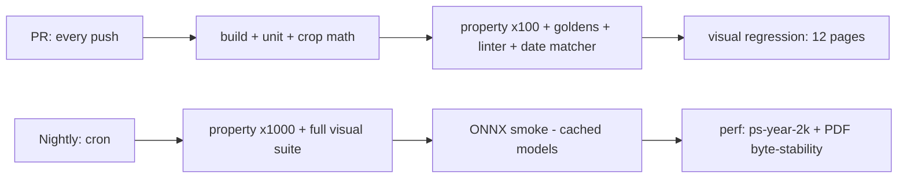

# 13 — Testing Strategy

This doc defines how PhotoBook is tested: golden layout tests that freeze engine behavior, determinism and property tests that enforce engine invariants, a template linter that runs as a test, crop-math unit tests, table-driven journal date-matcher tests, perceptual visual regression on rendered pages, and the CI split (PR vs nightly) on `windows-latest`. The layout engine is a pure function with no I/O ([02-architecture.md](02-architecture.md)), which is what makes most of this cheap; the strategy leans hard on that.

Related docs: [02-architecture.md](02-architecture.md) · [07-layout-template-system.md](07-layout-template-system.md) · [08-auto-layout-engine.md](08-auto-layout-engine.md) · [11-journal-ingestion.md](11-journal-ingestion.md) · [12-pdf-export.md](12-pdf-export.md) · [06-image-analysis.md](06-image-analysis.md)

## Scope and test philosophy

> **Decision:** Test stack is **xUnit + Verify** (snapshots) + **FsCheck** (property tests) + **BenchmarkDotNet** (perf), all on GitHub Actions `windows-latest`. xUnit and Verify are already locked by the solution layout in [02-architecture.md](02-architecture.md); FsCheck is added because the engine's invariants ("Pinned pages never change", "excluded photos never placed") are universally quantified claims that example-based tests cannot honestly cover. Inline rationale; no ADR needed — this is tooling, not architecture.

Three rules govern everything below:

1. **The engine is tested without pixels.** `PhotoBook.Engine` consumes photo metadata (dimensions, dates, Focus Regions, Tiers), journal entries, templates, style, and a Seed — never image bytes. Engine fixtures are therefore pure JSON and tiny.
2. **ML is quarantined.** Golden layout tests consume *recorded* analysis output (canned `FocusRegion`s and `QualityScore`s in the fixture), never live ONNX inference. Otherwise a model or ONNX Runtime version bump silently invalidates every golden. Live ONNX gets its own tolerance-based smoke tests (nightly).
3. **User intent files are the contract.** Tests assert against the serialized project format of [04-project-format-and-storage.md](04-project-format-and-storage.md) (`chapters/2024-01.json` shape), because that is what the user's book actually is.

## Test projects and fixtures

```
tests/
  PhotoBook.Core.Tests         — domain model, persistence round-trips, CropState math
  PhotoBook.Engine.Tests       — golden layouts, determinism, property tests
  PhotoBook.Templates.Tests    — template linter over the shipped library
  PhotoBook.Ingestion.Tests    — journal date matcher, .docx parsing, import report
  PhotoBook.Rendering.Tests    — visual regression, PDF byte-stability
  PhotoBook.Analysis.Tests     — ONNX smoke tests (nightly), analyzer contract tests
  fixtures/
    photosets/                 — JSON catalogs (photos.json shape + canned analysis + journal)
    images/                    — small real pixels (256 px) for Imaging/Rendering tests only
    baselines/                 — committed PNG baselines for visual regression
    journals/                  — .docx samples for ingestion tests
```

Canonical engine fixture sets (JSON only, committed):

| Fixture | Contents | Exercises |
|---|---|---|
| `ps-tiny-week` | 12 photos / 5 days, no journal | smoke, M0-era behavior |
| `ps-typical-month` | 180 photos / 26 days, journal on 14 days | the workhorse; pacing, text fit |
| `ps-sparse-month` | 9 photos / 6 days | Day Group merging onto shared pages (R28) |
| `ps-burst-day` | 60 photos / 1 day | day splitting across pages |
| `ps-tiers-skewed` | 40 photos, tiers forced S-heavy | Tier→slot-size affinity (R26) |
| `ps-year-2k` | synthetic 2,000-photo year, generated at test time from Seed 7 | nightly perf + determinism at scale |

Every fixture runs under Seeds **{1, 42, 1337}** unless the test says otherwise.

## Golden layout tests

A golden test is: **(fixture photo set, journal, template library, style, Seed) ⇒ committed expected chapter layout**. The engine output — pages, template refs, slot→photo placements with `CropState`, bin contents — is serialized exactly as `chapters/2024-01.json` would be and snapshotted with Verify (`*.verified.json` files committed next to the test).

- One golden per (fixture × Seed) plus targeted goldens: `ps-typical-month` with the journal removed (textless pacing), with 10 photos excluded, with 3 pages Pinned before re-layout.
- Assertion is a full structural diff. A failing golden is not noise — it means the book a user gets changed. The update workflow is: run locally, eyeball the Verify diff (and the visual-regression render of the same fixture, below), then accept. **Never** auto-accept in CI.
- Goldens double as the engine's regression spec for R7 (initial chronological layout), R28 (sparse-day merging), R25 (smart-crop `CropState` emission), and R26 (Tier-driven slot sizes).

The test shape, concretely:

```csharp
public class GoldenLayoutTests
{
    [Theory]
    [InlineData("ps-typical-month", 1)]
    [InlineData("ps-typical-month", 42)]
    [InlineData("ps-typical-month", 1337)]
    [InlineData("ps-sparse-month", 42)]
    [InlineData("ps-burst-day", 42)]
    [InlineData("ps-tiers-skewed", 42)]
    public Task Layout_matches_golden(string fixture, int seed)
    {
        var input  = EngineFixture.Load(fixture);              // pure JSON, no pixels
        var result = LayoutEngine.LayoutChapter(input with { Seed = seed });
        var json   = ProjectJson.Serialize(result);            // exact chapters/*.json shape
        return Verify(json).UseParameters(fixture, seed);      // → *.verified.json committed
    }
}
```

`EngineFixture.Load` reads `tests/fixtures/photosets/<name>/` — a `photos.json`-shaped catalog
(with canned Focus Regions and Tiers), an optional `journal.json`, and the shipped template
library. Nothing else. If a golden needs an image file to run, the fixture is wrong.

## Determinism tests

The engine contract ([08-auto-layout-engine.md](08-auto-layout-engine.md)) is *pure deterministic function of (photos, journal, templates, style, seed)*. Tests enforce it from four angles:

1. **Same input twice ⇒ identical output.** Run `LayoutChapter` twice on `ps-typical-month`, serialize both results with the canonical System.Text.Json settings, byte-compare. Any drift (unordered `Dictionary` iteration, `Parallel.For` reduction order, uncontrolled `Random`) fails here first.
2. **Input enumeration order is irrelevant.** Shuffle the photo list with an independent RNG before the second run; outputs must still be byte-identical. The engine must impose its own total ordering internally — how is doc 08's business; *that it does* is tested here.
3. **Cross-machine stability.** Goldens are committed from dev machines and re-verified on `windows-latest`; a green CI run *is* the cross-environment determinism test. Floating-point-sensitive scoring must use plain `double` arithmetic with no platform intrinsics for exactly this reason.
4. **PDF byte-stability** (nightly): export the same small project twice with the pinned-timestamp metadata option ([12-pdf-export.md](12-pdf-export.md)) and compare SHA-256 of the two files. Same project ⇒ same bytes.

## Property tests for engine invariants

FsCheck generators produce random catalogs (up to 300 photos, random dates inside one month, random aspect ratios 0.5–2.0, random Tiers, 0–20% excluded), random journals, and random Seeds. **100 cases per property on PR, 1,000 nightly.** Shrunk counterexamples are serialized to the test output so they can be promoted into permanent fixtures.

The Pinned-page property, concretely (the others follow the same pattern):

```csharp
[Property(MaxTest = 100)]  // 1000 nightly via PHOTOBOOK_PROPERTY_N env var
public Property Pinned_pages_never_change_on_relayout(
    ChapterInput input, PositiveInt pinCount, InputMutation mutation)
{
    var first  = LayoutEngine.LayoutChapter(input);
    var pinned = PickPages(first, pinCount.Get % first.Pages.Count);
    var second = LayoutEngine.LayoutChapter(
        mutation.Apply(input), keepPinned: pinned);

    return pinned.All(p =>
        ProjectJson.Serialize(second.Pages[p.Number]) ==
        ProjectJson.Serialize(first.Pages[p.Number]))
      .ToProperty();
}
```

Invariants (each is one property):

- **Overlap is declared or it is a bug.** On every emitted page, two image-slot rects intersect by more than 0.002 only when the template sets `overlaps: true` and the two slots sit on different `layer`s; a text slot lands on an image slot only when the template sets `overlaps: true` and the text slot sets `scrim: true`, or when the two are paired via `captionPolicy: "overlay"` (R5). The pairing rules are [07-layout-template-system.md](07-layout-template-system.md) L2 and L3.
- **Every placed photo exists** in the input catalog, and no photo id appears in more than one slot per Chapter.
- **Conservation.** placed ∪ Unplaced bin ∪ excluded = input catalog, and the three sets are disjoint (R10, R13, R17).
- **Pinned pages never change on re-layout.** Layout once; mark a random subset of pages Pinned; mutate the inputs (add 10 photos, flip 5 tiers, change the Seed); re-layout the Chapter. Every Pinned page's serialized form is byte-identical to before (R16).
- **Excluded photos are never placed**, under any mutation sequence including simulated re-scan of the source (R17; kernel: excluded survives re-scans/re-syncs).
- **Engine-emitted `CropState` is always cover-fit-legal:** `zoom ≥ 1.0` and offsets within the clamp bounds of §Crop-math below. Auto-layout never letterboxes; only users choose `zoom < 1` (R9).
- **Chronology.** Within a Chapter, first-placement order of photos is non-decreasing by date (R7), except inside a single multi-photo page where slot geometry may reorder.

## Template linter as a test

The linter is a library function (`TemplateLinter.Lint(Template) → LintError[]`) shipped in `PhotoBook.Core` so the app can validate Detached page snapshots at runtime too. `PhotoBook.Templates.Tests` runs it as an xUnit `[Theory]` over **every** template in the shipped library (~50; [07-layout-template-system.md](07-layout-template-system.md)) — one test case per template id, so failures name the file.

Per-template checks:

- `id` unique across the library, matches `^t-[a-z0-9-]+$`; `photoCount == slots.Count` and 1 ≤ `photoCount` ≤ 8 (R20).
- Every `rect` inside [0,1]² with `w,h > 0`; image slots pairwise non-overlapping **unless the template declares it** (L2); `aspect > 0`; `0 ≤ aspectTolerance ≤ 1`; `tierAffinity ∈ {S,A,B,C,any}`; `captionPolicy ∈ {none,below,overlay}`; `kind` in the schema enum.
- Text slots fully inside the Safe area: normalized insets **x ≥ 0.0341** (0.375 in / 11 in) and **y ≥ 0.0441** (0.375 in / 8.5 in) — geometry from [12-pdf-export.md](12-pdf-export.md).
- `mirrorable: true` ⇒ the horizontally mirrored variant re-passes every check above.
- `kind: "multiDay"` ⇒ `sections` non-empty and the sections exactly partition the template's slots and text slots.
- `spreadPair` templates: no text slot and no non-full-spread image slot enters the gutter caution zone (±0.0455 normalized of the spread centerline).

Library-level checks (one test each): at least one template for every `photoCount` 1–8; ≥ 4 `monthTitle` (R24); ≥ 5 `multiDay` (R28); ≥ 1 `fullBleed` (R18); textless templates exist for photoCounts 1–4 (negative-space option, R20).

## Crop-math unit tests

`CropState { zoom, offsetX, offsetY }` and its helpers live in `PhotoBook.Core` and are tested exhaustively there, since docs 07/08/09 all build on this one model:

- **`coverScale` cases:** landscape image in portrait slot, portrait in landscape, exact aspect match ⇒ `coverScale = max(slotW/imgW, slotH/imgH)` verified against hand-computed values.
- **Round-trips:** for a grid of image sizes × slot aspects × crop windows, `CropWindowToCropState` then `CropStateToCropWindow` reproduces the window within 1e-9. This is the bridge the smart-crop step depends on (Focus Region window → `CropState`, R25).
- **Clamping at `zoom ≥ 1`:** offsets are clamped so no background gap appears; the clamp function is idempotent (`Clamp(Clamp(s)) == Clamp(s)`) and at `zoom = 1.0` the fully-covered axis has zero pan freedom. Numeric clamp bounds and the editor's zoom limits are owned by [09-editor-ux.md](09-editor-ux.md); these tests assert the *behavioral* contract.
- **`zoom < 1` (letterbox, R9):** the visible image rect no longer fills the slot, the no-gap constraint is dropped, and the page background shows through; renderer tests confirm the exposed area paints `#000000` v1 background.
- **Degenerate inputs:** 1×1 px images, extreme aspects (10:1), `zoom` at the editor's min/max — no NaN, no exception, output still serializable.

## Journal date-matcher table tests

The tolerant multi-matcher ([11-journal-ingestion.md](11-journal-ingestion.md)) is tested as a single xUnit `[Theory]` with a `[MemberData]` table: `(input line, book year) → expected date | NoMatch`. The table is the living spec — every real-world quirk found in the family's journals becomes a new row, never a code-only fix.

Seed rows include: `"January 5"`, `"Jan 5, 2024"`, `"Jan. 5th"`, `"Monday, January 5th"`, `"1/5"`, `"1/5/24"`, `"2024-01-05"`, `"1-5-2024"`, ordinal and weekday noise, headings with trailing punctuation, and negative rows that must **not** match (phone numbers, "3/4 cup", bare years). Year-less formats resolve against the book year; Feb 29 in a non-leap book year ⇒ `NoMatch` routed to the Import Report. A second table test feeds a whole `.docx` fixture and asserts the Import Report contents: matched count, unmatched entries verbatim, `dateUncertain` propagation.

## Visual regression

Layout goldens catch *structural* drift; visual regression catches *paint* drift (text metrics, scrim gradients, border strokes, mirroring).

- `PhotoBook.Rendering.Tests` renders fixture pages through the real SkiaSharp page renderer at **96 DPI** (1056 × 816 px for the 11 × 8.5 in page) to PNG, using fixture pixels from `fixtures/images/` and the bundled OFL fonts loaded from file — system font fallback disabled, so rasters are machine-stable.
- **Perceptual diff, not byte diff:** a pixel differs if any channel delta > **3** (of 255); a page fails if > **0.1%** of pixels differ. This absorbs sub-pixel anti-aliasing wiggle while still catching a moved caption or wrong border color.
- Baselines are committed PNGs in `tests/fixtures/baselines/`. On failure CI uploads a triptych artifact (baseline / actual / diff heatmap). Updating a baseline is a reviewed commit, same policy as goldens.
- PR runs a **12-page** representative set (one page per template `kind`, a Spread, an overlay caption, a `zoom < 1` letterbox page, a mirrored pair); nightly renders **every** shipped template once with placeholder-but-real photos.

### Pixel assertions for the things a golden cannot see

A layout golden compares the *emitted page*, so it passes whether or not the renderer honored what
the template declared. Deliberate overlap (doc 07) is exactly that shape of risk — `layer` and
`scrim` are template facts that only exist as pixels — and it shipped once with the library
declaring both and the draw path honoring neither: templates linted clean, laid out clean, and
rendered a journal entry onto bare photo. `OverlapRenderingTests` closes that seam without a
baseline image, by rendering flat-colour photos onto a **white** page and reading device pixels back
through `PageRenderResult.SlotRects`:

- the slot on the higher `layer` owns the pixels where the two rects meet, even when the lower slot
  is authored *after* it, so reading order alone cannot produce the result;
- a lifted slot casts its shadow just outside its own edge and nowhere else;
- a `scrim: true` text slot darkens the photo behind its words, leaves the rest of that photo alone,
  and stops at the photo's edge rather than smearing the page around it;
- a text slot touching no photo gets nothing.

The white page is the point: on the shipped black background (R21) "the scrim did not spill here" is
unfalsifiable, because black over black is black.

> **Decision:** **A declaration the renderer can ignore needs a pixel test, not a golden.** Any future
> template field that changes only how a page is painted — borders per slot, background images (R21) —
> lands with an assertion of this kind in the same commit.

## CI on windows-latest



One workflow file, two triggers, both on `windows-latest` (the only OS PhotoBook ships on):

| Suite | PR gate | Nightly | Notes |
|---|---|---|---|
| Build + unit (Core, Imaging, Ingestion) | ✔ | ✔ | includes crop math, persistence round-trips |
| Golden layout tests | ✔ | ✔ | canned analysis; no pixels |
| Determinism double-run + shuffle | ✔ | ✔ | `ps-typical-month` |
| Property tests | 100 cases | 1,000 cases | `PHOTOBOOK_PROPERTY_N` env var |
| Template linter (full library) | ✔ | ✔ | one test case per template id |
| Journal date-matcher tables | ✔ | ✔ | plus full `.docx` Import Report test |
| Visual regression | 12-page set | every template | diff artifacts uploaded on failure |
| ONNX smoke (YuNet, U2-Netp, NIMA) | — | ✔ | models via `actions/cache` |
| Perf gates (BenchmarkDotNet) | — | ✔ | `ps-year-2k`; re-layout < 20 s CI bound |
| PDF byte-stability + 2k determinism | — | ✔ | SHA-256 compare, pinned timestamps |
| Azure adapter contract tests | — | secret-gated | skip loudly without `AZURE_VISION_KEY` |

**PR gate** (target < 10 min, required to merge): build all projects; every ✔ row above. No
network access needed — canned analysis only, models never touched, so a fork PR runs the full
gate without secrets.

**Nightly** (cron, non-blocking but paged on failure):

- Property tests at 1,000 cases; full-library visual regression.
- **ONNX smoke tests:** YuNet, U2-Netp, and NIMA each run on 6 committed reference photos; assertions are tolerance-based (face count exact; saliency/aesthetic within ±10% of recorded reference), so runtime patch releases don't false-fail. **Models are cached** via `actions/cache` keyed on the hash of `models.lock.json` (model file names + SHA-256, owned by [06-image-analysis.md](06-image-analysis.md)); cache miss downloads from the project's release storage — models are never committed to git.
- **Perf gates** (BenchmarkDotNet on `ps-year-2k`): full-year re-layout target is < 10 s local; CI asserts **< 20 s** (2× headroom for shared-runner variance) and fails on regression > 30% vs the rolling baseline. Full-year analysis (< 15 min target) is benchmarked but report-only.
- PDF byte-stability test (§Determinism) and a 2,000-photo determinism double-run.
- `AzureVisionAnalyzer` contract tests run only when the `AZURE_VISION_KEY` secret is present; otherwise they skip loudly (R27 — Azure is optional, CI must be green without it).

There is no Linux/macOS leg: PhotoBook is a Windows-only WPF app ([ADR-0002](adr/0002-ui-wpf.md)), and `windows-latest` is where users' bytes are produced — testing anywhere else would validate the wrong platform.
