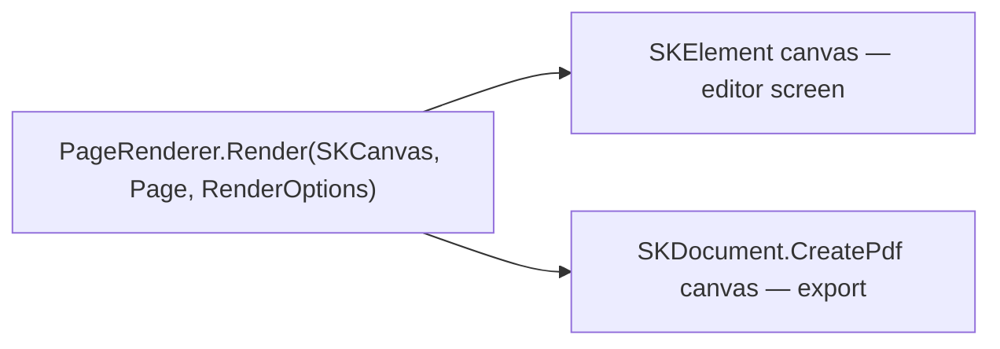

# ADR-0003 — Rendering: one SkiaSharp renderer for screen and PDF

Records the choice of SkiaSharp as the single rendering engine behind both the editor canvas and
the exported PDF. This is the decision that makes WYSIWYG a structural property instead of a QA
goal. Assumes [ADR-0001](0001-platform-dotnet.md) (platform) and pairs with
[ADR-0002](0002-ui-wpf.md) (SKElement hosting); the PDF-specific pipeline details live in
[ADR-0006](0006-pdf-skdocument.md).

Related docs: [12-pdf-export.md](../12-pdf-export.md) · [02-architecture.md](../02-architecture.md) · [10-styles-and-typography.md](../10-styles-and-typography.md)

## Status

Accepted — locked by the user 2026-08-01; recorded 2026-08-03.

## Context

The editor shows pages and Spreads exactly as they will print (R8): cropped/panned/zoomed images
in Slots (R9), full-bleed photos (R18), overlay captions on scrims (R5), month-title typography
(R24), black backgrounds (R21), multiple page sizes (R19). If the screen uses one text/graphics
stack and the PDF another, every one of those features drifts: different font metrics wrap captions
differently, different resamplers crop differently, and "tweak until the print matches" becomes the
user's job. The geometry is fixed in kernel §3 (11×8.5 in landscape trim, 0.125 in bleed, 0.375 in
safe margin, normalized [0,1]² template coordinates over the trim box) and export targets 300 DPI,
JPEG quality 90, sRGB, subset-embedded OFL fonts. The only structural guarantee of WYSIWYG is one
renderer with two output targets.

## Options considered

| Option | Verdict | One-line summary |
|---|---|---|
| SkiaSharp (SKElement + SKDocument) | **Chosen** | Same `SKCanvas` code path draws screen and PDF |
| WPF native drawing + separate PDF library | Rejected | Two text/graphics stacks ⇒ guaranteed drift |
| Direct2D (Vortice / Win2D) | Rejected | Fastest screen path, but no PDF target — still two renderers |
| Browser/HTML + CSS paged print (WebView2) | Rejected | Chromium owns layout; bleed/DPI/font control too coarse |

**WPF native drawing (`DrawingContext`/`DrawingVisual`) + PDFsharp/QuestPDF.** Zero extra
dependencies for the screen and idiomatic WPF. Rejected because WPF cannot render to PDF, so a
second library re-implements every page-drawing feature with different text shaping
(WPF `TextFormatter` vs the PDF library's), different image interpolation, and different
coordinate rounding. Every style change (R23) must then be verified twice. This is the exact
failure mode the north star forbids: edits stop being tweaks.

**Direct2D via Vortice or Win2D.** The best raw screen performance on Windows. Rejected for the
same structural reason: Direct2D has no PDF backend, so PDF needs a second renderer. Win2D is
additionally WinUI/UWP-oriented (conflicts with [ADR-0002](0002-ui-wpf.md)). SkiaSharp's raster
speed is more than sufficient for one visible page or Spread.

**Browser/HTML print (WebView2 + CSS paged media).** CSS is a capable layout language and Chromium
prints decent PDFs. Rejected because the print pipeline is a black box: no direct control of bleed
boxes, image placement resolution, JPEG recompression, or font subsetting; pixel-accurate parity
between the on-screen editor (which would itself have to be HTML, contradicting ADR-0002) and
Chromium's print path is not achievable, and PDF determinism (kernel §11) is off the table.

## Decision

> **Decision:** All page drawing lives in one class, `PageRenderer` in `src/PhotoBook.Rendering`,
> with the single entry point `Render(SKCanvas canvas, Page page, RenderOptions options)`. The
> editor calls it with an `SKElement`'s canvas; PDF export calls it with canvases from
> `SKDocument.CreatePdf`. WYSIWYG is therefore true by construction — there is no second code path
> to diverge.

- Coordinates: one `SKMatrix` maps normalized template rects (kernel §3) to device space; screen
  passes a zoom/pan view matrix, PDF passes a 300 DPI page matrix. The drawing code never knows
  which target it has.
- `RenderOptions { targetDpi, drawGuides, quality }`: guides (bleed/trim/safe boxes, amber
  empty-slot flags per R14) render on screen only; `drawGuides = false` for export.
- Text: all typography through SkiaSharp + HarfBuzzSharp shaping with the bundled OFL fonts
  (kernel §9) — WPF text APIs are never used for page content, only for app chrome.
- Images: photos enter as `SKImage` from the Magick.NET pipeline
  ([ADR-0004](0004-imaging-magick-net.md)); `CropState` (kernel §4) resolves to a source/dest rect
  pair identically for both targets, including `zoom < 1` letterboxing over the page background (R9).

## Consequences

- **We gain:** WYSIWYG without a test matrix; one place to implement every visual feature (borders,
  scrims, styles per R23); deterministic PDF output (same project ⇒ byte-stable modulo pinned
  timestamps, kernel §11); page-size flexibility (R19) is just a different matrix.
- **We pay:** SkiaSharp on WPF renders via CPU raster into a `WriteableBitmap` — measured budget is
  one page/Spread at editor zoom, comfortably within frame time on modern hardware, but 4K
  full-screen redraw needs dirty-rect discipline; SKDocument produces plain RGB PDF (no PDF/X, no
  CMYK, no ICC output intents) — acceptable because the product ships a *generic* print-ready PDF
  and service specifics live in `PrintProfile` JSON (kernel §2, §11); app chrome and page canvas
  use different text stacks, which is fine because chrome never prints.
- Native dependency (`libSkiaSharp` + HarfBuzz) is already paid for by [ADR-0001](0001-platform-dotnet.md).

## Revisit when

- A chosen print service hard-requires PDF/X or CMYK with ICC profiles — evaluate a post-process
  step (Ghostscript conversion) before ever considering a second renderer.
- Editor profiling shows CPU raster missing frame budget on target hardware — first resort is
  `SKGLElement`/GPU surface for the *same* renderer, not a renderer change.
- SkiaSharp's PDF backend gains or loses capabilities that change the export contract in
  [12-pdf-export.md](../12-pdf-export.md).
