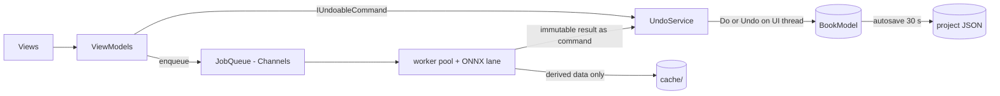

# ADR-0009 — App architecture: MVVM, DI, command undo, single-writer model, Channels job queue

This ADR fixes the in-process architecture of `PhotoBook.App`: MVVM with CommunityToolkit.Mvvm,
Microsoft.Extensions.DependencyInjection for composition, command-pattern undo/redo, a single-writer
threading rule over the domain model, and a System.Threading.Channels background job queue.

Related docs: [02-architecture.md](../02-architecture.md) · [09-editor-ux.md](../09-editor-ux.md) · [03-domain-model.md](../03-domain-model.md) · [ADR-0002](0002-ui-wpf.md)

## Status

Accepted — 2026-08-01.

## Context

The editor is interaction-heavy — drag-drop with swap semantics, pan/zoom cropping, tier
promote/demote, per-page layout overrides (R9–R15) — and everything must be undoable, because the
product promise is that "edits should really be tweaks" on top of automatic layout. Meanwhile heavy
work runs constantly in the background: first-import analysis has a 15-minute budget for 2,000
photos, thumbnails stream in, "auto-layout rest of chapter" (R16) and PDF export must not freeze
the UI. We need one boring, enforceable answer to "who may touch the model, on which thread, and
how is it undone?"

## Options considered

- **Code-behind + events, no container.** Fastest to start, unownable within a month; undo/redo
  retrofitted onto ad-hoc mutation never works.
- **Prism / ReactiveUI.** Capable frameworks, but Prism's region/module machinery outweighs a
  single-window docking app, and ReactiveUI's Rx idiom raises the long-term maintenance bar for a
  solo project. CommunityToolkit.Mvvm's source generators give the useful 90% with zero framework
  lock-in.
- **Free-threaded model with locks.** Fine-grained locking over a mutable object graph is the
  classic deadlock/torn-read factory; rejected.
- **The chosen combination** below.

## Decision

> **Decision:** CommunityToolkit.Mvvm + Microsoft.Extensions.DependencyInjection, all model
> mutations as undoable commands executed by a single writer on the UI thread, all heavy work on a
> Channels-based job queue that returns results as commands. Rationale inline per part.

- **MVVM.** `[ObservableProperty]`/`[RelayCommand]` source generators; ViewModels depend on
  services via constructor injection; Views bind, never compute. AvalonDock panes (Photos tab,
  Pages tab, bins) each get a ViewModel.
- **DI.** `Host.CreateApplicationBuilder()` in `App.xaml.cs` registers services from every project
  (`IProjectStore`, `IImageAnalyzer` per [ADR-0010](0010-analysis-plugin-local-first.md),
  `IPhotoSource` per [ADR-0011](0011-onedrive-graph-ingestion.md), `LayoutEngine`, `PageRenderer`,
  `JobQueue`, `UndoService`). No static singletons; the container is the composition root and tests
  build their own.
- **Undo/redo = command pattern.** Every mutation implements
  `IUndoableCommand { string Label; void Do(BookModel m); void Undo(BookModel m); }`.
  One undo stack per open Book, depth 200. Continuous gestures coalesce: a crop drag issues one
  `SetCropStateCommand` on mouse-up capturing before/after `CropState`; slider scrubs coalesce per
  control focus. Engine runs are commands too: "auto-layout rest of chapter" (R16) captures the
  replaced pages, so a whole re-layout undoes in one step.
- **Single-writer model threading.** The `BookModel` is mutated *only* inside command execution
  *only* on the UI thread. Background code never mutates the model — it computes immutable results
  and posts a command. Reads from background jobs use immutable snapshots (the engine already takes
  pure inputs). No locks exist anywhere in the model.
- **Channels job queue.** `JobQueue` wraps bounded `Channel<Job>` lanes with fixed priorities:
  `Interactive` (visible-grid thumbnails) > `Analysis` (R25 pre-processing) > `Bulk` (export,
  full-year re-layout). CPU lanes run `Environment.ProcessorCount - 1` workers; the ONNX lane is
  width 1 (one inference session). Jobs carry `CancellationToken`s; superseded jobs (user scrolled
  away) cancel cheaply. Completion marshals via `Dispatcher` as a command or a cache write.

## Consequences

- Every user-visible mutation is undoable by construction — nothing edits the model except
  commands, so undo coverage cannot silently rot.
- The single-writer rule makes data races impossible by policy, cheap by scale (the model is ~4 MB
  of objects; command execution is microseconds), and enforceable in review: `BookModel` setters
  are `internal` to `PhotoBook.Core` and only the command executor calls them.
- Job results can arrive after the world changed; commands validate targets on `Do` (photo still
  present, page not Pinned) and no-op gracefully.
- Undo stack lives in memory only; autosave persists model state, not history — reopening a project
  starts with an empty stack. Accepted.
- Analysis writes go to `cache/` directly (derived data, not user intent — see
  [ADR-0007](0007-project-storage-json-folder.md)); only user-intent changes go through commands.

## Revisit when

- Command execution on the UI thread ever exceeds ~10 ms for a common gesture (would motivate a dedicated writer thread with UI projection).
- Multi-window editing (two chapters side by side) strains the one-stack-per-book model.
- The job lanes need weighted fairness rather than strict priority (e.g. export starving thumbnails).
