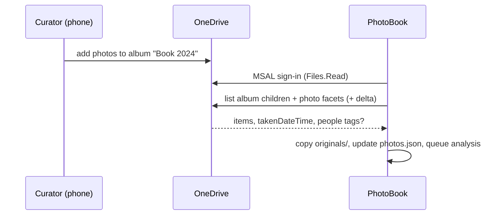

# ADR-0011 — Photo ingestion: OneDrive via MSAL + Microsoft Graph, album-based selection

This ADR records how photos get into a book (R1): sign-in with MSAL, sync via Microsoft Graph,
album-based selection with a local-folder fallback, OneDrive people tags as named top-priority
Focus Regions — and the honest spike required before the people-tag promise can be trusted.

Related docs: [05-ingestion-and-photo-sources.md](../05-ingestion-and-photo-sources.md) · [06-image-analysis.md](../06-image-analysis.md) · [14-roadmap.md](../14-roadmap.md) · [ADR-0010](0010-analysis-plugin-local-first.md)

## Status

Accepted — 2026-08-01; selection model **Album + in-app refine** confirmed by the user
2026-08-03. People-tag availability remains pending the M1 spike below.

## Context

The family's photos live in consumer OneDrive, and the curation workflow is collaborative: one
person gathers candidates from a phone over months, another builds the book. "A folder of photos
will be provided" (R1) is the contract, but *which* photos is a selection problem, and OneDrive's
people tagging is a potential goldmine for R25 — a named person is the strongest possible
automatic Focus Region. Ingestion must also feed the date chain (EXIF `DateTimeOriginal` → Graph
`photo.takenDateTime` → file mtime with `dateUncertain`) and copy originals into the
self-contained project folder ([ADR-0007](0007-project-storage-json-folder.md)).

## Options considered

- **Local folder only.** Zero auth work, but forces a manual export/download step per book, loses
  `takenDateTime` for files stripped by messaging apps, and loses people tags entirely. Kept as the
  universal fallback, rejected as the primary path.
- **Read the OneDrive sync-client folder.** Looks free, but Files On-Demand placeholders hydrate
  unpredictably under bulk read, there is no album view on disk, and no metadata beyond the file.
- **Microsoft Graph + MSAL (chosen).** First-party API for items, albums, thumbnails, photo facets,
  and delta sync.

Selection models within Graph: whole-folder mirror (over-includes; culling burden lands in-app),
date-range query (dates are exactly what's often wrong pre-cleanup), or **album-based (chosen)**.

## Decision

> **Decision:** `PhotoBook.Ingestion` implements `IPhotoSource` with `OneDriveGraphSource`
> (primary) and `LocalFolderSource` (fallback). Selection is **Album + in-app refine**
> (confirmed by the user 2026-08-03). People tags, if the spike confirms access,
> become named `person` Focus Regions. Rationale inline per part.

- **Auth.** MSAL `PublicClientApplication` with the Windows WAM broker; delegated scopes
  `Files.Read`, `User.Read` only (least privilege — we never write to OneDrive). Token cache
  encrypted at rest via MSAL extensions (DPAPI). Sign-in is per app, not per book.
- **Album + in-app refine.** The curator adds photos to a per-book OneDrive album ("Book 2024")
  from phone or web over the year. The app lists albums (Graph bundles:
  `GET /me/drive/bundles?$filter=bundle/album ne null`), the user picks one, and sync pulls its
  children. Final trims happen in the app's photo grid; `excluded: true` photos stay excluded
  across every later re-sync. This puts curation where the photos are (the phone) and final say
  where the book is (the app).
- **Folder fallback.** Any OneDrive folder (`/me/drive/root:/{path}:/children` + delta) or any
  local folder can be a source instead — same `IPhotoSource` seam, same catalog output.
- **Sync mechanics.** Enumerate → diff against `photos.json` by source id + content hash →
  download new/changed originals via `@microsoft.graph.downloadUrl` (4 concurrent, resume on
  restart) → copy into `originals/` with content-hash-prefixed immutable filenames → record
  `photo.takenDateTime` for the date chain. Honor `Retry-After` on 429/503 throttling. Re-sync is
  additive: it never removes user work, only proposes new photos and flags source-deleted ones.

- **People tags → Focus Regions.** Where available, each tag maps to
  `PersonTag { personName, sourceRegion? }` in `photos.json` and a
  `FocusRegion { kind: person, personName, weight }` ranked above `face` and `saliency`, below
  `user` — a named family member is the thing a family book must never crop out.
- **The honest spike (M1).** Consumer OneDrive's people tagging is a Photos-experience feature, and
  it is *unverified* whether Microsoft Graph exposes tags (or face rectangles) to third-party apps
  — the standard `photo` facet does not include them. Before any UI depends on names, a spike
  against a real family account must check: driveItem facets, `listItem/fields`, search by person,
  and tag survival in EXIF/XMP/IPTC of the downloaded bytes. **Fallback if inaccessible:** local
  YuNet face detection only ([ADR-0010](0010-analysis-plugin-local-first.md)) — unnamed `face`
  regions, which still protect faces in crops; only person-*name* features degrade.

## Consequences

- Requires an Entra app registration (public client, consumer accounts enabled) shipped with the
  app; documented in [05-ingestion-and-photo-sources.md](../05-ingestion-and-photo-sources.md).
- Projects stay self-contained and offline-editable after sync; OneDrive is needed only to ingest.
- The album workflow depends on the curator's habit; the folder fallback and re-date tooling in the
  photo grid absorb the misses.
- The people-tag feature is scoped as an upgrade, not a dependency — the engine is fully functional
  on `face`/`saliency` regions alone, so the spike can fail without schedule damage.
- A future Google Photos or iCloud source is one more `IPhotoSource` implementation.

## Revisit when

- The user rejects Album + in-app refine as the default workflow (fall back to folder-first).
- The M1 spike lands — record its outcome here and harden either the person pipeline or the fallback.
- Graph consumer-API surface for albums/people changes, or MSAL/WAM guidance shifts.
- A second photo source (Google Photos, iCloud, camera import) is actually requested.
